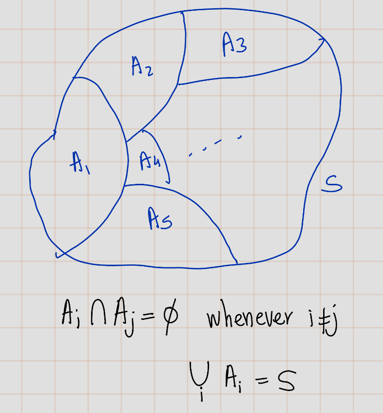
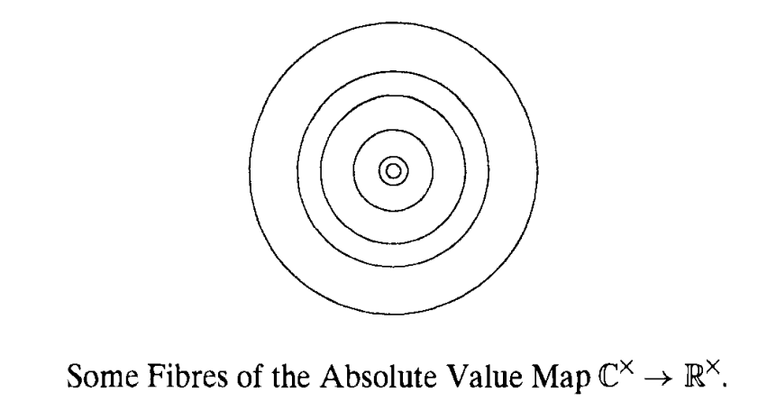
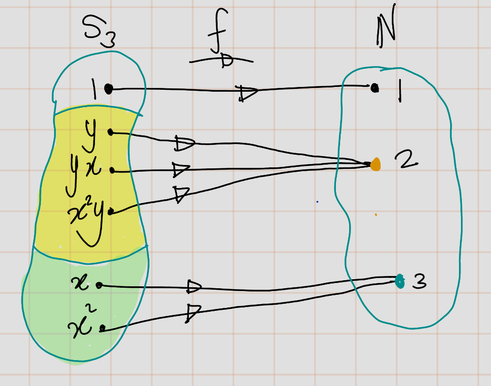
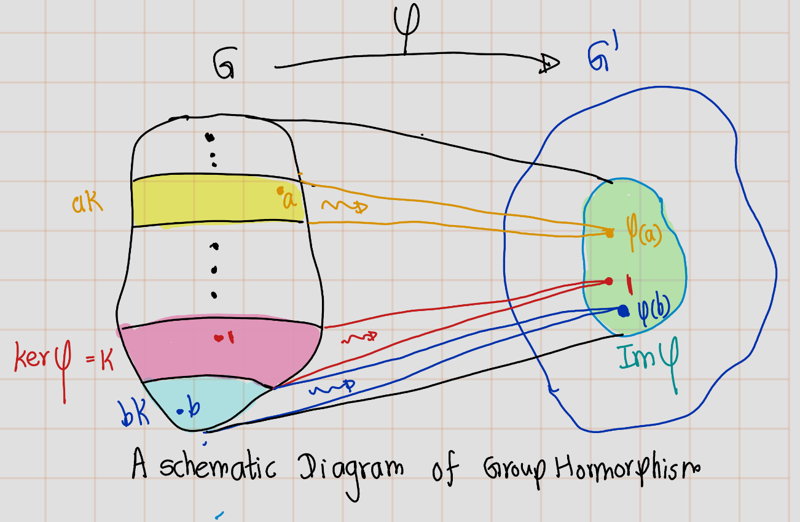
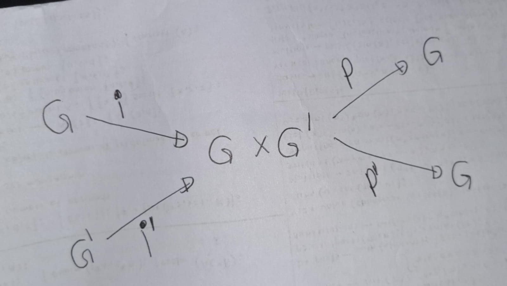
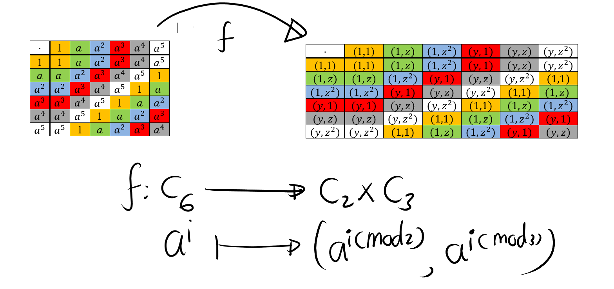
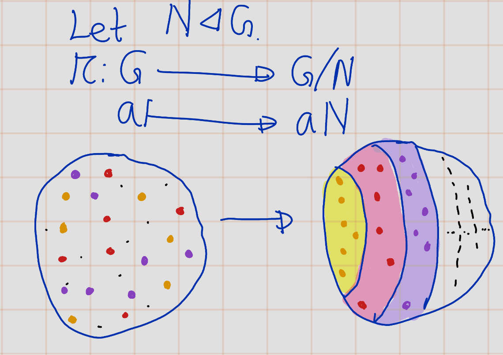
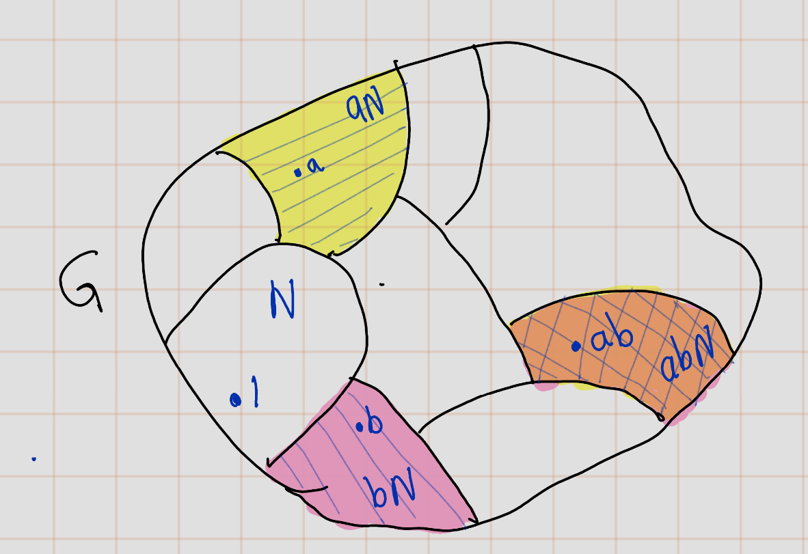

# Group Theory

## Laws of Compositions

```{definition,name='Law of Composition'}
A law o f composition on a set $S$ is any rule for combining pairs $a, b$ of elements of $S$ to get another element, say $p$, of $S$.
```

```{example}
- Some models for this concept are addition and multiplication 
of real numbers. 
- Matrix multiplication on the set of $n \times n$ matrices is another example. 
```

Formally, a law of composition is a function of two variables, or a map,
\[S\times S \to S\]
Here, $S \times S$ denotes, as always, the product set, whose elements are pairs $a, b$ of elements of $S$.

The element obtained by applying the law to a pair $a, b$ is usually written using a notation resembling one used for multiplication or addition:
\[p = ab, a \times b, a \circ b, a + b\],
or whatever, a choice being made for the particular law in question. The element $p$ may be called the product or the sum of a and b, depending on the notation chosen.


## Groups and Subgroups

```{definition,name='Group'}
A group is a set \(G\) together with a law of composition that has the following properties:

- The law of composition is associative: \((ab)c = a(bc)\) for all \(a\), \(b\), \(c\) in \(G\).
- \(G\) contains an identity element \(1\), such that \(la = a\) and \(al = a\) for all \(a\) in \(G\).
- Every element \(a\) of \(G\) has an inverse, an element \(b\) such that \(ab = 1\) and \(ba = 1\).
```
**Notation**: If set $G$ with composition $\cdot$ is a group, then we denote it by $(G,\cdot)$
```{definition,name='Ableian Group'}
Group G is called abliean if its law of composition is commutative. i.e.
\[\forall x\in G, xy=yx\]
```

```{example}
- $\mathbb{R}^\times:=\mathbb{R}\setminus \{0\}$ is an abliean group under multiplication 
- $GL_n(\mathbb{R}):=\{A\in M_n(\mathbb{R}): \text{ A is invertible}\}$ with materix multiplication is non-abliean group. This group is called _general linear group_. 
```

```{definition,name='Order of group'}
The order of a group $G$ is the number of elements that it contains. We \[| G | := \text{number of elements of }G=\text{ the order of G}\]

If the order is finite, $G$ is said to be a finite group. If not, $G$ is an infinite group. 
```
Here is our notation for some familiar infinite abelian groups:

```{example}
- $(\mathbb{Z},+)$ :The set of integers, with addition as itslaw of composition (the additive group of integers)
- $(\mathbb{R},+)$ :The set of real numbers, with addition as its law of 
composition (the additive group of real numbers)
- $(\mathbb{R}^\times,\times)$ :The set of nonzero real numbers, with multiplication as its law of composition(the multiplicative group)
$(\mathbb{C},+)$ :the set of complex numbers, with addition as its law of composition (the additive group of complex numbers)
- $(\mathbb{C}^\times,\times)$ :The set of nonzero complex numbers, with multiplication as its law of composition(the multiplicative group of complex numbers)
```

```{proposition,name='Cancellation Law'}
Let $G$ be group and let $a, b, c \in  G$ whose law of composition is written multiplicatively.

- If $ab = ac$ or if $ba = ca$, then $b = c$. 
- If $a b = a$ or if $ba = a$, then $b = 1$
```
```{proof}
Multiply both sides of $ab=ac$ on the left by$a^{-1}$ to obtain $b = c$. The other proofs are analogous.
```
```{remark}
As you saw $a^{-1}$ plays amajor rule in above proof. So the cancelation rule does not holds when elemenet $a$ is not invertible.
```

```{example,name='Example that not holding the cancelation law'}
\[\begin{bmatrix} 1 & 1 \\ 0 & 0\end{bmatrix}
\begin{bmatrix} 1 & 1 \\ 2 & 0\end{bmatrix}=
\begin{bmatrix} 1 & 1 \\ 0 & 0\end{bmatrix}
\begin{bmatrix} 3 & 0 \\ 0 & 1\end{bmatrix}\]
```

```{example}
Let $T$ be a set and $G:=\{f:T\to T: f \text{ is a bijection}\}$. Then $G$ with composition is a group. We use notation $sys(T) $ to denote the 
```

```{example}
The group of permutations of the set of indices $\{l, 2, ... , n\}$ is called the _symmetric group_,and is denoted by $S_n$. Then $|S_n|=n
!$. So, $S_n$ is a finite group of order $n!$.

Let's disscuss some individualcases for n.

- **$n=2$**\
The permutations of a set $\{1, 2\}$ of two elements are the identity $i$ and the transposition $\tau=(12)$.
\[S_2:=\{id,(12)\}\]

|$\circ$|$id$|$(12)$|
|-------|----|------|
|$id$   |$id$|$(12)$|
|$(12)$|$(12)$|$id$|
|------|------|-----|

- $n=3$\
$S_3$ has order $3!=6$. $S_3$ serves as a convenient example because it is the smallest group whose law of composition isn’t commutative. We will refer to it often. To describe it, we pick two particular permutations in terms of which we can write all others. We take the cyclic permutation $(123)$, and the transposition $(12)$, and label them as $x$ and $y$, respectively.Then
\begin{eqnarray}
x^3 &=& (123)^3=(123)(123)(123)=(123)(132)=id\\
y^2 &=& (12)^2=(12)(12)=id\\
yx  &=& (12)(123)=(13)=(132)(12)=((123)(123))(12)=(123)^2(12)
\end{eqnarray}
As a summary,
\[x^3=1,Y^2=1,yx=x^2y\]
```


## Subgroups of the Additive Group of Integers
We review some elementary number theory here, in terms of subgroups of the additive group $\mathbb{Z}^+$ of integers. To begin, we list the axioms for a subgroup when additive notation is used in the group: A subset $S$ of a group $G$ with law of composition written additively is a subgroup if it has these properties:


- _Closure_ : If $a$ and $b$ are in $S$, then $a + b$ is in $S$.
- _Identity_ : $0$ is in $S$.
- _Inverses_ : If $a$ is in $S$ then $-a$ is in $S$.

Let $a$ be an integer different from $O$. 
We denote the subset of $\mathbb{Z}$ that consists of all 
multiples of $a$ by $a\mathbb{Z}$:
\[a\mathbb{Z} := \{n \in \mathbb{ Z} | n = ka \text{ for some } k\in \mathbb{Z}\} \].

This is a subgroup of $\mathbb{Z}^+$. Its elements can also be described as the integers divisible by $a$.

```{theorem}
Let $S$ be a subgroup of the additive group $\mathbb{Z}^+$. Either $S$ is the trivial subgroup 
$\{0\}$, or else it has the form $a\mathbb{Z}$, where $a$ is the smallest positive integer in $S$.
```
```{proof}
Let $S$ be a subgroup of $\mathbb{Z}^+$. Then $0\in S$, and if $0$ is the only element of $S$ then $S$ is the trivial subgroup. ie.: $S=\{0\}$So that case is settled. 

Otherwise, $S$ contains an integer $n$ different from $0$, and either $n$ or $-n$ is positive. The third property of a subgroup tells us that $-n$ is in $S$, so in either case, $S$ contains a positive integer. We must show that $S$ is equal to $a\mathbb{Z}$, when $a$ is the smallest positive integer in $S$.

We first show that $a\mathbb{Z}$ is a subset of $S$, in other words, that $ka$ is in $S$ for every integer $k$. If $k$ is a positive integer, then $ka = a + a + \cdots + a$ ($k$ terms). Since $a$ is in $S$, closure and induction show that $ka$ is in $S$. Since inverses are in $S$, $-ka$ is in $S$. Finally, $0 = 0a$ is in $S$.

Next we show that $S$ is a subset of $Za$, that is, every element $n$ of $S$ is an integer multiple of $a$. We use division with remainder to write $n = qa + r$, where $q$ and $r$ are integers and where the remainder $r$ is in the range $0 < r < a$. Since $Za$ is contained in $S$, $qa$ is in $S$, and of course $n$ is in $S$. Since $S$ is a subgroup, $r = n - qa$ is in $S$ too. Now by our choice, $a$ is the smallest positive integer in $S$, while the remainder $r$ is in the range $0 < r < a$. The only remainder that can be in $S$ is $0$. So $r = 0$ and $n$ is the integer multiple $qa$ of $a$.


```


## Cyclic Groups

## Homomorphisms
```{definition}
Let $(G, *)$ and $(G', \odot)$ be groups. A **homomorphism** $\phi: G \rightarrow G'$ is a map from $G$ to $G'$ such that for all $a$ and $b$ in $G$:

\begin{equation}
    \phi(a * b) = \phi(a) \odot \phi(b).
\end{equation}
```
 **Examples of Homomorphisms**

1. **Determinant Function**: $\text{det}: GL_n(\mathbb{R}) \to \mathbb{R}^\times$
2. **Exponential Map**: $\text{exp}: (\mathbb{R}, +) \to (\mathbb{R}^\times, \times)$ defined by $x \mapsto e^x$
3. **Map $\phi$**: $(\mathbb{Z}, +) \to G$ defined by $\phi(n) = a^n$, where $a$ is a given element of $G$
4. **Absolute Value Map**: $|\cdot| : (\mathbb{C}^\times, \times) \to (\mathbb{R}^\times, \times)$

**Trivial Homomorphism**

The trivial homomorphism $\phi: G \rightarrow G'$ between any two groups maps every element of $G$ to the identity in $G'$.

**Inclusion Map**

If $H$ is a subgroup of $G$, the inclusion map $i: H \rightarrow G$ defined by $i(x) = x$ for $x$ in $H$ is a homomorphism.


```{proposition}
Let $\phi: G \rightarrow G'$ be a group homomorphism.

(a) If $a_i, \ldots, a_k$ are elements of $G$, then $\phi(a_i \ldots a_k) = \phi(a_i) \ldots \phi(a_k)$.

(b) $\phi$ maps the identity to the identity: $\phi(1_G) = 1_{G'}$.

(c) $\phi$ maps inverses to inverses: $\phi(a^{-1}) = \phi(a)^{-1}$.
```

```{proposition,label='258'}
Let $\phi : G \rightarrow G'$ be a homomorphism of groups, and 
let $a,b\in G$. Let $K\ker(\phi)$.
Then following conditions are equivalent:

- $\phi(a) = \phi(b)$,  
- $a^{-1}b$ is in $K$,
- $b$ is in the coset $aK$,
- The cosets $bK$ and $aK$ are equal.

```

```{proof}
- $(1)\implies (2)$.\\
        Suppose $\phi(a) = \phi(b)$. Now consider
        \[\phi(a^{-1}b)=\phi(a^{-1})\phi(b)=\phi(a^{-1} )\phi(b)=1\]
        Thus, $a^{-1}b\in K$.
- $(2)\implies (1)$\\ If $a^{-1}b \in K$
        \[1=\phi(a^{-1}b)=\phi(a^{-1})\phi(b)=\phi(a^{-1} )\phi(b)\].
        Thus, $\phi(a)=\phi(b)$. 
        $(3) \implies (4)$
- Suppose $b$ is in the coset $aK$. Then $b=ak$ for some 

```


## Isomorphisms
## Equivalence Relations and Partitions
```{definition}
Sure, here is the LaTeX version of your statement:

A partition $n$ of a set $S$ is a subdivision of $S$ into nonoverlapping, nonempty subsets:
$$S = \bigcup_{i} A_i$$
,where $A_i$ are disjoint nonempty subsets of $S$.
```
```{r echo=FALSE,label='fig2-32'}
   
```

```{example}
The two sets _Even_ and _Odd_ partition the set of integers.
```

```{example}
With the usual notation, the sets 
\[\{1\}, \{y, xy, x^2y\}, \{x, x^2\}\]
form a partition of the symmetric group $S_3$.
```

```{definition}
An equivalence relation on a set $S$ is a relation that holds between certain pairs of elements.

- Reflexive: For all $a$, $a \sim a$.
- Symmetric: If $a \sim b$ , then $b \sim a$.
- Transitive: If $a \sim b$ and $b \sim c$ , then $a \sim c$.


```

```{example}
Two triangles are said to be congruent if their sides have the same length and angles have same measure. \
Congruence of triangles is an example of an equivalence relation on the set of triangles in the plane. If $A , B,$ and $C$ are triangles, and if $A$ is congruent to $B$ and $B$ is congruent to $C$, then $A$ is congruent to $C$. It is very easy to check three equivalnace propoties. I am not going to do this.

```

```{example}
Conjugacy is an equivalence relation on a group. 
Let $G$ be garoup Two group elements are conjugate, $a\sim b$, if $b = gag^{- 1}$ for some $g\in G$.

- _Reflexive_: Observe that $a=aaa^{-1}$ then, $a\sim a$.
- _Symmetric_: Suppose that $a\sim b$, then $b=gag^{-1}$. Thus,
$a=g^{-1}bg$. Hence, $b \sim a$.
- _Transitive_:  Suppose that $a\sim b$ and $b \sim c$. This means that $b = g_1ag_1^{-1}$ and $c = g_2bg_2^{-1}$ for some group elements $g_1$ and $g_2$. 
Then $c = g_2(g_1ag_1^{-1})g_2^{-1} = (g_2 g_1)a (g_2 g_1),$ \ so $a \sim c$
```


```{proposition}
An equivalence relation on a set S determines a partition of S, and conversely.
```
```{proof}
- ($\Longrightarrow$): Given a partition of $S$, the corresponding equivalence relation is defined by the rule 
that $a \sim b$ if $a$ and $b$ lie in the same subset of the partition. The axioms for an equivalence relation are obviously satisfied.
- ($\Longrightarrow$): Given an equivalence relation ($\sim$), one defines a partition this way: \
The subset that contains $a$ is the set of all elements $b$ such that $a \sim b$. This subset is called the **equivalence class** of a. We’ll denote it by $C_a$ here
\[C_a = \{b \in S | a\sim b\}\]
The next lemma completes the proof of the proposition
```

```{lemma}
Given an equivalence relation on a set $S$, the subsets of $S$ that are equivalence classes partition $S$.
```

```{proof}
This is an important point, so we will check it carefully. We must remember that the notation $C_a$ stands for a subset defined in a certain way. The partition consists of the subsets, and several notations may describe the same subset.

- _Non-emptyness_: The reflexive axiom tells us that $a$ is in its equivalence class. Therefore, the class $C_a$ is nonempty.
- _Union is whole set_: Since $a$ can be any element, the union of the equivalence classes is the whole set $S$. 
- _Disjoint property_: To show this, we prove follwoing calim:

    - **Claim**: $\text{If } C_a \text{ and } C_b \text{ have an element in common, then } C_a = C_b$.\
Since we can interchange the roles of $a$ and $b$, it will suffice to show that if $C_a$ and $C_b$ have an element, say $d$, in common, then $C_b \subseteq C_a$.\
Sippose that $x$ is in $C_b$, then $b \sim x$. Since $d$ is in both sets, $a \sim d$ and $b \sim d$, and the symmetry property tells us that $d \sim b$. So we have $a \sim d$, $d \sim b$, and $b \sim x$. Two applications of transitivity show that $a \sim x$, and therefore, $x$ is in $C_a$.

```

```{example,label='272'}
The relation on a group defined by $a ~ b$ if $a$ and $b$ are elements of the same order is an equivalence relation. ( Trivial.)


The corresponding partition for the symmetric group S3 are 
\[\{1\}, \{y, xy, x^2y\}, \{x, x^2\}.\]
```

If a partition of a set $S$ is given, we may construct a new set $\overline{S}$ whose elements are the subsets. We imagine putting the subsets into separate piles, and we regard the piles as the elements of our new set $\overline{S}$. It seems advisable to have a notation to distinguish a subset from the element of the set $S$ (the pile) that it represents. If $U$ is a subset, we will denote by $[U]$ the corresponding element of $S$. 

```{example}
If $S$ is the set of integers and if $\text{Even}$ and $\text{Odd}$ denote the subsets of even and odd integers, respectively, then $\overline{S}$ contains the two elements $[\text{Even}]$ and $[\text{Odd}]$.
```
We will use this notation more generally. When we want to regard a subset $U$ of $S$ as an element of a set of subsets of $S$, we denote it by $[U]$.

When an equivalence relation on $S$ is given, the equivalence classes form a partition, and we obtain a new set $\overline{S}$ whose elements are the equivalence classes $[C_a]$. We can think of the elements of this new set in another way, as the set obtained by changing what we mean by equality among elements. If $a$ and $b$ are in $S$, we interpret $a \sim b$ to mean that $a$ and $b$ become equal in $\overline{S}$, because $C_a = C_b$. With this way of looking at it, the difference between the two sets $S$ and $\overline{S}$ is that in $\overline{S}$ more elements have been declared “equal,” i.e., equivalent. It seems to me that we often treat congruent triangles this way in school.

For any equivalence relation, there is a natural surjective map
\begin{equation}
 \quad \pi : S \to \overline{S}
\end{equation}
that maps an element $a$ of $S$ to its equivalence class: $\pi(a) = [C_a]$. When we want to regard $\overline{S}$ as the set obtained from $S$ by changing the notion of equality, it will be convenient to denote the element $[C_a]$ of $\overline{S}$ by the symbol $a$. Then the map $\pi$ becomes
\begin{equation}
\pi(a) = \overline{a}
\end{equation}

We can work in $\overline{S}$ with the symbols used for elements of $S$, but with bars over them to remind us of the new rule:
\begin{equation}
\text{If } a \text{ and } b \text{ are in } S, \text{ then } \overline{a} = \overline{b} \text{ means } a \sim b.
\end{equation}

A disadvantage of this bar notation is that many symbols represent the same element of $S$. Sometimes this disadvantage can be overcome by choosing a particular element, a representative element, in each equivalence class. For example, the even and the odd integers are often represented by $\overline{0}$ and $\overline{1}$:
\begin{equation}
\{[\text{Even}], [\text{Odd}]\} = \{ \overline{0}, \overline{1}\}.
\end{equation}

Though the pile picture may be easier to grasp at first, the second way of viewing $S$ is often better because the bar notation is easier to manipulate algebraically.

### The Equivalence Relation Defined by a Map
Any map of sets $f : S \to T$ gives us an equivalence relation on its domain $S$. It is defined by the rule: $a \sim b$ if $f(a) = f(b)$.


```{definition,name='Inverse Image  and Fibers'}
The inverse image of an element $t$ of $T$ is the subset of $S$ consisting of all elements $s$ such that $f(s) = t$. It is denoted symbolically as
\begin{equation}
f^{-1}(t) = \{s \in S \mid f(s) = t\}.
\end{equation}

The inverse images are also called the fibres of the map $f$ , and the fibres that are not empty are the equivalence classes for the relation defined above.
```

```{remark}
This is symbolic notation. Please remember that **unless $f$ is bijective, $f^{-1}$ will not be a map**.
```
Here the set S of equivalence classes has another incarnation, as the image of the map. 
The elements of the image correspond bijectively to the nonempty fibres, which are the 
equivalence classes

```{example}
Let's consider the absolute value map from the complex numbers $\mathbb{C}^\times$ to the positive real numbers $\mathbb{R}^+$:

\[ f: \mathbb{C}^\times \to \mathbb{R}^+, \quad f(z) = |z| \]

The fiber of an element $t$ in $\mathbb{R}^+$ is the subset of $\mathbb{C}^\times$ consisting of all complex numbers $z$ such that $f(z) = |z| = t$. Symbolically, we denote the fiber as:

\[ f^{-1}(t) = \{ z \in \mathbb{C}^\times : |z| = t \} \]

This fiber represents all complex numbers with the same absolute value $t$. Thus, fibers are circles in Complex plane.


Note that the absolute value map is surjective, so each positive real number $t$ corresponds to a unique fiber in $\mathbb{C}^\times$.
```

```{r echo=FALSE,label='fig2-33'}
   
```

```{example}
If $G$ is a finite group, we can define a map $f : G \to \mathbb{N}$ to the set $\{1, 2, 3, \ldots\}$ of natural numbers, letting $f(a)$ be the order of the element $a$ in $G$. The fibers of this map are the sets of elements with the same order (see example \@ref(exm:272)).

```

```{r echo=FALSE,label='fig2-34'}
   
```

```{definition,name='congruence'}
Let $G,G'$ be a groups and \(\phi: G \rightarrow G'\) be a group group homomorphism. The equivalence relation on \(G\) defined by \(\phi\) is usually denoted by \(\equiv\), rather than by \(\sim\), and is referred to as congruence.
\[a \equiv b \text{ if }\phi(a) = \phi(b)\]

```

We have seen that elements $a$ and $b$ of $G$ are congruent, i.e., $\phi(a) = \phi(b)$, if and only if $b$ is 
in the coset $a K$ of the kernel $K$ (See proposition \@ref(prp:258))

```{proposition}
Let $K$ be the kernel of a homomorphism $\varphi: G \to G'$. The fibre of  that contains an element $a$ of $G$ is the coset $a K$ of $K$. These cosets partition the group $G$, and they correspond to elements of the image of $\varphi$. 
```

```{r echo=FALSE,label='fig2-35'}
   
```


```{proof}
The fibre of $\varphi$ over an element $g' \in G'$ is the set of all elements $a \in G$ such that $\varphi(a) = g'$. Let's denote this fibre as 
\[F_{g'} = \{a \in G : \varphi(a) = g'\}\].

Now, let's take an arbitrary element $a \in G$ and consider the left coset $aK = \{ak : k \in K\}$. 

We know that $K$ is the kernel of $\varphi$, so for any $k \in K$, we have $\varphi(k) = 1_{G'}$ where $1_{G'}$ is the identity element in $G'$. 
  
- Claim 1: $aK=F_{\varphi(a)}$.  
  - sub claim 1.1: $aK \subseteq F_{\varphi(a)}$.\
For any $ak \in aK$, we have $\varphi(ak) = \varphi(a)\varphi(k) = \varphi(a)1_{G'} = \varphi(a)$.This shows that every element in the coset $aK$ is mapped to the same element under $\varphi$ as $a$ itself. Therefore, the coset $aK$ is a subset of the fibre $F_{\varphi(a)}$.

   - sub claim 1.2 : $F_{\varphi(a)}\subseteq aK$.\
If $a' \in F_{\varphi(a)}$, then $\varphi(a') = \varphi(a)$, which implies that $\varphi((a')^{-1}a) = 1_{G'}$. 
This means that $(a')^{-1}a \in K$, or equivalently, $a' \in aK$. (by proposition \@ref(prp:258))Therefore, the fibre $F_{\varphi(a)}$ is a subset of the coset $aK$.

Since $aK$ is a subset of $F_{\varphi(a)}$ and $F_{\varphi(a)}$ is a subset of $aK$, we conclude that $aK = F_{\varphi(a)}$. So, the fibre of $\varphi$ that contains an element $a$ of $G$ is indeed the coset $aK$ of $K$.

- Claim 2: The cosets of a subgroup $K$ partition the group $G$.

A partition of a set is a collection of non-empty subsets such that every element in the set is in exactly one of these subsets. 

To show that the cosets of $K$ partition $G$, we need to show two things:

 - sub claim 2.1: Every element of $G$ is in at least one coset of $K$.\
Given any $g \in G$, $g$ is in the coset $gK$. So, every element of $G$ is in at least one coset of $K$.

  - sub claim 2.2: No element of $G$ is in more than one coset of $K$\
Suppose $gK$ and $hK$ are two cosets of $K$ and there is some element $x \in G$ that is in both $gK$ and $hK$. This means that there exist $k_1, k_2 \in K$ such that $x = gk_1 = hk_2$ (by proposition \@ref(prp:258). Then $g = hk_2k_1^{-1}$. Thus, $g\in gK$, which implies that $gK = hK$. 
So, no element of $G$ is in more than one coset of $K$.

Therefore, the cosets of $K$ partition the group $G$.
```


## Cosets
## Modular Arithmetic
## The Correspondence Theorem

```{definition}
Let $\phi: G \rightarrow G^\prime$ be a group homomorphism, and let $H$ be a subgroup of $G$. We may restrict $\phi$ to $H$, obtaining a homomorphism
\[\phi|_H: H \rightarrow G^\prime\]
```

In other words, we take the same map but restrict its domain.

**Notation**: We use this notation for clarity $[\phi|_H](h)$.

Further, we can see that follwoing observatons.

- By definition, $\forall h\in H,\phi|_H(h) = \phi(h)$
- The restriction $\phi|_H$ is a homomorphism (Since $\phi$ is homomorphism).
- The kernel of $\phi|_H$ is the intersection of the kernel of $\phi$ with $H$:
\[ker(\phi|_H) = (ker\phi) \cap H\]
There is no need to prove this. This is trivial by definition of kernel.
- Image of $\phi|_H$ is the same as the image $\phi(H)$ of $H$ under the map $\phi$.
\[Im(\phi_H)=\phi(H)\]
- If $|H|$ and $|G'|$ have no common factor, $\phi(H) = \{1\}$, so $H$ is contained in the kernel.
(Since, by Artin's book corollary 2.8.13,

\begin{eqnarray}
|Im(\phi_H)|&\biggr |&|H|\\
|Im(\phi_H)|&\biggr |& |G'|
\end{eqnarray}, Thus, if $|H|$ and $|G'|$ have no common factors,$|Im(\phi_H)|=|\phi(H)| =1.$ So, $Im(\phi_H)=\phi(H)= \{1\}$

Now let's see an example.

```{example}
Define sign homorphism $\sigma: S_n \to \{\pm 1\}$ by $\sigma(x)=1$ if $x$ is even, and  $\sigma (x)=-1$ if $x$ is odd. Then the image of the sign homomorphism is,
\[Im(\sigma)=\{\pm 1\}\]
it has order $2$. 

Let $H=\{x \in S_n : \text{if $x$ has odd order}\}$. Then $H$ is a subgroup. So,, $H \subset \ker(\sigma)$ (We can easily verify this.) 

Furthur, The sub group of $S_n$ with even permutations is called _Alternating group_ ($A_n$).

```

### PROBLEM

```{proposition,label='2104'}
Let \(\phi:G \to G^{\prime}\) be a homomorphism with kernel \(K\), and let \(H^\prime\leq G^\prime\). Denote the inverse image \(\phi^{-1}(H^\prime)\) by \(H\). i.e.: 

\[H=\phi^{-1}(H^\prime)=\{x\in G: \phi(x)\in H^\prime\}\]
Then,

- \(\phi^{-1}(H^\prime)\) is a subgroup of \(G\) that contains \(K\). 
- If \(H\) is a normal subgroup of \(G^\prime\), then \(\phi^{-1}(H^\prime)\) is also a normal subgroup of \(G\). 
- If \(\phi\) is surjective and \(H\) is a normal subgroup of \(G\), then \(\phi^{-1}(H^\prime)\) is a normal subgroup of \(G^\prime\).
```
```{remark}
$\phi^{-1}$ is not a map.
```
```{proof}
- **Claim 1**: \(K\subseteq \phi^{-1}(H^\prime)=H\)\
Let $x\in K$. Then $\phi(x)=1_{G^\prime}$. Since $1_{G^\prime}\in H^\prime$. Thus, $x\in \phi^{-1}(H^\prime)=H$. Therfore, \(K\subseteq \phi^{-1}(H^\prime)=H\)
- **Claim 2**: \(\phi^{-1}(H^\prime)\) is a subgroup of \(G\)\
  - _Closure_ :Suppose $x,y\in H= \phi^{-1}(H^\prime)$. Then $\phi(x),\phi(y)\in \phi(H^\prime)$. Since $\phi$ is hormophism $\phi(x)\phi(y)=\phi(xy)$. Since $H^\prime\leq G^\prime$, then  $\phi(xy)=\phi(x)\phi(y)\in H^\prime$. Thus, \(xy\in \phi^{-1}(H^\prime)=H\) 
  - _Identity_ : Since \(\phi(1_G)=1_{G^\prime}\), \(1_G\in \phi^{-1}(H^\prime)=H\)
  - _Inverse_ : Let $x\in \phi^{-1}(H^\prime)=H$. Then $\phi(x)\in H^\prime$ and since $H^\prime \leq G^\prime$,then \((\phi(x))^{-1}\in H^\prime\). Since $\phi$ is a homomorphism, \((\phi(x))^{-1}=\phi(x^{-1})\), Thus \((\phi(x))^{-1}=\phi(x^{-1})\in H^\prime\). Hence, $x^{-1}\in \phi^{-1}(H^\prime)$.

- **Claim 3**: If \(H^\prime\) is a normal subgroup of \(G^\prime\), then \(\phi^{-1}(H^\prime)\) is also a normal subgroup of \(G\).\
Now suppose that \(H^\prime\) is a normal subgroup of \(G^\prime\). Let $x\in H$ and $g\in G$. Then, since $\phi$ is hormorphism,
\[\phi(-1)=\phi(g)\phi(x)\phi(g^{-1})=\phi(g)\phi(x)(\phi(g))^{-1}\]
So, \(\phi(gxg^{-1})\) is conjugate of $\phi(x)$. Since $x\in H=\phi^{-1}(H^\prime)$,the $\phi(x)\in H^\prime$. Thus, \(\phi(gxg^{-1})=\phi(g)\phi(x)(\phi(g))^{-1}\in H^\prime\). Hence,
$gxg^{-1}\in \phi^{-1}(H^\prime)=H$.
- **Claim 4**: If \(\phi\) is surjective and \(H\) is a normal subgroup of \(G\), then \(\phi^{-1}(H^\prime)\) is a normal subgroup of \(G^\prime\).\
Suppose that \(\phi\) is surjective and \(H\) is a normal subgroup of \(G\). Let $a\in H^\prime$ and $b\in G^\prime$. Since $\phi$ is surjcetive, There are elements $x\in H$ and $y\in G$ such that $\phi(x) = a$ and $\phi(y) = b$. Since $H$ is normal  $yxy^{- 1}\in H$, thus $\phi(yxy^{-1})=bab^{-1}\in H^\prime$.
```

```{example}
let denote the determinant homomorphism \[det:GL_n(\mathbb{R})\to \mathbb{R}^\times\]. Note that $\mathbb{R}^+\unlhd \mathbb{R}^\times$. (It is very clear that $The set of  positive real numbers is a subgroup of $\mathbb{R}^\times$, and since  $\mathbb{R}^\times$ is abliean, $\mathbb{R}^+$ is normal.) Now consider the inverse image of $\mathbb{R}^+$,
\[det^{-1}(\mathbb{R}^+)=\{A\in GL_n(\mathbb{R}):det(A)\in \mathbb{R}^+\}=SL_n(\mathbb{R})\]. By above proposition we can ge that $SL_n(\mathbb{R})$ is normal subgroup. (Because $\mathbb{R}^+\unlhd \mathbb{R}^\times$ and $det$ is surjective map.)
```


```{theorem,'CorrespondenceTheorem',name='Correspondence Theorem'}
Let $\phi: G \to G^\prime$ be a surjective group homomorphism with kernel $K$. There is a bijective correspondence between subgroups of $G^\prime$ and subgroups of $G$ that contain $K$:
  \[\{\text{subgroups of $G$ that contain $K$}\}\longleftrightarrow \{\text{subgroups of $G^\prime$}\}\]
This corresponde nce is defined as follows:
$$\begin{aligned}
\text{a subgroup $H$ of $G$ that contains K} &\rightsquigarrow \text{ its image} (\phi(H) \in G^\prime,\\
\text{a subgroup $H^\prime$ of $G^\prime$} &\rightsquigarrow \text{ its inverse image $\phi^{-1}(H^\prime)$ in $G$}.
\end{aligned}$$

  
- If $H$ and $H^\prime$ are corresponding subgroups, then $H$ is normal in $G$ if and only if is normal in $G^\prime$.
- If  If $H$ and $H^\prime$ are corresponding subgroups, then 
\[|H|= |H^\prime||K |\]
```

```{proof}
Let $H$ be subgroup of $G$ that contain $K$. Let $H^\prime$ be a subgroup of $G^\prime$. Now we need to check folllwings,

- $\phi(H)$ is a subgroup of $G^\prime$.
- $\phi^{-1}(H^\prime)$ is a subgroup of $G$, and it contains $K$.
- $H^\prime$ is a normal subgroup of $G^\prime$ if and only if $\phi^{-1}(H^\prime)$ is a normal subgroup of $G$.
- (_bijectivity of the correspondence_) $\phi(\phi^{-1}(H^\prime)) =H^\prime$ and $\phi^{-1}(\phi(H))=H$
- $|(\phi^{-1} (H^\prime)| = |H^\prime||K|$.
     
     
- **Claim 1**: $\phi(H)$ is a subgroup of $G^\prime$.\
  - _Closure_: Let $$x,y\in phi(H)$. Then there is $a,b\in H$ such that $\phi(a)=x$ and $\phi(b)=y$. Since $\phi$ is hormorphism, $xy=\phi(a)\phi(b)=\phi(ab)$. Sine $H\leq G$, $ab\in H,~ xy=\phi(ab)\in \phi(H)$.
  - _Identity_ : Since $1_G\in H$, $\phi(1_G)=1_{G^\prime}\in \phi(H)$
  - _Inverse_ : Let $x\in \phi(H)$. Then there exist $a\in H$ such that $\phi(a)=x$. Since $H\leq G$, $a^{-1}$ exists in $H$.  $\phi(a^{-1})=\phi(a)^{-1}=x^{-1}\in \phi(G)$.

- **Claim 2**: $\phi^{-1}(H^\prime)$ is a subgroup of $G$, and it contains $K$.\
This is true from proportion \@ref(prp:2104)

- **Claim 3**: $H^\prime$ is a normal subgroup of $G^\prime$ if and only if $\phi^{-1}(H^\prime)$ is a normal subgroup of $G$.\
Alreday this prooved in proportion \@ref(prp:2104)

- **Claim 4.1**: $\phi(\phi^{-1}(H^\prime))=H^\prime$
  - $\phi(\phi^{-1}(H^\prime))\subset H^\prime$\
Lett $x\in \phi(\phi^{-1}(H^\prime))$. 
Then there exist $y\in\phi^{-1}(H^\prime)$ such that $\phi(y)=x$. Then by definiton of the pre  image $x=\phi(y)\in H^\prime$. 
  
  - $\phi(\phi^{-1}(H^\prime))\supset H^\prime$\
Let $a\in H^\prime$. Since $\phi$ is surjective, there exists $b\in G$ such that $\phi(b)=a\in H^\prime$. Thus $b\in \phi^{-1}(H^\prime)$. Hence $a=\phi(b)=\phi(\phi^{-1}(H^\prime))$. 

Therefore, $\phi(\phi^{-1}(H^\prime))=H^\prime$.

- **Claim 4.2**: $\phi^{-1}(\phi(H))=H$
  - $\phi^{-1}(\phi(H))\supset H$\
Let $x\in H$. Then $\phi(x) \in \phi(H)$. So, $x\in \phi^{-1}(\phi(H))$.
  - $\phi^{-1}(\phi(H))subset H$\
Let $y\in \phi^{-1}(\phi(H))$. By definition of inverse image, $\phi(y)\in \phi(H)$. Then there exist $z\in H$ such that $\phi(y)=\phi(z)$. Then $z^{-1}y$ is in the kernal $K$.(by Artins book proposition 2.5.8). Since $K \subset H$, $z^{-1}y\in H$. So, $a\in H$ and $a^{-1}z\in H$. Thus, $a(a^{-1}x)=x\in H$. Hence  $\phi^{-1}(\phi(H))\subset H$

Therefore,   $\phi^{-1}(\phi(H))=H$
- **Claim 5** : $|(\phi^{-1} (H^\prime)| = |H^\prime||K|$.\

```
### Problem


```{example}
Recall

$$\begin{aligned}
S_4 &= \left\{ id, (1 2), (1 3), (1 4), (2 3), (2 4), (3 4), (1 2 3), (1 2 4), (1 3 2), (1 3 4), (1 4 2), (1 4 3), (2 3 4), (1 2 3 4) \right\}\\
S_3 &= \left\{ id, (1 2), (1 3), (2 3), (1 2 3), (1 3 2) \right\}
\end{aligned}$$

There are 6 such subgroups of $S_3$,\[ <(1 2)>, <(1 3)>, <(2 3)>, <(1 2 3)>= <(1 3 2)>,S_3\].
There is one proper subgroup of order 3. That is $<(123)>$. There are 3 subgroups of order 2. They are $<(1 2)>, <(1 3)>, <(2 3)>$
  
The Correspondence Theorem tells us that there are four proper 
subgroups of $S_4$ that contain $K$.
```
### Problem


## Product Groups

Let $G,G'$ be two groups. The product set $G \times G'$, the set of pairs of elements $(a, a')$ with
a in G and a' in G', can be made into a group by component-wise multiplication, 

multiplication of pairs is defined by the  rule,

\[(a,a')\cdot(b,b')=(ab,a'b')\quad \text{for } a,b\in  G \text{ and for } a',b'\in G\]
Let's prove that $G\times G'$ is a group.

```{proof}
Let $G,G'$ be two groups and let $a,b,c\in G$ and $a',b',c'\in G'$
  
- _Closure_ : $(a,a')\cdot (b,b')=(ab,a'b')$. So, since $a,b\in G$ and $a',b'\in G'$ and $G$ and $G'$ be a group, then $ab\in G$ and $a'b'\in G$. Thus, $(a,a')\cdot(b,b')=(ab,a'b')\in G \times G'$.
- _Asscitivity_:  We can obtain following using asscivity property of group $G$ and $G'$.
\[((a,a')\cdot(b,b'))\cdot(c,c')=(ab,a'b')\cdot(c,c')
=(abc,a'b'c')=
(a,a')\cdot(bc,b'c')=(a,a')\cdot((b,b')\cdot(c,c'))\]
- _identity_: (1_G,1_{G'}) is the idenitity\
\[(1_G,1_{G'})\cdot(b,b')=(1_Gb,1_{G'}b')=(b,b')
=(b1_G,b'1_{G'})=(b,b')\cdot(1_G,1_{G'})\]
- _Inverse_ : The inverse of $(a,a')$ is $(a^{-1},(a')^{-1})$\
\[(a,a')\cdot(a^{-1},(a')^{-1})=(aa^{-1},a'(a')^{-1})=(1_G,1_{G'})=(a^{-1}a,(a')^{-1}a')=(a^{-1},(a')^{-1})\cdot(a,a')\]
```
So, The group obtained in this way is called the product of $G$ and $G'$.

It is related to the two factors $G$ and $G'$ in a simple way that we can sum up in terms of some homomorphisms.
```{r echo=FALSE,label='fig2-1'}
   

```
The homomorphisms are defined as follows,
\begin{eqnarray}
i:G &\rightarrow& G \times G' \\
x &\mapsto& (x,1)\\\\
i':G' &\rightarrow& G \times G' \\
x &\mapsto& (x',1)\\\\
p:G \times G' &\rightarrow& G' \\
(x,x') &\mapsto& x\\\\
p':G' \times G' &\rightarrow& G' \\
(x,x') &\mapsto& x'\\\\
\end{eqnarray}

Observe that $i$ and $i'$ are injective and \[Im(i)=G\times 1_G'\leq G\times G' \text{ and }Im(i')=1_G\times G'\leq G\times G'\] 
The maps $p$ and $p '$ are called projections and they are surjective. 
\[\ker(p)=1\times G'\text{ and }\ker(p')=G\times 1_{G'}\]
It is obviously desirable to decompose a given group $G$ as a product, that is, to find investigate groups $H$ and $H '$ such that $G$ is isomorphic to the product $H \times H'$. The groups $H$ and $H'$ will be simpler, and the relation between $H\times H'$ and its factors is easily understood. It is rare that a group is a product, but it does happen occasionally

```{example}
Consider a cyclicgroup of order $6$ can be decomposed. It migheted be suprised you. A cyclic group $C_6$ of order $6$ isisomorphic to the product $C_2 \times C_3$ of cyclic groups of orders $2$ and $3$.
\[C_6\equiv C_2 \times C_3\]
Let say 

\begin{eqnarray}
C_2&=&<y>=\{1,y\},\text{ with } y^2=1\\
C_3&=&<z>=\{1,z,z^2\}, \text{ with } y^3=1
\end{eqnarray}

Let $x\in C_2\times c_3$. Then there exist $p\in C_2$ and $q\in C_3$ such that $x=(p, q)$. Let's find order of $x$, that is the smallest positive integer $k$ such that $x^k =(y^k,z^k)$ is the identity $(1, 1)$.

- _Case-I_: $k=1, x^1=(y^1,z^1)=(y,z)$
- _Case-II_: $k=2, x^2=(y^2,z^2)=(1,z^2)$
- _Case-III_: $k=3, x^3=(y^3,z^3)=(y,1)$
- _Case-IV_: $k=4, x^4=(y^4,z^4)=(1,z)$
- _Case-V_: $k=5, x^5=(y^5,z^5)=(1,z^2)$
- _Case-VI_: $k=6, x^5=(y^6,z^6)=(1,1)$

Thus, the smallest positive integer $k$ such that $x^k=(1, 1)$ is 6. So, order of $x$ is $6$. Since $C_2\times C_3$ has order $6$. Furthur,
\[C_2\times C_3 =<x>\]
The powers of $x$ are
\[(1,1),(y,z),(1,z^2),(y,1),(1,z),(y,z^2)\]

```

```{r echo=FALSE,label='fig2-2'}
   

```
Here $i=0,1,2...5$

So let's try to see above result more generally.

```{proposition}
Let $r$ and $s$ be relatively prime integers.
A cyclic group of order $rs$ is isomorphic to the product of a cyclic group of order $r$ and a cyclic group of order $s$.
```
```{example,name='s'}
On the other hand, a cyclic group of order $4$ is not isomorphic to a product of two cyclic
groups of order $2$. 
\[C_4\not\equiv C2 \times C_2\]
Because , every element of $C_2 \times C_2$ has order $1$ or $2$,whereasa cyclic group of order
$4$ contains two elements of order $4$.

```

The next proposition describes product groups.

```{proposition,label='prp2114'}
Let $G$ be a group and let $H,K\leq G$, and let $f: H \times K \rightarrow G$ be the multiplication map, defined by $f(h, k) = hk$. Its image is the set $HK = \{hk | h \in H, k \in K\}$.

a. $f$ is injective if and only if $H \cap K = \{1\}$.
a. $f$ is a homomorphism from the product group $H \times K$ to $G$ if and only if elements of $K$ commute with elements of $H$: $hk = kh$.
a. If $H$ is a normal subgroup of $G$, then $HK$ is a subgroup of $G$.
a. $f$ is an isomorphism from the product group $H \times K$ to $G$ if and only if $H \cap K = \{1\}$, $HK = G$, and also $H$ and $K$ are normal subgroups of $G$.


It is important to note that the multiplication map may be bijective though it isn't a group homomorphism. This happens, for instance, when $G = S_3$, and with the usual notation, $H = \langle x \rangle$ and $K = \langle y \rangle$.

```

```{proof}
a. 
  - ($\Longrightarrow$) We are going to use proof by contrapositive. So, suppose that $x\in H\cap K$ such that $x \neq 1$. Since $x\in H$ then $x^{-1} \in H$. 
\[f(x^{-1},x)=x^{-1}\cdot x=1=1\cdot 1=f(1,1)\]
Thus, $f$ is not injective. Thus, if $f$ is injective then $H \cap K = \{1\}$.
  -($\Longleftarrow$) 
Now Suppose that $H \cap K = \{1\}$. Let $(h_1, k_1),(h_2, k_2)\in H \times K$ such that $h_1k_1 = h_2k_2$. Now multiply both sides of this equation on the left by $h_1^{-1}$ and on the right by $k_2^{-1}$,
\begin{eqnarray}
h_1k_1 &=& h_2k_2\\
h_1^{-1}(h_1k_1)k_2^{-1} &=& h_1^{-1}(h_2k_2)k_2^{-1}\\
(h_1^{-1}h_1)k_1k_2^{-1} &=& h_1^{-1}h_2(k_2k_2^{-1})\\
k_1k_2^{-1} &=& h_1^{-1}h_2
\end{eqnarray}
Note that $(k_1k_2^{-1})\in K$ and $h_1^{-1}h_2\in H$. Since $H \cap K = \{1\}$, \[k_1k_2^{-1} = h_1^{-1}h_2 = 1\]. Then,
\[
k_1=k_2~~\text{and}~~~~h_1=h_2.
\]
Then \[(h_1, k_1) = (h_2, k_2)\]

b. Let $(h_1, k_1),(h_2, k_2)\in H \times K$.  Now consider,
\begin{eqnarray}
f((h_1,k_1)\cdot (h_2,k_2))&=&f((h_1h_2,k_1k_2))=h_1h_2k_1k_2\\
f((h_1,k_1))\cdot f((h_2,k_2))&=& (h_1k_1)\cdot(h_2k_2)=h_1k_1h_2k_2
\end{eqnarray}

\begin{eqnarray}
f\text{ is homorphism} &\iff & 
f((h_1,k_1)\cdot (h_2,k_2))=f((h_1,k_1))\cdot f((h_2,k_2))\\
&\iff & h_1h_2k_1k_2=h_1k_1h_2k_2\\
&\iff & h_1^{-1}(h_1h_2k_1k_2)k_2^{-1}=h_1^{-1}(h_1k_1h_2k_2)k_2^{-1}\\
&\iff & (h_1^{-1}h_1)h_2k_1(k_2k_2^{-1})=(h_1^{-1}h_1)k_1h_2(k_2k_2^{-1})\\
&\iff & (h_1^{-1}h_1)h_2k_1(k_2k_2^{-1})=(h_1^{-1}h_1)k_1h_2(k_2k_2^{-1})\\
&\iff & h_2k_1=k_1h_2
\end{eqnarray}

c. 


  - Suppose that $H$ is a normal sub group of G. Note that \[KH=\bigcup_{k\in K}kH~~\text{   and     } ~~HK=\bigcup_{k\in K}Hk\] 
Since, $H$ is normal, $kH=Hk$ for all $k\in K$. So, $HK=KH$. We are going to use sub group test,
    
    - _non-emptyness_: Clearly, $1=1\cdot 1\in HK$ (because $1\in H$ and $1\in K$
    - _closure_: 
  \[HKHK=HHKK=HK\]
Thus, $HK$ is closed under multiplication.
    - _closed under inverse_: Let $hk\in HK$. Then 
\[(hk)^{-1} = k^{-1}\cdot h^{-1} \in KH=HK \]
This proves closure of $HK$ under inverses.
d. 
  - $(\Longleftarrow)$: Suppose that $H \cap K = \{1\}$, $HK = G$, and also $H,K \trianglelefteq  G$. According to the (b),  $f$ is a homomorphism from $H \times K$ to $G$ if and only if $hk = kh$ for all $h\in H$. Consider,
\[(hkh^{-1})k^{-1}=h(kh^{-1}k^{-1}).\]
Note that, Since $K \trianglelefteq G$, $hkh^{-1}\in K$. So,$(hkh^{-1})k^{-1}\in K$. Similary we can  show that $h(kh^{-1}k^{-1})\in H$.Thus,\[(hkh^{-1})k^{-1}=h(kh^{-1}k^{-1})\in H\cap K.\]  But from our hypothesis, $H\cap K=\{1\}$. Hence,

\begin{eqnarray}
hkh^{-1}k^{-1}&=&1\\
hk&=& kh
\end{eqnarray}

Therefore, by (b) we can $f$ is hormorphism. Now we have to proove bijectivity,
      - _Injectivity_: Already prooved in \@ref(prp:prp2114) (a)
      - _Surjectivity_: For any $g \in G$, we can write $g = hk$ for some $h \in H$ and $k \in K$ (since $Im(f)=HK = G$). Thus, $f(h, k) = hk = g$, so $f$ is surjective.

Therefore $f$ is an isomorphism.

  - $(\Longrightarrow)$ Now suppose that $f$ is isomorphism.

    - **Claim i**: $H \cap K = \{1\}$.\
Suppose that $x\in H \cap K$. Then,
\[f(1,x)=x=f(x,1)\]
Since $f$ is an isomorphism (and hence injective), we must have $x = 1$. Therefore, $H \cap K = \{1\}$.
    - **Claim ii** :$HK = G$.\
Since $f$ is surjective, for any $g \in G$, there exist $h \in H$ and $k \in K$ such that $f(h, k) = hk = g$. Therefore, $HK = G$.

    - **Claim iii** : $H$ and $K$ are normal in $G$.\
For any $h \in H$ and $g \in G$, we can write $g = hk$ for some $k \in K$. Then 
\[ghg^{-1} = (hk)h(hk)^{-1}
  =hk(hh^{-1})k^{-1}=h(kk^{-1})=h\in H.\]
Thus, $H\trianglelefteq G$.
Similarly, we can show that $K\trianglelefteq G$.
```
\


```{proposition}
There are two isomorphism classes of groups of order $4$, the class of the cyclic group $C_4$ of order $4$ and the class of the Klein Four Group,which is isomorphic to the product $C_2 \times C_2$ of two groups of order $2$.
```

```{proof}
Let $G$ be a group of order 4. The order of any element $x$ of $G$ divides 4, so there are two cases to consider:


- Case 1: $G$ contains an element of order $4 (|G|=4)$. Then $G$ is a cyclic group of order $4$.
- Case 2: Every element of $G$ except the identity has order $2$.\
In this case, $x = x^{-1}$ for every element $x$ of $G$. Let $x$ and $y$ be two elements of $G$. Then $xy$ has order $2$, so $(xy)(x^{-1}y^{-1}) = (xy)(xy) = 1$. This shows that $x$ and $y$ commute,

\begin{eqnarray}
xyx^{-1}y^{-1} &=& 1\\
xyx^{-1}(y^{-1} y) &=& y\\
xyx^{-1} &=& y\\
xy(x^{-1}x) &=& yx\\
xy &=& yx
\end{eqnarray}

since $x,y$ are arbitrary elements, $G$ is abelian. So every subgroup is normal. We choose distinct elements $x$ and $y$ in $G$, and we let $H$ and $K$ be the cyclic groups of order 2 that they generate. Proposition \@ref(prp:prp2114) (d) shows that $G$ is isomorphic to the product group $H \times K$.

```


## Quotient Groups
```{definition}
The set of cosets of a normal subgroup $N$ of a group $G$ is often denoted by $G / N$.
\[G / N \text{ is the set of cosets of $N$ in} G\]
```
**Notation**: When we regard a coset $C$ as an element of the set of cosets, the bracket notation $[C]$ 
may be used. 
If $C = aN$, we may also use the bar notation to denote the element $[C]$ by $\overline{a}$,
and then we would denote the set of cosets by $\overline{G}$:
\[\overline{G} = G /N\]

```{theorem,label='2122'}
Let $N$ be a normal subgroup of a group $G$, and let $G$ denote the set of cosets of $N$ in $G$. There is a law of composition on $G$ that makes this set into a group, such that the map $\pi: G \to \overline{G}$ defined by $\pi(a) = \overline{a}$ is a surjective homomorphism whose kernel is $N$.
```

```{r echo=FALSE,label='fig2-29'}
   
```

```{remark}
 The map is often referred to as the canonical map from $G$ to $\overline{G}$. The word “**canonical**” 
indicates that this is the only map that we might reasonably be talking about
```

The next corollary is very simple, but it is important enough to single out:

```{corollary}
Let $N \trianglelefteq G$, and let $\overline{G}$ denote the set of cosets of $N$ in $G$. Let $\pi: G \to \overline{G}=G/N$ be the canonical homomorphism. Let $a_1, \ldots, a_k\in G$ such that the product $a_1 \cdots a_k\in N$. Then $\overline{a_1} \cdots \overline{a_k} = \overline{1}$.
```

```{proof}
Let $p=a_1 \cdots a_k\in N$. This implies
\(\pi(p)=\overline{p}=\overline{1}\).\
Since is $pi$ a homomorphism, \(\pi(p)=\pi(a_1 \cdots a_k)=\pi(a_1)\cdots \pi(a_k)=\overline{a_1}\cdots\overline{a_n}\)
```

_Proof of \@ref(thm:2122)_
There are several things to be done. We must

- define a law of composition on $\overline{G}$,
- prove that the law makes $\overline{G}$ into a group,
- prove that $\pi$ is a surjective homomorphism, and
- prove that the kernel of $\pi$ is $N$.

```{remark}
If $A,B \subseteq G$ then $AB$  denotes the set of products $ab$:
  \[AB:=\{x\in G: x=ab, a\in A, b\in B\}\]

- We will call this a product set, though in some other contexts the phrase “product set” refers 
to the set $A \times B$ of pairs of elements
```

```{lemma,label='2125'}
Let $N$ be a normal subgroup of a group $G$, and let $a N$ and $b N$ be cosets of $N$. The product set $(aN )(bN )$ is also a coset and \[(aN )(bN )=\{x\in G: x=anbn' ~\& ~ n,n'\in N\}=abN\].
```
```{proof}
Since $N$ is a subgroup, $N N = N$.\
Since $N$ is normal, left and right cosets are equal: 
$N b = bN$.
\[(aN )(bN ) = a (N b )N = a (b N )N = a b N N = abN\]
```

- This lemma allows us to define multiplication on the set $\overline{G} = G / N$. 
- Using the bracket 
notation, the definition is this: If \(C_1\) and $C_2$ are cosets, then \([C_1][C_2] = [C_1 C_2]\), 
Where \(C_1 C_2\) is the product set. 
- The lemma shows that this product set is another coset.    
- To compute the product $[C_1][C_2]$, take any elements $a \in C_1$ and $b \in C_2$. Then $C_1 = aN$ ,
$C_2 = bN$ , and $C_1 C_2$ is the coset $a b N$ that contains $ab$. So,
\[[aN][bN] = [abN] \text{ or } \overline{a}\overline{b} = \overline{ab}.\]
Then by definition of the map $\pi$ in theorm \@ref(thm:2122),
\[\pi(ab)=\overline{a}\overline{b} = \overline{ab}=\pi(a)\pi(b)\]
The fact that $\pi$ is a homomorphism will follow, once we show that G is a group. 
Since the canonical map $\pi$ is surjective , the next lemma proves this

```{lemma}
Let \(G\) be a group, and let \(Y\) be a set with a law of composition (both laws written with multiplicative notation). Consider a surjective map \(\varphi : G \to Y\) with the homomorphism property: \(\varphi(ab) = \varphi(a)\varphi(b)\) for all \(a\) and \(b\) in \(G\). Then \(Y\) is a group, and \(\varphi\) is a homomorphism. 
```

```{proof}
The group axioms that are true in \(G\) are carried over to \(Y\) by the surjective map \(\varphi\). 

- **Closure** : Let \(y_1,y_2\in Y\). Since \(\varphi\) is surjective, \(y_1=\varphi(x_1),y_2=\varphi(x_2)\) for some $x_1,x_2\in G$.
\[y_1y_2=\varphi(x_1)\varphi(x_2)=\varphi(x_1x_2)\in Y\]

- **Assciativity Property** : \
Let \(y_1\), \(y_2\), and \(y_3\) be elements of \(Y\). Since \(\varphi\) is surjective, \(y_i = \varphi(x_i)\) for some \(x_i\) in \(G\). Then


\begin{eqnarray}
(y_1 y_2) y_3 &=& (\varphi(x_1) \varphi(x_2)) \varphi(x_3) = \varphi(x_1 x_2) \varphi(x_3) = \varphi((x_1 x_2) x_3) \\
&=^*& \varphi(x_1 (x_2 x_3)) = \varphi(x_1) \varphi(x_2 x_3) = y_1 (y_2 y_3)
\end{eqnarray}

The equality marked with an asterisk $(=^*)$ is the associative law in \(G\). The other equalities follow from the homomorphism property of \(\varphi\). 

- **Identity**
  Let $y\in Y$. Since $\varphi$ is surjective, there exist $x\in G$ such that $y=\varphi(x)$. Let $1_G$ be identity of $G$ Then,
\[y\varphi(1_G)=\varphi(x)\varphi(1_G)=\varphi(x1_G)=\varphi(x)=y=
    \varphi(1_Gx)=\varphi(1_G)\varphi(x)=\varphi(1_G)y\]
Thus, $\varphi(1_G)$ is the identity of $Y$.

- **Inverse** : Let $y\in G$. Since $\varphi$ is surjective, there exist $x\in G$ such that $y=\varphi(x)$, 
\[y\varphi(x^{-1}=\varphi(x)\varphi(x^{-1})
           =\varphi(xx^{-1})=\varphi(1_G)=\varphi(x^{-1}x)=\varphi(x^{-1})\varphi(x)=\varphi(x^{-1})y\]
Thus, $y^{-1}=\varphi(x)$
```

The only thing remaining to be verified is that the kernel of the homomorphism $\pi$ is the subgroup $N$.

\begin{eqnarray}
\pi (a) =\pi(1) &\iff & \bar{a}= \bar{1}\\
& \iff & [aN] = [1N]\\
& \iff & a \in N.
\end{eqnarray}
Thus, $\ker(\pi)=N$

```{r echo=FALSE,fig.cap="A Schematic Diagram of Coset Multiplication.",label='fig2-30',}
   
```

```{remark}
Our assumption that \(N\) is a **normal** subgroup of \(G\) is crucial to lemma \@ref(lem:2125). If \(H\) is **not** normal, there will be left cosets \(C_1\) and \(C_2\) of \(H\) in \(G\) such that the product set \(C_1 C_2\) does not lie in a single left cosets. 

Let's see an example for this. Going back once more to the subgroup \(H = \langle y \rangle\) of \(S_3\).
Note that the subgroup \(H\) is not normal.\
The product set \((1H)(xH)\) contains four elements: \[(1H)(xH)=\{1, y\}\{x, xy\} = \{x, xy, x^2y, x^2\}\]. It is not a coset. 

```
The next theorem relates the quotient group construction to a general group homomorphism, and it provides a fundamental method of identifying quotient groups.

```{theorem,name='First Isomorphism Theorem'}
Let $\varphi: G \to G'$ be a surjective group homomorphism with kernel $N$. The quotient group $\overline{G}=G/N$ is isomorphic to the image $G'$. To be precise, let $\pi: G \to \overline{G}=G/N$ be the canonical map. There exists a unique isomorphism $\overline{\varphi}: G/N \to G'$ such that $\varphi = \psi \circ \pi$.

```

```{r echo=FALSE,out.width="50%",label='fig2-31',fig.align='center'}
  knitr::include_graphics('figures/ch_2/fig31.png',) 
```

```{proof}
The elements of $\overline{G}=G/N$ are the cosets of $N$, and they are also the fibres of the map $\varphi$. The map $\overline{\varphi}$  referred to in the theorem is the one that sends a non-empty fibre to its image: $\overline{\varphi}(\overline{x})=\varphi(x)$. For any surjective map of sets $\varphi: G \to  G'$, one can form the set $\overline{G}$ of fibres, and then one obtains a diagram as above, in which $\overline{\phi}$ is the bijective map that  sends a fibre to its image. When $\phi$ is a group homomorphism, $\overline{\phi}$ is an isomorphism because 
\[\overline{\phi}(\overline{ab}) = \phi(ab) = \phi(a)\phi(b) = \overline{\phi}(\overline{a})\overline{\phi}(\overline{b}).\] 
```


\

```{corollary} 
Let $\varphi: G \rightarrow G'$ be a group homomorphism with kernel $N$ and image $H'$. The quotient group $\overline{G}=G/N$ is isomorphic to the image $H'$.
```


