# Exercises

## Chapter 1

## Chapter 2

### Laws of composition

```{exercise,name= 'Artin 2.1.1'}
Let \( S \) be a set. Prove that the law of composition defined by \( ab = a \) for all \( a \) and \( b \) in \( S \) is associative? For which sets does this law have an identity?
```

**Solution**: Let $a,b,c\in S$.
Now consider following
\[(ab)c=(ac)=a=(ab)=a(bc)\]
Thus, the given law of composition is associative.

If the given law of composition  has an identity element whenever every element $a\in S$ has a multiplicative inverse./
In other words, for every element $a\in S$, there exists an element $e \in S$ such that \[ae = ea = a.\] 
Thus, $ae=a=ea=e$. So, the identity element is the same as every element in S, and the law has an identity for all sets S. Thus, only singletons sets have this given law of compositions have identity.

```{exercise,name='Artin 2.1.2'}
Prove the properties of inversesthat are listed near the end ofthe section.
```
- If an element $a$ has both a left inverse $l$ and a right inverse $r$, then $r = l$, $a$ is invertible and $r$ is its inverse.


```{proof} 
Since $l$ is a left inverse for $a$, then $la = 1$. In the same way, since $r$ is a right inverse for $a$ the equality $ar = 1$ holds. Let us now consider the expression $lar$. By associativity of the composition law in a group we have $r = 1r = (la)r = lar = l(ar) = l1 = l$. This implies that $l = r$. Since $l = r$, it holds also that that $ar = 1 = la = ra$ hence $a$ is invertible and $r$ is its inverse.
```

- If $a$ is invertible, its inverse is unique.

```{proof}
Let $i_1$ and $i_2$ be inverses of $a$. In particular $i_1$ is a left inverse of $a$ and $i_2$ is a right inverse of $a$. By point (a) $i_1 = i_2$.
```

 - Inverses multiply in the opposite order: if $a$ and $b$ are invertible, then the product $ab$ is invertible and $(ab)^{-1} = b^{-1}a^{-1}$.

```{proof} 
In order to show that $ab$ is invertible, it is enough to exhibit an element that is a right and a left inverse of $ab$. The element $b^{-1}a^{-1}$ is a right inverse of $ab$ since $abb^{-1}a^{-1} = a(bb^{-1})a^{-1} = a1a^{-1} = aa^{-1} = 1$. It is a left inverse since $b^{-1}a^{-1}ab = b^{-1}(a^{-1}a)b = b^{-11}b = b^{-1}b = 1$. This proves that $ab$ is invertible and that $b^{-1}a^{-1}$ is its inverse.
```


### Groups and Subgroups

```{exercise,name='Artin 2.2.1'}
Make a multiplication table for the symmetric group $S_3$.
```
**Solution**

| $\circ$  | **e** | (12) | (13) | (23) | (123) | (132) |
|---|---|---|---|---|---|---|
| **e** | e | (12) | (13) | (23) | (123) | (132) |
| **(12)** | (12) | e | (123) | (132) | (13) | (23) |
| **(13)** | (13) | (123) | e | (132) | (23) | (12) |
| **(23)** | (23) | (132) | (123) | e | (12) | (13) |
| **(123)** | (123) | (13) | (23) | (12) | (132) | e |
| **(132)** | (132) | (23) | (12) | (13) | e | (123) |


```{exercise,name='Artin 2.2.2'}
Let $S$ be a se t with an associative law of composition and with an identity element. Prove that the subset consisting of the invertible elements in $S$ is a group.
```

```{proof}
Let $S^*\subseteq S$ with consisting of the invertible elements in $S$.

- _identity_ : We are given identity element $1 \in S$ and $(1^{-1})(1)=1 \implies 1 \in S^*$.

- _Closure_ :
So let $a,b\in S^*$. Then $a,b$ are invertible. Let $a^{-1},b^{-1}\in S^*$ be inverses of $a$ and $b$ respectively. Now we need to check $ab\in S^*$.\

\[(b^{-1}a^{-1})(ab)=b^{-1}(a^{-1}a)b=b^{-1}b=e=
  aa^{-1}=a(bb^{-1})a^{-1}=(ab)(b^{-1}a^{-1})\]
```
Thus, $(ab)^{-1}=b^{-1}a^{-1}$. So, $ab\in S^*$
Therefore, $S^*$ is closed under the composition.

- _Associativity_: The associativity property inherit from the group $S$.

Therefore, $S^*$ is a group.

```{exercise,,name='Artin 2.2.3'}
Let $G$ be a group.Let $x, y, z,w \in G$.

(a) Solve for $y$, given that $xyz^{-1}w = 1$.
(b) Suppose that $xyz = 1$. Does it follow that $yzx = 1$? Does it follow that $yxz = 1$?

```
**Solution**: 

a. \
```{r echo=FALSE,label='fig2-17'}
  knitr::include_graphics('figures/ch_2/fig17.jpg') 
```
b. \

```{r echo=FALSE,label='fig2-18'}
  knitr::include_graphics('figures/ch_2/fig18.jpg') 
```
- The given statement is false.
\begin{eqnarray}
          xyz&=&1\\
  x^{-1}(xyz)&=&x^{-1} \cdot 1\\
  (x^{-1}x)(yz)&=&x^{-1}\\
  1 \cdot(yz)&=&x^{-1}\\
  (yz)&=&x^{-1}\\
  (yz)z^{-1}&=&x^{-1}z^{-1}\\
  y(zz^{-1})&=&x^{-1}z^{-1}\\
  y \cdot 1&=&x^{-1}z^{-1}\\
  yx&=&x^{-1}z^{-1}x\\
  yxz&=&x^{-1}z^{-1}xz\\
\end{eqnarray}
If $G$ is not abelian or $z\neq x$. $xyz=1 \nRightarrow yxz=1$.

```{exercise,name='Artin 2.2.4'}
In which of the following cases is \(H\) a subgroup of \(G\)?

(a) \(G = GL_n(\mathbb{C})\) and \(H = GL_n(\mathbb{R})\).

(b) \(G = \mathbb{R}^\times\) and \(H = \{1, -1\}\).

(c) \(G = \mathbb{Z}^+\) and \(H\) is the set of positive integers.

(d) \(G = \mathbb{R}^+\) and \(H\) is the set of positive reals.

(e) \(G = GL_2(\mathbb{R})\) and \(H\) is the set of matrices $\begin{bmatrix} a & 0 \\ 0 & 0 \end{bmatrix}$ with all entries equal to 0.
```

**Solution**:\

(a) 

- _Subset ?_ : Since every matrix with real entries can be interpreted as a matrix with complex entries, we conclude that $H \subset G$.

- _Closure ?_ : For every $A, B \in GL_n(\mathbb{R})$ we have $AB \in GL_n(\mathbb{R})$  since Product of invertible matrices is invertible. I proved this result in chapter 1. 

- _Identity ?_ :The identity in $G$ is $I_n$, the identity $n x n$ matrix. Observe that $I_n\in H=GL_n(\mathbb{R})$. (Because every entry of $I_n$ is 1 or 0)

- _Inverse ?_: $GL_n(\mathbb{R})$ is the set of $n \times n$ invertible matrices with real entries. So, all the elements in $H$ is invertible.

Therefore, $H \leq G$

(b) 

- _Subset ?_ : This is trivial $\{-1,1\}\subset \mathbb{R}^\times$

- _Closure ?_ : 

\begin{eqnarray}
1 \times 1 &=& 1\in H\\
(-1) \times 1 &=& (-1)\in H\\
1 \times (-1) &=& (-1)\in H\\
(-1) \times (-1) &=& -1\in H\\
\end{eqnarray}
Thus, $H$ is closed.
- _Identity ?_ : The identity in $G$ is $1$, which is also in $H$.

- _Inverse ?_ : 
\begin{eqnarray}
1 \times 1 = 1   &\implies & (1)^{-1}=1\in H\\
(-1) \times (-1) = 1 &\implies & (-1)^{-1}=(-1)\in H
\end{eqnarray}
x`Therefore, $H$ is sub group of $G$.

(c) Note that $2\in H$, but inverse of $2$ in $\mathbb{Z}^+$ is $(-2) \not \in H$.\
Therefore, $H$ is not a subgroup of $G$.


(d)
- _Subset ?_ : This is trivial. $H \subset \mathbb{R}^\times$

- _Closure ?_ : Product of positive real number is positive. Thus, $H$ is closed.

- _Identity ?_ : $1$ is the identity of $G$, which is in $H$.

- _Inverse ?_ : Let $a\in H$. Then, 
\[a\cdot \frac{1}{a}=\frac{1}{a}\cdot a=1\]
So, $\frac{1}{a}\in H$ is the inverse of $a$. Thus, $H$ is closed under inverses.

(e) Let $A=\begin{bmatrix} 2 & 0 \\ 0 & 0 \end{bmatrix}$ Then $A\in H$. But observe that $det(A)=0\implies A$ is not invertible. Thus, $A\not\in H$. Thus, this $H \not\subseteq G$. 

Therefore, $H$ is not a subgroup of $G$.

```{exercise,name='Artin 2.2.5'}
In the definition of a subgroup, the identity element in $H$ is required to be the identity 
of $G$. One might require only that H have an identity element, not that it need be the 
same as the identity in $G$. 

- Show that if $H$ has an identity at all, then it is the identity in $G$. 
- Show that the analogous statement is true for inverses.
```

```{r echo=FALSE}
  knitr::include_graphics('figures/ch_2/fig49.jpg') 
```
```{r echo=FALSE}
  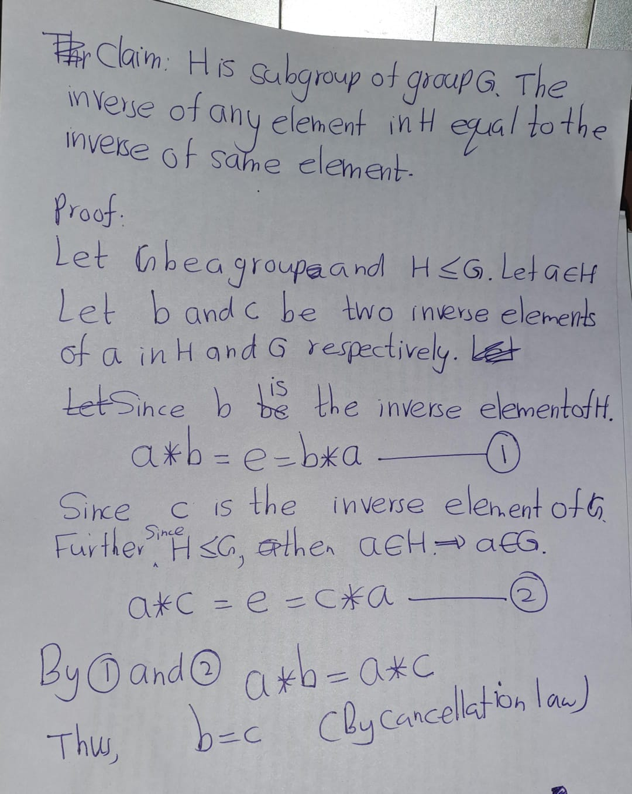 
```


```{exercise,name='Artin 2.2.6'}
Let \( G \) be a group. We define an opposite group \( G^{\circ} \) with the law of composition \( a * b \) as follows: 
- The underlying set is the same as \( G \), 
- but the law of composition is \( a * b = ba \). 

Prove that \( G^{\circ} \) is a group.

```

**Solution**:

```{r echo=FALSE,label='fig2-19'}
  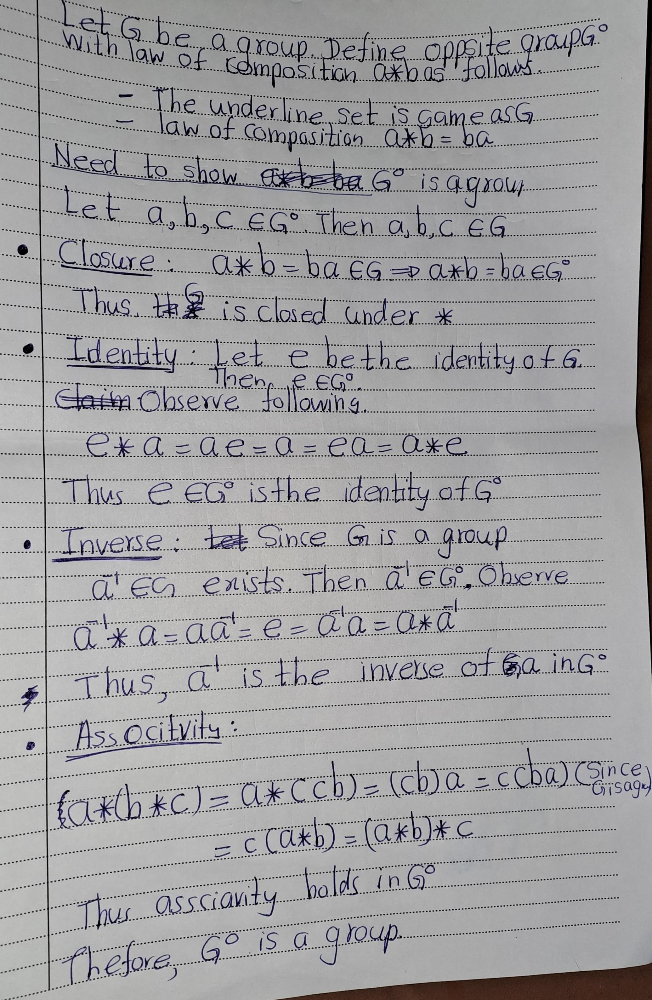 
```

### Subgroups of the Additive Group of Integers

```{exercise,name='Artin 2.3.1'}
 Let $a = 123$ and $b = 321$. 
Compute $d = gcd(a, b)$, and express $d$ as an integer 
combination $ra + bs$.
```

**Solution**:
```{r echo=FALSE,label='fig2-20'}
  knitr::include_graphics('figures/ch_2/fig20.jpg') 
```

```{exercise,,name='Artin 2.3.2'}
Prove that if $a$ and $b$ are positive integers whose sum is a prime $p$, their greatest common 
divisor is $1$.
```
**Solution**:
```{r echo=FALSE,label='fig2-21'}
  knitr::include_graphics('figures/ch_2/fig21.jpg') 
```

```{exercise,name='Artin 2.3.3'}

a. Define the greatest common divisor of a set $\{a_1, ..., a_n\}$ of $n$ integers. Prove that it exists, and that it is an integer combination of $a_1, ..., a_n$.
b. Prove that if the greatest common divisor of $\{a_1, ..., a_n\}$ is $d$, then the greatest common divisor of $\{a_1/d, ..., a_n/d)$ is $1$. 
```

**Solution**:

a. 

```{r echo=FALSE}
  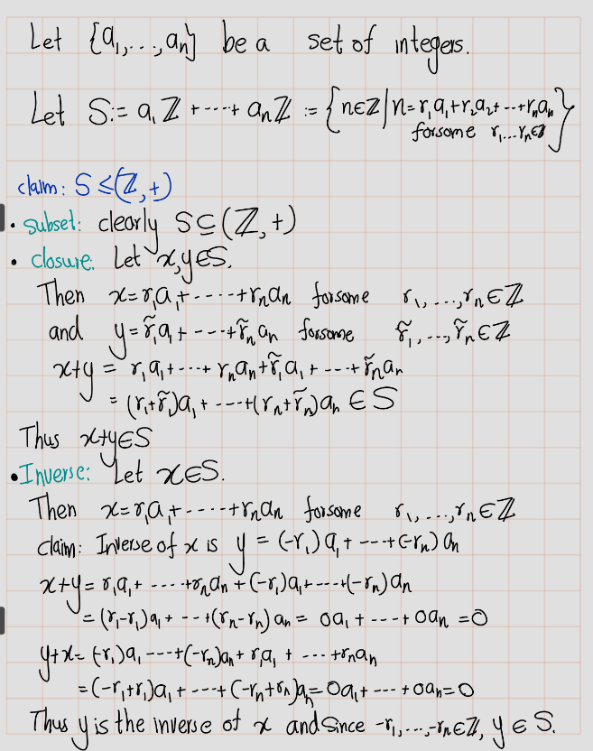 
```
```{r echo=FALSE}
   
```
b. 

```{r echo=FALSE}
  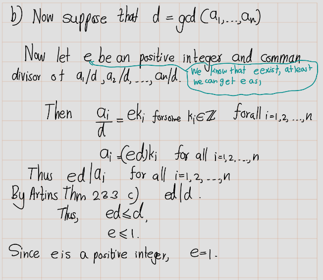 
```


### Cyclic group
```{exercise,name='Artin 2.4.1'}
Let $a$ and $b$ be elements of a group $G$. Assume that a has order $7$ and that $a^3b = ba^3$. 
Prove that $a b = ba$.
```
**Solution**:

```{r echo=FALSE,label='fig2-22'}
  knitr::include_graphics('figures/ch_2/fig22.png') 
```

```{exercise,name='Artin 2.4.2'}
An $n$th root of unity is a complex number $z$ such that $z^n = 1$.

(a) Prove that the nth roots of unity form a cyclic subgroup of $\mathbb{C}^\times$ of order $n$.
(b) Determine the product of all the $n$th roots of unity.
```
**Solution**:
```{r echo=FALSE,label='fig2-23'}
  knitr::include_graphics('figures/ch_2/fig23.png') 
```

```{r echo=FALSE,label='fig2-24'}
   
```

```{r echo=FALSE,label='fig2-25'}
   
```
```{r echo=FALSE,label='fig2-26'}
  knitr::include_graphics('figures/ch_2/fig26.png') 
```
```{r echo=FALSE,label='fig2-27'}
  knitr::include_graphics('figures/ch_2/fig27.png') 
```
```{r echo=FALSE,label='fig2-28'}
  knitr::include_graphics('figures/ch_2/fig28.png') 
```

```{exercise,,name='Artin 2.4.3'}
Let $a$ and $b$ be elements of a group $G$. Prove that $ab$ and $ba$ have the same order
```

```{proof}
Let \(a\) and \(b\) be elements in a group \(G\) with identity \(e\).

Suppose that \(ab\) has finite order \(n\). Then \((ab)^n = e\) and \(n\) is the smallest positive integer for which this equation is true. We also have that \[ (ba)^{n+1} = (ba)(ba) \cdots (ba) = b\underbrace{(ab) \cdots (ab)}_{n \text{ times}}a =b(ab)^na=a(ba)^m b =bea = ba. \]

Thus, since  \((ba)^{n+1} = (ba)^n(ba) \) we can conclude that \( (ba)^n(ba) = ba \) and then by the cancellation law, we have that $(ba)^n = e.$

Now, to show that the order of \(ba\) is \(n\), we need to demonstrate that \(n\) is the smallest positive integer such that \( (ba\)^n = e. \)

Suppose there exists a positive integer \(m < n\) such that \( (ba)^m = e. \)
Then,\[
(ab)^{m+1} =(ab)(ab)\cdots(ab)=a\underbrace{(ba)\cdots(ba)}_{m \text{ times}}b=a(ba)^m b=aeb= ab.
\]

Thus, since\((ab)^{m+1} =(ab)^m(ab) \)
we have that
$(ab)^m(ab)= ab$
and then by the cancellation law, we have that
$(ab)^m=e$
which contradicts the fact that \(n\) is the smallest positive integer such that
\((ab)^n=e.\)

Hence, \(n\) is the smallest positive integer such that
\((ba)^n=e\)
and therefore
\((ba)\) has finite order \(n\).
```


```{exercise,name='Artin 2.4.4'}
Describe all groups G that contain no proper subgroup
```

**Solution**:
```{r echo=FALSE}
  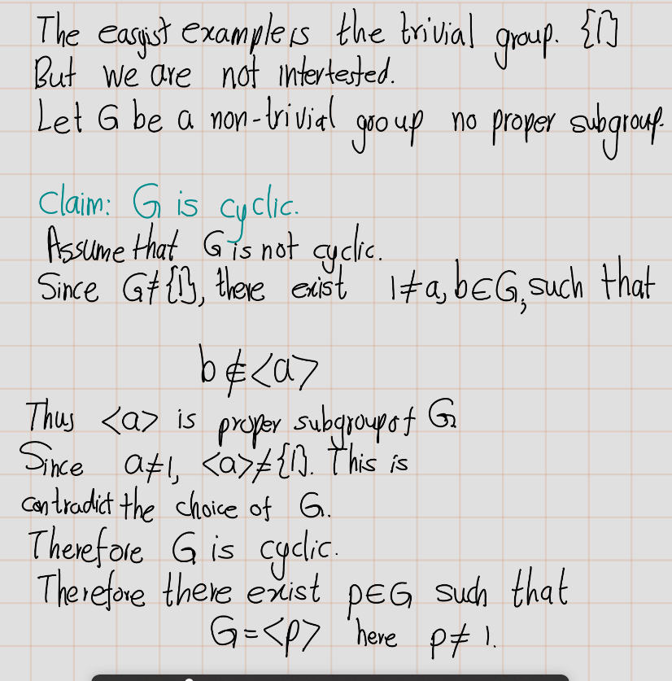 
```
```{r echo=FALSE}
  knitr::include_graphics('figures/ch_2/fig55.png') 
```
```{r echo=FALSE}
   
```
```{r echo=FALSE}
  knitr::include_graphics('figures/ch_2/fig57.png') 
```
```{r echo=FALSE}
  knitr::include_graphics('figures/ch_2/fig58.png') 
```

```{exercise,name='Artin 2.4.5'}
Prove that every subgroup of a cyclic group is cyclic. Do this by working with exponents, and use the description of the subgroups of $(\mathbb{Z},+)$.

```
```{r echo=FALSE}
  knitr::include_graphics('figures/ch_2/fig59.png') 
```
```{r echo=FALSE}
  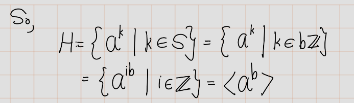 
```

```{exercise,name='Artin 2.4.6'}
(a) Let $G$ be a cyclic group of order 6. How many of its elements generate $G$?\
Answer the same question for cyclic groups of orders 5 and 8.
(a) Describe the number of elements that generate a cyclic group of arbitrary order $n$.
```

**Solution**:

a)

```{r echo=FALSE}
  knitr::include_graphics('figures/ch_2/fig61.png') 
```
```{r echo=FALSE}
  knitr::include_graphics('figures/ch_2/fig62.png') 
```
b)
```{r echo=FALSE}
  knitr::include_graphics('figures/ch_2/fig63.png') 
```

```{exercise,name='Artin 2.4.7'}
Let $x$ and $y$ be elements of a group $G$. Assume that each of the elements $x$, $y$, and $xy$ has order 2. Prove that the set $H = \{I, x, y, xy\}$ is a subgroup of $G$, and that it has order 4.
```
```{r echo=FALSE}
  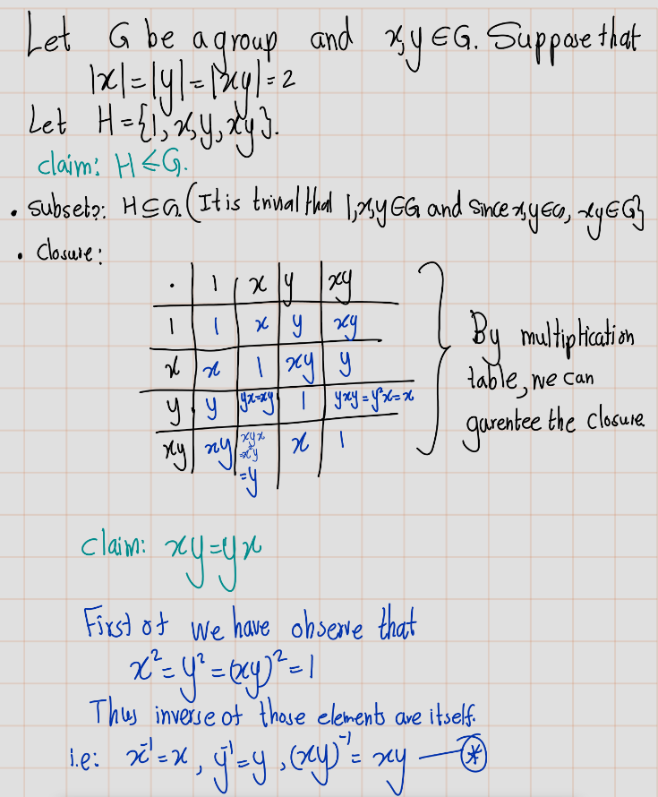 
```
```{r echo=FALSE}
  knitr::include_graphics('figures/ch_2/fig65.png') 
```
```{r echo=FALSE}
  knitr::include_graphics('figures/ch_2/fig66.png') 
```

```{exercise,name='Artin 2.4.8'}
a) Prove that the elementary matrices of the first and third types (1.2.4) generate $GL_n(\mathbb{R})$.
a) Prove that the elementary matrices of the first type generate $SL_n(K)$. Do the $2 \times 2$ case first.
```
Recall the types of elementary matrices,

```{r echo=FALSE}
   
```

```{exercise,name='Artin 2.4.9'}
 How many elements of order $2$ does the symmetric group $S_4$ contain?
```

```{r echo=FALSE}
   
```
```{r echo=FALSE}
  knitr::include_graphics('figures/ch_2/fig69.png') 
```
```{r echo=FALSE}
  knitr::include_graphics('figures/ch_2/fig70.png') 
```

```{exercise,name='Artin 2.4.10'}
Show by example that the product of elementsof finite order in a group need not have finite order. What if the group is abelian?
```

```{r echo=FALSE}
  knitr::include_graphics('figures/ch_2/fig71.png') 
```
```{r echo=FALSE}
  knitr::include_graphics('figures/ch_2/fig72.png') 
```


### Homomorphisms
```{exercise,name='Artin 2.5.1'}
Let $\varphi: G \rightarrow G'$ be a surjective homomorphism. Prove that if $G$ is cyclic, then $G'$ is cyclic, and if $G$ is abelian, then $G'$ is abelian.
```

```{r echo=FALSE}
   
```

```{exercise,name='Artin 2.5.2'}
Prove that the intersection $K \cap H$ ofsubgroupsof a group $G$ is a subgroup of $H$, and that if $K$ is a normal subgroup of $G$, then $K \cap H$ is a normal subgroup of $H$.
```

```{r echo=FALSE}
  knitr::include_graphics('figures/ch_2/fig74.png') 
```

```{exercise,name='Artin 2.5.3'}
Let $U$ denote the group of invertible upper triangular $2 \times 2$ matrices $A = \begin{bmatrix} a & b \\ 0 & d \end{bmatrix}$, and let $\varphi : U \rightarrow \mathbb{R}^{\times}$ be the map that sends $A$ to $a^2$. Prove that $\varphi$ is a homomorphism, and determine its kernel and image.
```

```{r echo=FALSE}
   
```
```{r echo=FALSE}
  knitr::include_graphics('figures/ch_2/fig76.png') 
```

```{exercise,name='Artin 2.5.4'}
Let $f: (\mathbb{R},+) \rightarrow (\mathbb{C},\times)$ be the map $f(x) = e^{ix}$. Prove that $f$ is a homomorphism, and determine its kernel and image.
```

```{r echo=FALSE}
   
```


```{exercise,name='Artin 2.5.5'}
Prove that the \(n \times n\) matrices that have the block form \(M = \begin{bmatrix} A & B \\ 0 & D \end{bmatrix}\), with \(A \in GL_r(\mathbb{R})\) and \(D \in GL_{n-r}(\mathbb{R})\), form a subgroup \(H\) of \(GL_n(\mathbb{R})\), and that the map \(H \rightarrow GL_r(\mathbb{R})\) that sends \(M \mapsto A\) is a homomorphism. What is its kernel?
```

```{exercise,name='Artin 2.5.6'}
Determine the center of \(GL_n (\mathbb{R})\).

*Hint:* You are asked to determine the invertible matrices \(A\) that commute with every invertible matrix \(B\). Do not test with a general matrix \(B\). Test with elementary matrices.
```

### Isomorphisms

```{exercise,name='Artin 2.6.1'}
Let \(G'\) be the group of real matrices of the form
\(\begin{bmatrix}1 & x \\ & 1\end{bmatrix}\)
Is the map \(\phi: (\mathbb{R},+) \rightarrow G'\) that sends \(x\) to this matrix an isomorphism?
```
```{r echo=FALSE}
  knitr::include_graphics('figures/ch_2/fig78.png') 
```

```{exercise,name='Artin 2.6.2'}
Describe all homomorphisms \(\phi : (\mathbb{Z},+) \rightarrow (\mathbb{Z},+)\). Determine which are injective, which are surjective, and which are isomorphisms.
```

```{r echo=FALSE}
  knitr::include_graphics('figures/ch_2/fig79.png') 
```

```{r echo=FALSE}
   
```

```{r echo=FALSE}
   
```

```{exercise,name='Artin 2.6.3'}
 Show that the functions \(f = \frac{1}{x}\), \(g = \frac{x - 1}{x}\) generate a group of functions, the law of composition being composition of functions, that is isomorphic to the symmetric group \(S_3\).
```

There are 6 elemenst in the $S_3$. 
Let G be the group that define in the question.
First find the all 6 elements group.
Let's do some rough works. 
\begin{eqnarray*}
    f(x)&=\frac{1}{x}\\\\
    g(x)&=&\frac{x - 1}{x}\\\\
    f\circ f(x)&=& \frac{1}{1/x}=x\\\\
    g\circ g (x) &=& \frac{((x-1)/x)-1}{(x-1)/x}=\frac{1}{x-1}\\\\
    f\circ g (x) &=& \frac{x}{x-1}\\\\
    g\circ f (x) &=& \frac{(1/x)-1}{(1/x)}=1-x
\end{eqnarray*}
Now let's define 
\[f_1=\frac{1}{x},~~f_2=\frac{x - 1}{x},~~ f_3=x,~~ f_4=\frac{1}{x-1},
~~ f_5=\frac{x}{x-1}, ~~ , f_6=1-x\].
Now let's construct multiplication table.

| $\circ$ | $f_1$ | $f_2$ | $f_3$ | $f_4$ | $f_5$ | $f_6$ |
|---------|-------|-------|-------|-------|-------|-------|
| $f_1$   | $f_3$ | $f_5$ | $f_1$ | $f_6$ | $f_2$ | $f_4$ |
| $f_2$   | $f_6$ | $f_4$ | $f_2$ | $f_3$ | $f_1$ | $f_5$ |
| $f_3$   | $f_1$ | $f_3$ | $f_3$ | $f_4$ | $f_5$ | $f_6$ |
| $f_4$   | $f_5$ | $f_3$ | $f_4$ | $f_2$ | $f_6$ | $f_1$ |
| $f_5$   | $f_4$ | $f_6$ | $f_5$ | $f_1$ | $f_3$ | $f_2$ |
| $f_6$   | $f_2$ | $f_1$ | $f_6$ | $f_5$ | $f_4$ | $f_3$ |

This table proves the closure property. 
According to the table $f_3$ is the identity. Further,
\begin{eqnarray*}
    \left(f_1\right)^{-1}&=&f_1\\
    \left(f_2\right)^{-1}&=&f_4\\
    \left(f_3\right)^{-1}&=&f_3\\
    \left(f_4\right)^{-1}&=&f_2\\
    \left(f_5\right)^{-1}&=&f_5\\
    \left(f_6\right)^{-1}&=&f_6\\
\end{eqnarray*}
The associativity property holds for the composition of rational functions are associative.
To see the isomorphism let's rearrange rows and columns in this table.

```{r echo=FALSE}
   
```
  
By looking at the table we can tell that $G\cong S_3$.
$G$ is isomorphic to $S_3$.

Let $\phi:G\to S_3$ ide defined by $\phi(f)=(23)$ and $\phi(g)=(132)$


```{exercise,name='Artin 2.6.4'}
Prove that in a group, the products \(ab\) and \(ba\) are conjugate elements.
```

```{r echo=FALSE}
   
```

```{exercise,name='Artin 2.6.5'}
Decide whether or not the two matrices \(A = \begin{bmatrix} 3 & 0 \\ 0 & 2 \end{bmatrix}\) and \(B = \begin{bmatrix} 1 & 1 \\ -2 & 4 \end{bmatrix}\) are conjugate elements of the general linear group \(GL_2(\mathbb{R})\).
```

```{r echo=FALSE}
   
```


```{r echo=FALSE}
  knitr::include_graphics('figures/ch_2/fig84.png') 
```

```{r echo=FALSE}
  knitr::include_graphics('figures/ch_2/fig85.png') 
```

```{r echo=FALSE}
  knitr::include_graphics('figures/ch_2/fig86.png') 
```

```{exercise,name='Artin 2.6.7'}
Let $H$ be a subgroup of $G$, and let $g$ be a fixed element of $G$. The conjugate subgroup $gHg^{-1}$ is defined to be the set of all conjugates $ghg^{-1}$, with $h$ in $H$. Prove that $gHg^{-1}$ is a subgroup of $G$.
```

```{r echo=FALSE}
   
```

```{exercise,name='Artin 2.6.8'}
Prove that the map $A \mapsto (A^{t})^{-1}$ is an automorphism of $GL_{n}(\mathbb{R})$.
```

```{r echo=FALSE}
  knitr::include_graphics('figures/ch_2/fig88.png') 
```

```{exercise,name='Artin 2.6.9'}
Prove that a group $G$ and its opposite group $G^{o}$ (Exercise 2.2.6) are isomorphic.
```

```{r echo=FALSE}
  knitr::include_graphics('figures/ch_2/fig89.png') 
```

```{exercise,name='Artin 2.6.10'}
Find all automorphisms of 

(a) a cyclic group of order 10, 
(b) the symmetric group $S_{3}$.
```

```{r echo=FALSE}
  knitr::include_graphics('figures/ch_2/fig90.png') 
```

```{exercise,name='Artin 2.6.11'}
Let $a$ be an element of a group $G$. Prove that if the set $\{1, a\}$ is a normal subgroup of $G$, then $a$ is in the center of $G$.
```

```{r echo=FALSE}
  knitr::include_graphics('figures/ch_2/fig91.png') 
```


### Equivalence Relations and Partitions

```{exercise,name='Artin 2.7.1'}
Let $G$ be a group. Prove that the relation $a \sim b$ if $b = gag^{-1}$ for some $g$ in $G$ is an equivalence relation on $G$.
```

```{r echo=FALSE}
   
```

```{r echo=FALSE}
  knitr::include_graphics('figures/ch_2/fig93.png') 
```

```{exercise,name='Artin 2.7.2'}
An equivalence relation on $S$ is determined by the subset $R$ of the set $S \times S$ consisting of those pairs $(a, b)$ such that $a \sim b$. Write the axioms for an equivalence relation in terms of the subset $R$.
```

```{r echo=FALSE}
   
```

```{exercise,name='Artin 2.7.3'}
With the notation of Exercise 2.7.2, is the intersection $R \cap R'$ of two equivalence relations $R$ and $R'$ an equivalence relation? Is the union?
```

```{r echo=FALSE}
  knitr::include_graphics('figures/ch_2/fig95.png') 
```

```{r echo=FALSE}
   
```

```{exercise,name='Artin 2.7.4'}
A relation $R$ on the set of real numbers can be thought of as a subset of the $(x, y)$-plane. With the notation of Exercise 7.2, explain the geometric meaning of the reflexive and symmetric properties.
```

```{r echo=FALSE}
  knitr::include_graphics('figures/ch_2/fig97.png') 
```

```{exercise,name='Artin 2.7.5'}
With the notation of Exercise 7.2, each of the following subsets $R$ of the $(x, y)$-plane defines a relation on the set $\mathbb{R}$ of real numbers. Determine which of the axioms (2.7.3) are satisfied: 
  
(a) the set $\{(s, s) | s \in \mathbb{R}\}$, 
(b) the empty set, 
(c) the locus $\{xy + 1 = 0\}$,
(d) the locus $\{x^2y - xy^2 - x + y = 0\}$.
```

```{r echo=FALSE}
  knitr::include_graphics('figures/ch_2/fig100.png') 
``` 

```{exercise,name='Artin 2.7.5'}
How many different equivalence relations can be defined on a set of five elements?
```

```{r echo=FALSE}
   
```

```{r echo=FALSE}
  knitr::include_graphics('figures/ch_2/fig99.png') 
```


### Cosets

```{exercise,name='Artin 2.8.1'}
Let $H$ be the cyclic subgroup of the alternating group $A_4$ generated by the permutation $(123)$. Exhibit the left and the right cosets of $H$ explicitly.
```

First let's see the elements in the $A_4$. 
There are $\frac{4!}{2}=\frac{1\times 2\times 3\times 4}{2}=\frac{24}{2}=12$ elements in the $A_4$.
$$    A_4 = \{id, (12)(34), (13)(24), (14)(23), (123), (132), (124), (142), (134), (143), (234), (243) \}$$
let $H=<(1 2 3)>=\{id, (1 2 3), (1 3 2) \}$
Let's find the left cosets, we apply the elements of $A_4$ to $H$,

- $id ~H = \{ id \cdot id, id \cdot (123), id \cdot (132)\} = \{ id, (123), (132) \}=H$
- $(12)(34)H = \{ (12)(34) \cdot id, (12)(34) \cdot (123), (12)(34) \cdot (132)\}=\{(12)(34),(2 4 3),(1 4 3)\}$
- $(13)(24)H = \{ (13)(24) \cdot id, (13)(24) \cdot (123), (13)(24) \cdot (132)\}= \{(13)(24),(142),(234)\}$
- $(14)(23)H = \{ (14)(23) \cdot id, (14)(23) \cdot (123), (14)(23) \cdot (132)\}=\{(14)(23),(134),(1 2 4)\}$
- $(123)H = \{ (123) \cdot id, (123) \cdot (123), (123) \cdot (132)\} =\{(123),(132),id\}=H$
- $(132)H = \{ (132) \cdot id, (132) \cdot (123), (132) \cdot (132)\} =\{(132),id,(123)\}= H$
- $(124)H = \{ (124) \cdot id, (124) \cdot (123), (124) \cdot (132)\}=\{(124),(14)(23),(134)\}$
- $(142)H = \{ (142) \cdot id, (142) \cdot (123), (142) \cdot (132)\}=\{(142),(234),(13)(24)\}$
- $(134)H = \{ (134) \cdot id, (134) \cdot (123), (134) \cdot (132)\}=\{(134),(124),(14)(23)\}$
- $(143)H = \{ (143) \cdot id, (143) \cdot (123), (143) \cdot (132)\}=\{(143),(12)(34),(243)\}$
- $(234)H = \{ (234) \cdot id, (234) \cdot (123), (234) \cdot (132)\}=\{(234),(13)(24),(142)\}$
- $(243)H = \{ (243) \cdot id, (243) \cdot (123), (243) \cdot (132)\}=\{(243),(143),(12)(34)\}$


As a summary,
\begin{eqnarray*}
    id~H&=&(123)H=(132)H=\{id,(123),(132)\}=H\\
    (12)(34)H&=&(243)H=(143)H=\{(12)(34),(243),(143)\}\\
    (13)(24)H&=&(142)H=(234)H=\{(13)(24),(142),(234)\}\\
    (14)(23)H&=&(134)H=(124)H=\{(14)(23),(134),(124)\}
\end{eqnarray*}
Futhur, $A_4=H\sqcup(12)(34)H\sqcup(13)(24)H\sqcup(14)(23)H$.
Similarly, 
\begin{eqnarray*}
    H~id&=&H(123)=H(132)=\{ id, (123), (132) \}=H\\
    H(12)(34)&=& H (134)= H(234)=\{(12)(34),(134),(234)\}\\
    H(13)(24)&=&H(243)=H(124)=\{(13)(24),(243),(124)\}\\
    H(14)(23)&=&H(142)=H(143)=\{(14)(23),(142),(143)\}
\end{eqnarray*}
$A_4=H\sqcup H(12)(34)\sqcup H (13)(24)\sqcup H(14)(23)$.\\\\
Further, note that $(12)(34)H\neq H(12)(34)$


```{exercise,name='Artin 2.8.2'}
In the additive group $\mathbb{R}^m$ of vectors, let $W$ be the set of solutions of a system of homogeneous linear equations $AX = 0$. Show that the set of solutions of an inhomogeneous system $AX = B$ is either empty, or else it is an (additive) coset of $W$.
```


**Solution (Method I)**:\
Let $W=\{\underline{x}\in\mathbb{R}^n:A\underline{x}=0\}$
 and $W'=\{\underline{x}\in\mathbb{R}^n:A\underline{x}=B\}$\\
\underline{Need to show}: Either $W'=\emptyset$ or $W'=\underline{v_0} +W$ for some $\underline{v_0}\in \mathbb{R}^n$\\
Suppose that $W'\neq \emptyset$.

Let $\underline{x_1}\in W'$, then $A\underline{x_1}=B$.
Now consider following $$\underline{x_1}+W=\{\underline{x_1}+\omega:\omega\in W\}$$
First of all, we are going to show that $\underline{x_1}+W \subseteq W'$.
Let $\underline{x_1}+\underline{\omega_1}\in \underline{x_1}+W$. Now consider
\[A(\underline{x_1}+\underline{\omega_1})=A(\underline{x_1})+A(\underline{\omega_1})=B+0=B\].
Thus, $\underline{x_1}+\underline{\omega_1}\in W'$. Therefore, $\underline{x_1}+W\subseteq W'$.\\
Now we need to show that reverse inclusion.
Let $\underline{y_1}\in W'$. Now let $\underline{\omega_2}=\underline{y_1}-\underline{x_1}$.Then 
$A(\underline{\omega_2})=A(\underline{y_1}-\underline{x_1})=A(\underline{y_1})-A(\underline{x_1})=B-B=0$. Hence $\underline{\omega_2}\in W$.
$$ \underline{x_1}+\underline{\omega_2}=\underline{x_1}+(\underline{y_1}-\underline{x_1}) =y \in  \underline{x_1}+W $$
Hence, $W'\subseteq \underline{x_1}+W$. Therefore, $W'=\underline{x_1}+W$.


```{exercise,name='Artin 2.8.4'}
Does a group of order $35$ contain an element of order $5$? of order $7$?
```
**Claim**: Let $G$ be a group with order $35$. $G$ contains elements of order  5 & 7.

```{proof}
(proof of the claim.)
Let $x \in G$. By Artin's book Corollary 2.8.10, $Ord(x)$ should be a divisor of $35$.
In other words, $Ord(x) \in \{1,5,7,35\}$.

- Case-I: Existence of group elements with order 5
We are going to use proof by contradiction method.
Assume that there is no any element with order 5.
	- Sub claim:
All non-identity elements have order 7.
If $e \neq p \in G$ with $Ord(p) = 35$ then $q = p^7$ has order 5 ($\because q^5 = (p^{7})^5 = p^35 = e$). 
This contradicts our hypothesis. Thus, in case-I all non-identity elements have order 7.
Let $h \in G$ with $Ord(h) = 7$. Now consider cyclic subgroup generated from $<h> = H$.
Then $|H| = 7$. Choose $e \neq g \not \in H$. 
Then by above subclaim $g$ has order 7.
Now consider left cosets $H, gH, g^2H, g^3H, g^4H, g^5H, g^6H$.
Note that those cosets are disjoint.
Because if cosets are disjoint then there exist elements such as,
$g^ah^n = g^bh^m$ for some $1 \leq a, b \leq 6$ and $1 \leq n, m \leq 6$. Then

\begin{eqnarray*}
    g^ah^n &=& g^bh^m \\
    g^{a-b} &=& h^{m-n} \\
\end{eqnarray*}


So, we can choose $r \in \mathbb{Z}^+$ such that $r(a-b) \equiv 1 \pmod{7}$.
Thus,

$$
g = g^{r(a-b)} = h^{r(m-n)} \in H
$$

This contradicts selection of $g$.
Thus, $H, gH, g^2H, g^3H, g^4H, g^5H, g^6H$ left cosets are disjoint.
Recall the counting formula


\begin{eqnarray*}
\text{(order of G)} &=& \text{(order of H)} \cdot \text{(number of cosets)} \\
|G| &=& |H| \cdot [G:H]
\end{eqnarray*}


But observe that $|G| = 35 \neq 49 = 7 \cdot 7 = |H| \cdot [G:H]$. 
This contradicts our first hypothesis. 
Thus $G$ contains an element of order 5.

- Case-II: Existence of group elements with order 7
This case is also similar to previous one. But I am going to do it.
Now assume that there is no any element with order 7. 
It is very similar to previous case we can prove that all non-identity elements have order 5.
Let $h \in G$ with order 5.  We can choose $g$ very similar to previous case.
Further we can consider left cosets $H, gH, g^2H, g^3H, g^4H$.
So, we can prove that above cosets are disjoint. Then again we use counting formula,
$|G| = 35 \neq 25 = 5 \cdot 5 = |H| \cdot [G:H]$. This is a contradiction.
Thus $G$ contains an element of order 7.

```


```{exercise,name='Artin 2.8.5'}
A finite group contains an element $x$ of order $10$ and also an element $y$ of order $6$. What can be said about the order of $G$?
```

Let $G$ b group, with $|G|<\infty$.
Let $x,y\in G$ with $|x|=10$ and $|y|=6$.
By Artin's book Corollary 2.8.10 , $|x|\biggr | |G|=10\biggr ||G|$ and $|y|\biggr |G|=6\biggr | |G|$. Hence, $$LCM(|x|,|y|)\biggr |G|=LCM(10,6)\biggr | |G|=30\biggr  | |G|$$.

```{exercise,name='Artin 2.8.6'}
Let $\phi: G \rightarrow G'$ be a group homomorphism. Suppose that $|G| = 18$, $|G'| = 15$, and that $\phi$ is not the trivial homomorphism. What is the order of the kernel?
```

Then possibilities for $Img(\phi)$ are as follows. We use Artin's Algbera book Corollary 2.8.13,
\begin{eqnarray*}
|img(\phi)| \biggr ||G|~~~~&\text{and}&~~~~|img(\phi)| \biggr | |G'|\\
|img(\phi)| \biggr |  18~~~~&\text{and}&~~~~|img(\phi)| \biggr | 15\\
|img(\phi)| =1,2,3,6,9 \text{ or } 18~~~~&\text{and}&~~~~|img(\phi)| = 1,3,5\text{ or }15.
\end{eqnarray*}
Thus, $|img(\phi)| =1,3$. But given that $\phi$ is not the trivial homomorphism.
Hence, $|img(\phi)| \neq 1$. Therefore, $|img(\phi)| =3$.\
Now let's find the order of the kernel. By Corollary 2.8.13,
\begin{eqnarray*}
    |G | &=& |\ker(\phi)| \cdot |im(\phi)|\\
    18 &=& |\ker(\phi)| \cdot 3\\
    |\ker(\phi)| &=& 6
\end{eqnarray*}

```{exercise,name='Artin 2.8.7'}
A group $G$ of order 22 contains elements $x$ and $y$, where $x \neq 1$ and $y$ is not a power of $x$. Prove that the subgroup generated by these elements is the whole group $G$.
```

```{proof}
Let $G$ of order 22 contains elements $x$ and $y$, where $x \neq 1$ and $y$ is not a power of $x$. Let $G'=<x,y>$.

_Need to show_: $|H|=22$.\
    By Largrage Therom, $|G'| \biggr | |G|=|G'| \biggr | 22$.
    So, $|H|=1,2,11,22$. Let's condier each and evrry cases.

- $|H|\neq 1$. Beacuse $1\neq x\in H$. So, $H$ can not be happen trivial group.
- $|H|\neq 2$. If $|H|=2$ then $y=1$ or $y=x$.  
        But both cases can not happen.So, $|H|\neq 2$. 
        Beacuse that contrduct that $y$ is not a power of $x$.
- $|H|\neq 11$. Beacuse if $|H|= 11$ and 11 is prime, then $H$ is cyclic. (By Corollary 2.8.11) Furthur, $H=<x>$. Then  $y$ is a power of $x$, but it can not happen. So, $|H|\neq 11$. 
- Therefore, $|H|=|<x,y>|=22$.
```

```{exercise,name='Artin 2.8.8'}
Let $G$ be a group of order $25$. Prove that $G$ has at least one subgroup of order $5$, and that if it contains only one subgroup of order $5$, then it is a cyclic group.
```

**Claim 1**: Let $G$ be a group of order 25.  Then $G$ has at least one subgroup of order 5.

```{proof}
Let $G$ be a group of order 25. Let $1 \neq x \in G$. 
By corollary 2.8.10, $|x|$ divides $|x| = |G'|$ which divides $25$.
So, $|x| = 5, 25$. Let's consider each and every case.

- If $|x| = 5$ then $H = <x>$.
Then $|H| = |<x>| = 5$ (By corollary 2.8.11), $G$ has at least one subgroup of order 5.
- Suppose that $|x| = 25$, let $y = x^5$.

*Subclaim*: $|y| = 5$.

$y^5 = (x^5)^5 = x^{25} = 1$.

Let $m \in \mathbb{Z}$ such that $y^m = 1$. 
Then $y^m = (x^5)^m = x^{5m}$. Then $25 \geq 5m \implies 5 \geq m$.
Thus, $|y| = 5$.

Hence $<y> = <x^5>$ is a subgroup of order 5.
```

**Claim 2** :If it contains only one subgroup of order 5, then it is a cyclic group.
```{proof}
Suppose that $G$ contains only one subgroup of order 5. 
Let's call that subgroup $G'$.
Let $y \not\in G'$ and $1 \neq y \in G$.
By corollary 2.8.10, $|y|$ divides $|G| = |y|$ which divides $25$.
So, $|y| = 5, 25$.

- If $|y| = 5$, then $|<y>| = 5$. 
But $G'$ is the only one subgroup of order 5. 
$G' = <y>$. But it contradicts the selection of $y$.
- If $|y| = 25$, then $|<y>| = 25$, so $<y> = G$. 
Therefore, $G = <x>$ is cyclic.  
```

```{exercise,name='Artin 2.8.9'}
Let $G$ be a finite group. Under what circumstances is the map $f: G \to G$ defined by $f(x) = x^2$ an automorphism of $G$?
```

- **Claim 1**: The map  $f:G\to G$ is a homomorphism if and only if G is abelian.

```{proof}
$f$ is a homomorphism if and only if for all $x, y \in G$, $f(xy) = f(x)f(y)$.
This is equivalent to for all $x, y \in G$, $(xy)^2 = (xy)(xy) = x^2y^2$.
This is equivalent to for all $x, y \in G$, $xyxy = xxyy$.
This is equivalent to for all $x, y \in G$, $xy = yx$.
This is equivalent to $G$ is abelian.
```

- **Claim 2**: $f$ is injective if and only if no element in $G$ has order $2$.
```{proof}
$f$ is injective if and only if $\ker(f) \neq \{1\}$.
This is equivalent to for all $x \in G$ with $1 \neq x$, $f(x) = x^2 \neq 1$.
This is equivalent to no element having order 2.
This is equivalent to all elements of $G$ having odd order (By following sub claim).

  - _Sub Claim 2.1_: Group $H$ has no element having order $2$ is if and only if all elements of H having odd order.
  

First let's prove the backward direction. 
We use proof of contradiction.
Assume the contrary. There are some elements of $H$ having even order.
So, $|x| = 2k$ for some $k \in \mathbb{Z}^+$.
Then $|x^k| = 2$ has order $2$. 
```

```{exercise,name='Artin 2.8.10'}
Prove that every subgroup of index $2$ is a normal subgroup, and show by example that a subgroup of index $3$ need not be normal.
```

```{proof}
Let $G$ be a group and let $H \leq G$ with $[G:H] = 2$.
So, $H$ has only two left cosets. 
Then left cosets are $H$ and $G \setminus H$ and the cosets partition $G$. 
Let $x \in G$.

- If $x \in H$, then $gH = H = Hg$. 
- If $x \notin H$, then $gH = G \setminus H$ and $Hg = G \setminus H$. Thus, $gH = Hg$.

Therefore, $G$ is a normal subgroup.
```
**Claim**: A subgroup of index 3 need not be normal.

**Example**: Consider $S_3 = \{id, (12), (13), (23), (123), (132)\}$ 
and $H = <(12)> = \{id, (12)\} \leq S_3$. Let's find the index using the counting formula


\begin{align*}
    |G| &= |H| \cdot [G:H] \\
    6 &= 2 \cdot [G:H] \\
    [G:H] &= 3
\end{align*}


Let's take $g = (13)$ and $h = (12)$, then $ghg^{-1} = (13)(12)(13) = (23)$.
But $(23) \notin H$, so $H$ is not a normal subgroup of $S_3$.
Therefore, we have proven that $H$ is not a normal subgroup of $S_3$.
Thus, $H$ is not a normal subgroup.

```{exercise,name='Artin 2.8.11'}
Let $G$ and $H$ be the following subgroups of $GL_2 (\mathbb{R})$:
\[ G =\left\{ \begin{bmatrix} x & y \\ 0 & 1 \end{bmatrix}\right\}, 
H = \left\{\begin{bmatrix} x & 0 \\ 0 & 1 \end{bmatrix}\right\}  \]
with $x$ and $y$ real and $x > 0$. An element of $G$ can be represented by a point in the right 
half plane. Make sketches showing the partitions of the half plane into left cosets and into 
right cosets of $H$.
```


```{exercise,name='Artin 2.8.12'}
Let $S$ be a subset of a group $G$ that contains the identity element 1, and such that the left cosets $aS$, with $a$ in $G$, partition $G$. Prove that $S$ is a subgroup of $G$.
```

```{proof}
Let $1 \in S \subseteq G$, and such that  $\Pi = \{aS : a \in G\}$, is a partition of $G$.
-_Subset_ : This is trivial.(Given in the problem in already.)
- _Identity_ : $1 \in S$.
- _Closure and Inversion_ : Let $x, y \in S$. Since $\Pi$ is part of $G$, there exists $g \in G$ such that $xy^{-1} \in gS$. So, $xy^{-1} = gr$ for some $r \in S$. Then $x = gry \in grS$ (since $y \in S$). Thus, $x \in S \cap grS$. This implies $S \cap grS \neq \emptyset$. But $\Pi$ is a partition of $G$. Thus, $S = grS$. Now observe that $gr \in gS$ (since $r \in S$) and $gr \in grS$. Hence $gr \in gS \cap grS$. Thus, $gS = grS$. Hence, $xy^{-1} = S = gS = grS$.

By the subgroup test, $S$ is a subgroup of $G$.

```

```{exercise,name='Artin2.8.13'}
Let $S$ be a set with a law of composition: A partition 
$\Pi_1 \cup \Pi_2 \cup \cdots$ of $S$ is compatible
with the law of composition if for all $i$ and $j$, 
the product 
\[\Pi_i \Pi_j =\{ xy: x\in \Pi_i , y\in  \Pi_j\}\]
set is contained in a single subset $\Pi_k$ 
of the partition.

a) The set $Z$ of integers can be partitioned into the three sets [Pos] , [Neg], [{0}]. Discuss  the extent to which the laws of composition $+$ and $\times$ are compatible with this  partition.
b) Describe all partitions of the integers that are compatible with the operation $+$
```


### Modular Arthmetic

```{exercise,name='Artin 2.9.2'}
What are the possible values of $a^2$ modulo 4? modulo 8?
```
**solution**:

- _In modulo 4_\
\begin{eqnarray*}
    \overline{0}^2&\equiv & 0 \pmod{4}\\
    \overline{1}^2&\equiv & 1 \pmod{4}\\
    \overline{2}^2&\equiv & 0 \pmod{4}\\
    \overline{3}^2&\equiv & 1 \pmod{4}\\
\end{eqnarray*}
The possible values of $a^2\pmod{4}$ are 0 and 1. 

- _In modulo 8_\
\begin{eqnarray*}
    \overline{0}^2&\equiv & 0 \pmod{8}\\
    \overline{1}^2&\equiv & 1 \pmod{8}\\
    \overline{2}^2&\equiv & 4 \pmod{8}\\
    \overline{3}^2&\equiv & 1 \pmod{8}\\
    \overline{4}^2&\equiv & 0 \pmod{8}\\
    \overline{5}^2&\equiv & 1 \pmod{8}\\
    \overline{6}^2&\equiv & 4 \pmod{8}\\
    \overline{7}^2&\equiv & 1 \pmod{8}\\
\end{eqnarray*}
The possible values of $a^2\pmod{8}$ are 0,1 and 4.


```{exercise,name='Artin 2.9.3'}
Prove that every integer $a$ is congruent to the sum of its decimal digits modulo 9.
```

```{proof}
Let $x\in \mathbb{Z}$. Now we can represent $x$ as follows

\[x=a_010^0+a_110^1+\cdots +a_n10^n=\sum_{i=0}^n a_{i}10^i\text{  forsome } n\in \mathbb{Z},\text{ and }a_i\in \{0,1,...,9\}\]
    
We need to show $x \equiv  \sum_{i=0}^na_i\pmod{9}$. So, now consider,

\begin{eqnarray}
x-\sum_{i=0}^n a_{i}&=&\sum_{i=0}^n a_{i}10^i-\sum_{i=0}^n a_{i}\\
&=& \sum_{i=0}^n (a_{i}10^i- a_{i})\\
&=& \sum_{i=0}^n a_{i}(10^i- 1)
\end{eqnarray}

By follwing calim we can get that,

\begin{eqnarray}
x-\sum_{i=0}^n a_i &\equiv & 0 \pmod{9}\\
x &\equiv & \sum_{i=0}^na_i\pmod{9}
\end{eqnarray}
```

\textbf{Claim}: $9|(10^k-1)$ for any $k\in \mathbb{N}$.


```{proof}
We use mathematical induction.\
_$k=1$_\
This case is trivial. Because $9|10-1$.\
_$k=n\in\mathbb{Z}$_\
Now asuume when $n=k, 9|(10^n-1)$.\
_$k=n+1$_
\[10^{n+1}-1 =10\cdot 10^{n}-1=9\cdot 10^n + (10^n - 1) \]
Thus $9\vert (10^{n+1}-1)$. \
Therefore,by mathematical induction, $9|(10^n-1)$ for any $n\in \mathbb{N}$.
```


```{exercise,name='Artin 2.9.4'}
Solve the congruence $2x \equiv 5$ modulo 9 and modulo 6.
```

```{r echo=FALSE}
   
```


```{exercise,name='Artin 2.9.5'}
Determine the integers $n$ for which the pair of congruences $2x - y \equiv 1$ and $4x + 3y \equiv 2$ modulo $n$ has a solution.
```

```{r echo=FALSE}
  knitr::include_graphics('figures/ch_2/fig103.jpg') 
```

```{r echo=FALSE}
  knitr::include_graphics('figures/ch_2/fig104.jpg') 
```


```{exercise,name='Artin 2.9.6'}
Prove the Chinese Remainder Theorem: Let $a, b, u, v$ be integers, and assume that the greatest common divisor of $a$ and $b$ is 1. Then there is an integer $x$ such that $x \equiv u$ modulo $a$ and $X \equiv v$ modulo $b$. \
Hint: Do the case $u = 0$ and $v = 1$ first.
```


```{exercise,name='Artin 2.9.7'}
Determine the order of each of the matrices $A=\begin{bmatrix}1 & 1 \\ 0 & 1\end{bmatrix}$ and $B=\begin{bmatrix}1 & 1 \\ 1 & 0\end{bmatrix}$ when the matrix entries are interpreted modulo 3.
```

```{r echo=FALSE}
   
```

### The Correspondence Theorem

```{exercise,name='Artin 2.10.1'}
Describe how to tell from the cycle decomposition whether a permutation is odd or even.
```

```{exercise,name='Artin 2.10.2'}
Let H and K be subgroups of a group G.

a)Prove that the intersection xH n yK of two cosets of H and K is either empty or else is a coset of the subgroup H n K.
b) Prove that if H and K have finite index in G then H n K also has finite index in G.
```

```{exercise,name='Artin 2.10.3'}
Let $G$ and $G'$ be cyclic groups of orders $12$ and $6$, generated by elements $x$ and $y$, respectively, and let $\phi : G \to G'$ be the map defined by $\phi(x^i) = y^i$. Exhibit the correspondence referred to in the Correspondence Theorem explicitly.
```

```{exercise,name='Artin 2.10.4'}
With the notation of the Correspondence Theorem, let $H$ and $H'$ be corresponding subgroups. Prove that \[[G : H] = [G' : H']\].
```

```{exercise,name='Artin 2.10.5'}
With reference to the homomorphism S4 -> S3 described in Example 2.5.13, determine the six subgroups of S4 that contain K.
```


<!------------------------------------------>

### Product Group


```{exercise}
Let $x$ be an element of order $r$ of a group $G$, and let $y$ be an element of $G'$ of order $s$. What is the order of $(x, y)$ in the product group $G \times G'$?
```

**Solution**: The order of $(x, y)$ in the product group $G \times G'$ is $lcm(r,s)$\
Let $n\in \mathbb{Z}^+$  such that \[(x,y)^n=(x^n,y^n)=(1_G,1_{G'}).\]
This implies, $x^n=1_G$ and $y^n=1_{G'}$. Since order of $x$ and $y$ are $r$ and $s$ respectively, 
\[r|n~~~\text{ and }~~~s|n\]
So, we know that the least positive integer such that above property holds is $lcm(r,s)$. Hence,The order of $(x, y)$ in the product group $G \times G'$ is $lcm(r,s)$.


```{exercise}
What does Proposition \@ref(prp:prp2114) tell us when, with the usual notation for the symmetric
group $S_3,K$ and $H$ are the subgroups $<y>$ and $<x>$?
```

Recall: $y^2=1$ and $x^3=1$. Then 
\[H=<x>=\{1,x,x^2\}~~~\text{ and }~~~ K=<y>=\{1,y\}\]
Let the multiplication map, $f:H\times K \to S_3$ defined by $f(h,k)=hk$. Then, 
$Im(f)=HK=\{hk:h\in <x>, k\in <y>\}=\{1,x,x^2,y,xy,x^2y\}$.

**Claim 1**: $f$ is injective.\
Observe that $H \cap K=\{1\}$. by \@ref(prp:prp2114) a) $f$ is injective.

**Claim 2**: $f$ is surjective.\
Observe that $S_3=HK=\{1,x,x^2,y,xy,x^2y\}$. Thus, $f$ is surjective.


**Claim 3** : $f$ is not homomorphism.\
\begin{eqnarray}
f((x,y)\cdot (x,1))&=& f(x^2,y^2)=f(x^2,1)=x^2\cdot 1=x^2\\
f(x,y)\cdot f(x,1)&=& (x\cdot y)\cdot (x\cdot 1)=(xy)\cdot x=y
\end{eqnarray}
Thus, $f$ is not a homomorphism.

```{exercise}
Prove that the product of two infinite cyclic groups is not infinite cyclic.
```


```{proof}

- **Claim 1** : Infinite cyclic groups are isomorphic to $Z$.\
Let $G$ be a infinte cyclic group and $<a>=G$.
We can define a function $f: \mathbb{Z} \rightarrow G$ by $f(n) = a^n$ for all integers $n$. We need to show that $f$ is an isomorphism, which means it is bijective.

    - **Subclaim 1.1** : $f$ is a hormorphism.\
\[f(n+m)=a^{n+m}=a^n \cdot a^m =f(n)\cdot f(m)\]
Thus, $f$ is a hormorphism.
    - **Subclaim 1.2** :$f$ is a injective\
Suppose that $f(n)=f(m)$
  \begin{eqnarray}
    f(n)&=&f(m)\\
    a^n &=& a^m \\
    n&=& m ~~(\text{Since order is infinite})
  \end{eqnarray}
  - **Subclaim 1.3** : $f$ is surjective.\
Let $x\in G=<a>$. Then, $x=a^k$ for some $k\in \mathbb{Z}$.  Then, observe that 
    \[f(k)=a^k=a \].
    Thus, $f$ is surjective. 

Therefore, $f$ is an isomorphism. Thus, the infinite cyclic groups are isomorphic to $\mathbb{Z}$. 


We can consider $\mathbb{Z}\times \mathbb{Z}$. Suppose that $(a, b)$ generate the product group. But then, we see that $(2a, b)$ cannot be obtained from adding $(a, b)$ to itself, which implies that  $\mathbb{Z}\times \mathbb{Z}$ is not infinite cyclic.
```


```{exercise}
In each of the following cases, determine whether or not $G$ is isomorphic to the product group $H \times K$.

(a) $G = \mathbb{R}^\times$, $H = \{\pm 1\}$, $K = \{$positive real numbers$\}$.

(b) $G = \{$invertible upper triangular $2 \times 2$ matrices$\}$, $H = \{$invertible diagonal matrices$\}$, $K = \{$upper triangular matrices with diagonal entries $1\}$.

(c) $G = e^x$, $H = \{$unit circle$\}$, $K = \{$positive real numbers$\}$.

```

**Solution**:

(a) Observe that $G=\mathbb{R}^\times=\mathbb{R}\setminus\{0\}$ is abelian.  Then $H,K \trianglelefteq G$. Further, observe that $H\cap K=\{1\}$ and $HK=\mathbb{R}^\times=G$. Thus, by proposition \@ref(prp:prp2114) $G \cong H \times K$.

(b) 
- **Claim b.1**: $K\trianglelefteq G$.\
Let $g = \begin{bmatrix}
a & b \\
& c
\end{bmatrix}$ be an arbitary matrix in $G$ and $k = \begin{bmatrix}
1 & d \\
& 1
\end{bmatrix}\in K$.
Then,
$$ g^{-1} = \begin{bmatrix}
a^{-1} & -ba^{-1}c^{-1} \\
& c^{-1}
\end{bmatrix}$$
Then
$$gkg^{-1} = \begin{bmatrix}
a & b \\
& c
\end{bmatrix}\begin{bmatrix}
1 & d \\
& 1
\end{bmatrix}\begin{bmatrix}
a^{-1} & -ba^{-1}c^{-1} \\
& c^{-1}
\end{bmatrix}$$
$$= \begin{bmatrix}
a & b \\
& c
\end{bmatrix}\begin{bmatrix}
a^{-1} & dc^{-1} - ba^{-1}c^{-1} \\
& c^{-1}
\end{bmatrix} = \begin{bmatrix}
1 & adc^{-1} \\
& 1
\end{bmatrix} \in K$$
Thus, $H\trianglelefteq G$.

- **Claim b.2** : $H=Z(G)$ ($H$ is in the center of $G$).
    
    - _subclaim b.2.1_ : $H \subseteq Z(G)$.\
    Let $h=\begin{bmatrix}
x & 0 \\
& x
\end{bmatrix} \in H$. Then,
\[B=\begin{bmatrix}
x & 0 \\
& x
\end{bmatrix}=x\begin{bmatrix}
1 &  \\
& 1
\end{bmatrix}=BI\]
Then observe that,  for any $A\in G$,
\[BA=(xI)A = xA = Ax = A(xI)=AB\]
    - _subclaim b.2.2_ : $H \supseteq Z(G)$.\
    Let $\begin{bmatrix}
p & q \\
r & s
\end{bmatrix}\in Z(G)$, then,

\begin{eqnarray}
\begin{bmatrix}
p & q \\
r & s
\end{bmatrix}\begin{bmatrix}
1 & 0 \\
0 & -1
\end{bmatrix} &=& \begin{bmatrix}
1 & 0 \\
0 & -1
\end{bmatrix}\begin{bmatrix}
p & q \\
r & s
\end{bmatrix}\\
\begin{bmatrix}
p & -q \\
r & -s
\end{bmatrix}&=& \begin{bmatrix}
p & q \\
-r & -s
\end{bmatrix}\\
\end{eqnarray}
This yields $-q = q$ and $r = -r$ which imply $q = r = 0$. Now considering,


\begin{eqnarray}
\begin{bmatrix}
p & 0 \\
0 & s
\end{bmatrix}\begin{bmatrix}
0 & 1 \\
1 & 0
\end{bmatrix} &=& \begin{bmatrix}
0 & 1 \\
1 & 0
\end{bmatrix}\begin{bmatrix}
p & 0 \\
0 & s
\end{bmatrix}\\
\begin{bmatrix}
0 & p \\
q & 0
\end{bmatrix}&=& \begin{bmatrix}
0 & q \\
p & 0
\end{bmatrix}\\
\end{eqnarray}
This implies that $a = d$ and since the matrix is invertible, $a\neq 0$. Thus, $H \supseteq Z(G)$.

Therefore, $H = Z(G)$. In other words, $H$ is in the center of $G$.


- **Claim b.2** : $H\trianglelefteq G$.\
Since, $H$ is in the center of $G$, then $H$ is normal. 

- **Claim b.3** : $H\cap K=\{I\}$.\
This is trivial.

- **Claim b.4** : $HK=G$
Clearly, $HK\subseteq G$. Conversly,
for any $g\in G$, $a\neq 0, b\neq 0$,
\[g=\begin{bmatrix}
a & b \\
& c
\end{bmatrix}=\begin{bmatrix}
a &  \\
& c
\end{bmatrix}\begin{bmatrix}
1 & a^{-1}b \\
& 1
\end{bmatrix}\in HK\]. 
Thus, $HK=G$.

Therefore, by proposition \@ref(prp:prp2114) $G\cong HK$


(c) Since $C^\times$ is abelian, then $H$ and $K$ are normal. And, $H \cap K = \left\lbrace 1 \right\rbrace$.


```{r echo=FALSE,label='fig2-3'}
  knitr::include_graphics('figures/ch_2/fig03.png') 

```

Consider $a + bi \in C^\times$. Then 
$$a + bi = \left(\frac{a}{\sqrt{a^2+b^2}} + \frac{b}{\sqrt{a^2+b^2}}i\right)\sqrt{a^2+b^2} \in HK$$
So, $HK = G$. So,  by proposition \@ref(prp:prp2114) $G \cong H \times K$.


```{exercise}
Let $G_1$ and $G_2$ be groups, and let $Z_i$ be the center of $G_i$. Prove that the center of the product group $G_1 \times G_2$ is $Z_1 \times Z_2$.
```

```{r echo=FALSE,label='fig2-4'}
  knitr::include_graphics('figures/ch_2/fig04.jpg') 

```

```{r echo=FALSE,label='fig2-5'}
  knitr::include_graphics('figures/ch_2/fig05.jpg') 

```

```{exercise}
Let $G$ be a group that contains normal subgroups of orders $3$ and $5$, respectively. Prove that $G$ contains an element of order $15$.
```

```{exercise}
Let $H$ be a subgroup of a group $G$, let $\phi:G \to H$ be a homomorphism whose restriction to $H$ is the identity map, and let $N$ be its kernel. What can one say about the product map $H \times N \to G$?
```


```{r echo=FALSE,label='fig2-6'}
  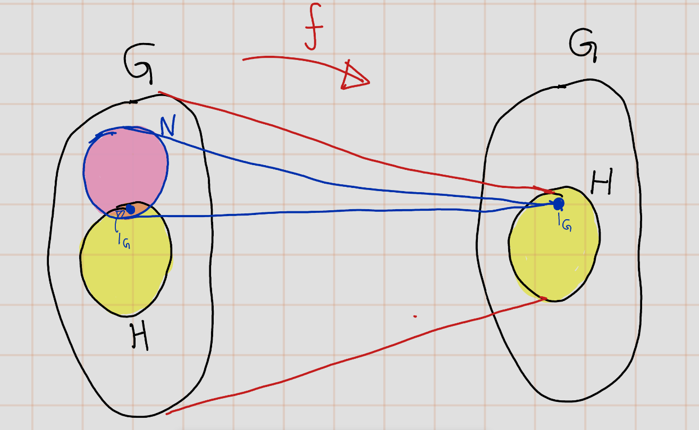 
```
```{r echo=FALSE,label='fig2-7'}
   
```
```{r echo=FALSE,label='fig2-9'}
  knitr::include_graphics('figures/ch_2/fig09.png') 
```
```{r echo=FALSE,label='fig2-8'}
  knitr::include_graphics('figures/ch_2/fig08.jpg') 
```

```{exercise}
Let $G$, $G'$, and $H$ be groups. Establish a bijective correspondence between homomorphisms $\phi : H \to G \times G'$ from $H$ to the product group and pairs $(\varphi, \varphi')$ consisting of a homomorphism $\varphi:H \to G$ and a homomorphism $\varphi':H \to G'$.
```
```{r echo=FALSE,label='fig2-10'}
  knitr::include_graphics('figures/ch_2/fig10.png') 
```

```{r echo=FALSE,label='fig2-11'}
  knitr::include_graphics('figures/ch_2/fig11.jpg') 
```
```{r echo=FALSE,label='fig2-12'}
  knitr::include_graphics('figures/ch_2/fig12.jpg') 
```
```{r echo=FALSE,label='fig2-13'}
  knitr::include_graphics('figures/ch_2/fig13.jpg') 
```
```{r echo=FALSE,label='fig2-14'}
   
```
```{r echo=FALSE,label='fig2-15'}
  knitr::include_graphics('figures/ch_2/fig15.jpg') 
```
```{r echo=FALSE,label='fig2-16'}
  knitr::include_graphics('figures/ch_2/fig16.jpg') 
```

```{exercise}
Let \(H\) and \(K\) be subgroups of a group \(G\). Prove that the product set \(HK\) is a subgroup of \(G\) if and only if \(HK = KH\).
```

**Solution** :

```{proof}
Let $G$ be group and $H,K\leq G$.

- $(\Longrightarrow)$: **Claim **: if $HK\leq G$ then $HK=KH$.\

  Suppose $HK\leq G$.
  - **sub claim**:
  Let $x\in KH$. Then $x=kh$ for some $h\in H$ and $k\in K$,
\[x=kh=1kh1=(1k)(h1)\in HK\]
(Since $1\in H$ and $1\in K$). Thus, $KH \subseteq HK$.\
  - **sub claim**: $KH \supseteq HK$.\
We can not use previous method.Because we still do not know $KH$ is sub group or not.\
Let $y\in HK$. Since  $HK\leq G$, $y^{-1}\in HK$. Then $y^{-1}=hk$ for some $h_0\in H$ and $k_0\in K$. \\
\[y=(y^{-1})^{-1}=(h_0k_0)^{-1}=k_0h_0\in KH\]
Thus, $KH \supseteq HK$.

Therefore, $KH=HK$.

- $(\Longleftarrow)$: **Claim **: If $HK=KH$ then  $HK\leq G$.\

Now suppose that $HK=KH$.Suppose that $HK=KH$ is empty. Then, $H,K$ is empty. Now we use sub group test.\
  - _Closure_: Let $x,y\in HK$. Then $x=h_1k_1$ and $y=h_2k_2$ for some $h_1,h_2\in H$ and $k_1,k_2\in K$.
\begin{eqnarray}
  xy&=&(h_1k_1)(h_2k_2)\\
  &=& h_1(k_1h_2)k_2) ~~(\text{By associavity property})\\
  &=& h_1(h_3k_3)k_2) ~\text{for some  }h_3\in H \text{ and } k_3\in K ~(\text{Since} KH=HK)\\
  &=& (h_1h_3)(k_3k_2)\in HK
\end{eqnarray}
  - _Inverse_: Let Let $x\in HK$. Then $x=h'k'$ for some $h'\in H$ and $k'\in K$.
  \[x^{-1}=(h'k')^{-1}=k'h'\in KH=HK\]
  Thus, $HK\leq G$. 
  
Therefore, the product set \(HK\) is a subgroup of \(G\) if and only if \(HK = KH\)
```


### Quotient Groups

```{exercise}
Show that if a subgroup $H$ of a group $G$ is not normal, there are left cosets $aH$ and $bH$ 
whose product is not a coset.
```

```{proof}
Suppose that $H \leq G$ but $H \not\trianglelefteq G$. We are going to use indirect proof. So, assume that  $(aH)(bH)$ is a coset for all $a,b\in G$. Then,
\[aHbH=abH\]
then for all $h_1,h_2,h_3\in H$, So,
\[ah_1bh_2=abh_3\]
\begin{eqnarray}
ah_1bh_2 &= & abh_3\\
a^{-1}(ah_1bh_2) &=& a^{-1}(abh_3)\\
(a^{-1}a)(h_1bh_2) &=& (a^{-1}a)(bh_3)\\
h_1bh_2 &=& bh_3\\
b^{-1}(h_1bh_2)h_2^{-1} &=& b^{-1}(bh_3)h_2^{-1}\\
b^{-1}h_1b(h_2h_2^{-1}) &=& (b^{-1}b)h_3h_2^{-1}\\
b^{-1}h_1b &=& h_3h_2^{-1}\in H\\
\end{eqnarray}
Thus, $b^{-1}h_1b\in H$. and since $b\in G$ and $h_1\in H$ is arbitary, $H$ is normal subgroup, which contradict the our hypothesis.  Thus, there exist left cosets $aH$ and $bH$ whose product is not a coset.
```

```{exercise}
In the general linear group \(GL_3(\mathbb{R})\), consider the subsets:

\[ H = \left\{ \begin{pmatrix} 1 & * & * \\ 0 & 1 & * \\ 0 & 0 & 1 \end{pmatrix} \mid * \text{ represents an arbitrary real number} \right\} \]

and

\[ K = \left\{ \begin{pmatrix} 1 & 0 & * \\ 0 & 1 & 0 \\ 0 & 0 & 1 \end{pmatrix} \mid * \text{ represents an arbitrary real number} \right\} \]

Show that \(H\) is a subgroup of \(GL_3\), that \(K\) is a normal subgroup of \(H\), and identify the quotient group \(H/K\). Determine the center of \(H\).
```
- **Claim 1**: $H \leq G$.\
Certainly! Let's prove that the subset \(H\) is a subgroup of the general linear group \(GL_3(\mathbb{R})\).

  - _Non-emptiness_: We start by showing that \(H\) is non-empty. The identity matrix \(\mathbf{I}_3\) belongs to \(H\) since it satisfies the conditions for \(H\):
\[ \mathbf{I}_3 = \begin{pmatrix} 1 & 0 & 0 \\ 0 & 1 & 0 \\ 0 & 0 & 1 \end{pmatrix} \]
Therefore, \(H\) is non-empty.

  - _Closure under matrix multiplication_: Let \(\mathbf{A}\) and \(\mathbf{B}\) be matrices in \(H\). We need to show that their product \(\mathbf{AB}\) is also in \(H\). Consider:
\[ \mathbf{A} = \begin{pmatrix} 1 & a & b \\ 0 & 1 & c \\ 0 & 0 & 1 \end{pmatrix} \quad \text{and} \quad \mathbf{B} = \begin{pmatrix} 1 & x & y \\ 0 & 1 & z \\ 0 & 0 & 1 \end{pmatrix} \]
The product \(\mathbf{AB}\) is:
\[ \mathbf{AB} = \begin{pmatrix} 1 & a+x & by+az+b \\ 0 & 1 & c+z \\ 0 & 0 & 1 \end{pmatrix} \]               `````
Since \(a+x\), \(y+az+b\), and \(c+z\) are arbitrary real numbers, \(\mathbf{AB}\) satisfies the conditions for \(H\). Hence, \(H\) is closed under matrix multiplication.

  - _Closure under taking inverses_: Let \(\mathbf{A}\) be a matrix in \(H\). We need to show that its inverse \(\mathbf{A}^{-1}\) is also in \(H\). The inverse of \(\mathbf{A}\) is:

\[ \mathbf{A}^{-1} = \begin{pmatrix} 1 & -a & ac-b \\ 0 & 1 & -c \\ 0 & 0 & 1 \end{pmatrix} \]
Again, since \(-a\), \(ac-b\), and \(-c\) are arbitrary real numbers, \(\mathbf{A}^{-1}\) satisfies the conditions for \(H\). Therefore, \(H\) is closed under taking inverses.
Hence, we have shown that \(H\) is a subgroup of \(GL_3(\mathbb{R})\).

- **Claim 2** : $K\leq H$.\
I am not going to prove that this case, because this is exhausting. This is very easy.

- **Claim 3** : $K$ is normal sub group of $H$.\
Let $A:=\begin{bmatrix} 1 & a & b \\0 & 1 & c\\ 0 & 0  & 1\end{bmatrix}\in H$ and $B:=\begin{bmatrix} 1 & 0 & d \\0 & 1 & 0\\ 0 & 0  & 1\end{bmatrix}\in K$, where $a,b,c,d\in \mathbb{R}$.
Then,

\begin{eqnarray}
ABA^{-1}& =& \begin{bmatrix} 1 & a & b \\0 & 1 & c\\ 0 & 0  & 1\end{bmatrix}
\begin{bmatrix} 1 & 0 & d \\0 & 1 & 0\\ 0 & 0  & 1\end{bmatrix}
\begin{bmatrix} 1 & -a & ac-b \\ 0 & 1 & -c \\ 0 & 0 & 1 \end{bmatrix} \\
&=&\begin{bmatrix} 1 & a & d+b \\0 & 1 & c\\ 0 & 0  & 1\end{bmatrix}
\begin{bmatrix} 1 & -a & ac-b \\ 0 & 1 & -c \\ 0 & 0 & 1 \end{bmatrix} \\ 
&=& \begin{bmatrix} 1 & 0 & d \\0 & 1 & 0\\ 0 & 0  & 1\end{bmatrix}\in K
\end{eqnarray}
Thus, $K$ is normal sub group of $H$.

- **Quotient group $H/K$** :\
Let $h_1,h_2\in H$ be such that 
\[h_1=\begin{bmatrix} 1 & a_1 & b_1 \\0 & 1 & c_1\\ 0 & 0  & 1\end{bmatrix} \text{ and } 
h_2=\begin{bmatrix} 1 & a_2 & b_2 \\0 & 1 & c_2\\ 0 & 0  & 1\end{bmatrix}.\]
Suppose that $h_1K=h_2K$. By Artin's book 2.85, $h_1^{-1}h_2\in K$.
\[h_1^{-1}h_2=
\begin{bmatrix} 1 & -a_1 & a_1c_1-b_1 \\0 & 1 & -c_1\\ 0 & 0  & 1\end{bmatrix}
\begin{bmatrix} 1 & a_2 & b_2 \\0 & 1 & c_2\\ 0 & 0  & 1\end{bmatrix}
=\begin{bmatrix} 1 & -a_1+a_2 & b_2-a_1c_2+a_1c_1-b_1 \\0 & 1 & -c_1+c_2\\ 0 & 0  & 1\end{bmatrix}\]
Since,

\begin{eqnarray}
h_1K=h_2K & \iff & h_1^{-1}h_2\in K\\
& \iff &  -a_1+a_2=0 \text{ and }-c_2-c_1\\
& \iff &  a_1=a_2\text{ and }c_1=c_2
\end{eqnarray} 

Thus,
\[H/K=\left\{hK\Biggr | \begin{bmatrix} 1 & a & 0 \\0 & 1 & c\\ 0 & 0  & 1\end{bmatrix}, a,c\in \mathbb{R}\right\}\]

- **Center of Group H**\
\[Z(H)=\left\{A\in H\biggr | AX=XA \text{ for all } X\in H\right\}\]
Let's find center. We need to find $a,b,c\in \mathbb{R}$ such that 
\begin{eqnarray}
\begin{bmatrix} 1 & a & b \\0 & 1 & c\\ 0 & 0  & 1\end{bmatrix}
\begin{bmatrix} 1 & x & y \\0 & 1 & z\\ 0 & 0  & 1\end{bmatrix}
&=&
\begin{bmatrix} 1 & x & y \\0 & 1 & z\\ 0 & 0  & 1\end{bmatrix}
\begin{bmatrix} 1 & a & b \\0 & 1 & c\\ 0 & 0  & 1\end{bmatrix}
\text{ for all } x,y,z\in \mathbb{R}\\
\begin{bmatrix} 1 & a+x & b+y+az \\0 & 1 & c+z\\ 0 & 0  & 1\end{bmatrix}
&=&
\begin{bmatrix} 1 & a+x & b+y+xc \\0 & 1 & c+z\\ 0 & 0  & 1\end{bmatrix}
\end{eqnarray}
By comparing $1 \times 3$ index, we need to find that $a,b,c\in \mathbb{R}$ $az=xc$ for all $x,y,z\mathbb{R}$. SO, the only possibility is $a=c=0$. Thus,
\[Z(H)=\left\{\begin{bmatrix} 1 & 0 & b \\0 & 1 & 0\\ 0 & 0  & 1\end{bmatrix}\Biggr | b\in \mathbb{R}\right\}\]

```{exercise}
Let \(P\) be a partition of a group \(G\) with the property that for any pair of elements \(A\), \(B\) of the partition, the product set \(AB\) is contained entirely within another element \(C\) of the partition. Let \(N\) be the element of \(P\) that contains 1. Prove that \(N\) is a normal subgroup of \(G\) and that \(P\) is the set of its cosets.
```

```{proof}
- **Claim 1**: The product set $NN=N$.\
Let $x\in N$, Then $x=x\cdot 1 \in NN$. Thus, $N \subseteq NN$. We know that the product set $NN$ is contained entirely within in an element of pratition, but $N$ is a partion. The only way this happen $N=NN$.

- **Claim 2**: $N \leq G$.\
  - _Subset_: It is very clear that $N \subseteq G$.
  - _Closure_: Let $x,y\in N$. Then $(xy)\in NN=N$. So, $N$ is closed under composition.
  - _Identity_: Given that $1\in N$.
  - _Inverse_: Let $x\in N$. We have to show that $x^{-1}$ is contained in $N$. We use proof by contardiction. So, Assume contary, $x^{-1}\in M$, $M$  is an elemenet of partion $P$ such that $N\neq M$. 

\[xx^{-1}\in NM, xx^{-1}=1 \in  N\]
So, we would have $NM \subseteq N$ (since the product set is contained entirely wiithin one of the sets of partition). On the other hand,
\[1x^{-1}\in NM, 1x^{-1}=x^{-1} \in N\]
So, $NM\subseteq N$a contradiction.

Therefore, conclude that our assumption that $x^{-1}\not\in N$ was wrong, that we must have $x^{-1}\in N$
  
- **Claim 3**: $N\trianglelefteq$\
Let $a\in G$ and $n\in N$. Let $a\in A$ and $a^{-1}\in B$, where $A,B\in P$.
\[ana^{-1}=ANB\],
But also, $1\in N$,
\[g\cdot 1 \cdot g ^{-1}=1\in ANB\]
Since P spilts into disjoint  subsets and the only one element of partion that containn $1$ is $N$.
\[ANB=N\]
and but also $gng^{-1}\in N$. Thefeore, $N$ is normal sub group.

-**Claim 4**:  P is the set of its cosets.\
Let $A$ be some element Of partition, and let $a \in A$.

Need to prove: $A=aN$
  
  - Subclaim 4.1: $A\subseteq aN$.\
Let $a\in A$. Let $b\in B$, where $B$ is elmenet of partion.
Then $b^{-l}b\in BA, \quad b^{-l} = 1 \in N$
So, $BA \subseteq N$. Specially,
\[b^{-1}a \in N\]
So there exists some $n \in  N$ such that
\[b^{-1}a = n \quad \iff \quad a =bn \quad \iff \quad b=an^{-1}\]
Since $N\leq G$. $n^{-1}\in N$. Thus, $b \in aN$, so $A \subset aN$.

  - Subcliam 4.2 : $A\supseteq aN$.\
      - subclaim 4.2.1: $AN \subseteq A$,

Note that  $a \in A$ and $1 \in N$, Thus,
\[a\cdot 1\in AN, \quad a\cdot 1=a\in A\]
Since, the product set is contained entirely in one element
partition.  Thus, $AN\subseteq A$ 
  
Now,
\[aN=\{an | n \in N\} \subseteq \{an : a\in A, n\in N\} = AN \subseteq  A \]
Thus, $ax \in A$, as required. Thus $aN\subseteq A$

Hence, we can conclude that $A =aN$.
```


```{exercise}
Let $H = \{\pm1, \pm i\}$ be the subgroup of $G = C^{\times}$ of fourth roots of unity. Describe the cosets of $H$ in $G$ explicitly. Is $G / H$ isomorphic to $G$?
  
```

```{r echo=FALSE,label='fig2-36'}
  knitr::include_graphics('figures/ch_2/fig36.png') 
```

```{r echo=FALSE,label='fig2-37'}
  knitr::include_graphics('figures/ch_2/fig37.png') 
```

```{r echo=FALSE,label='fig2-38'}
  knitr::include_graphics('figures/ch_2/fig38.png') 
```

```{r echo=FALSE,label='fig2-39'}
  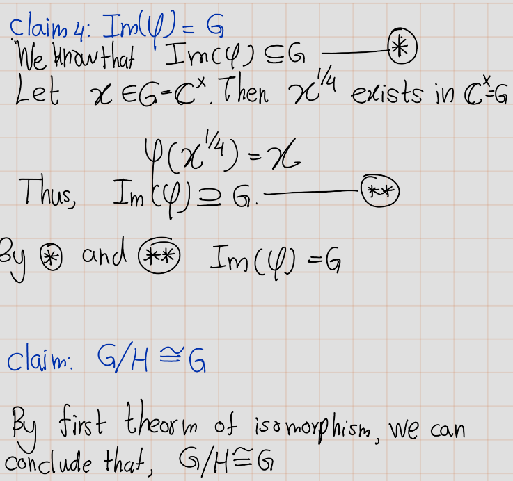 
```


```{exercise}
Let $G$ be the group of upper triangular real matrices $\begin{bmatrix} a & b \\ 0 & d \end{bmatrix}$ with $a$ and $d$ different from zero. For each of the following subsets, determine whether or not $S$ is a subgroup, and whether or not $S$ is a normal subgroup. If $S$ is a normal subgroup, identify the quotient group $G /S$.

1. $S$ is the subset defined by $b = 0$.
1. $S$ is the subset defined by $d = 1$.
1. $S$ is the subset defined by $a = d$.

```

```{r echo=FALSE,label='fig2-40'}
  knitr::include_graphics('figures/ch_2/fig40.png') 
```
```{r echo=FALSE,label='fig2-41'}
  knitr::include_graphics('figures/ch_2/fig41.png') 
```

```{r echo=FALSE,label='fig2-42'}
   
```

```{r echo=FALSE,label='fig2-43'}
  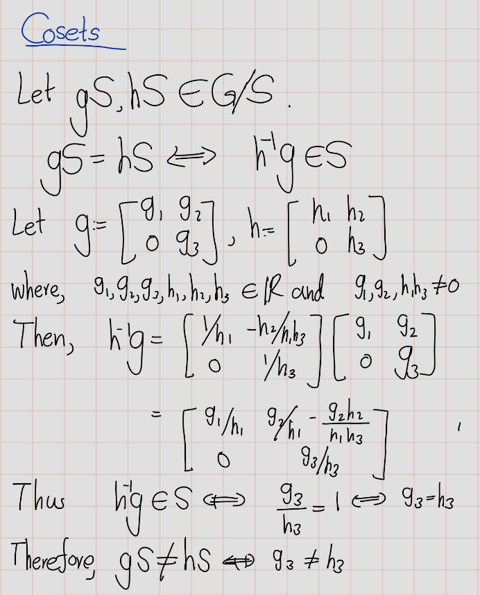 
```

```{r echo=FALSE,label='fig2-44'}
  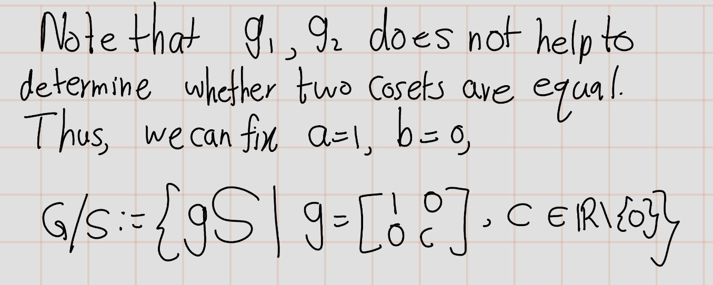 
```

```{r echo=FALSE,label='fig2-45'}
  knitr::include_graphics('figures/ch_2/fig45.png') 
```

```{r echo=FALSE,label='fig2-46'}
  knitr::include_graphics('figures/ch_2/fig46.png') 
```

### Miscellaneous Problems
```{exercise,name='M1'}
Describe the column vectors $(a, c)^T$ that occur as the first column of an integer matrix $A$ whose inverse is also an integer matrix.
```

```{r echo=FALSE,label='fig2-47'}
   
```

```{r echo=FALSE,label='fig2-48'}
  knitr::include_graphics('figures/ch_2/fig48.png') 
```

```{exercise,name='M.2'}
(a) Prove that every group of even order contains an element of order $2$.
(b) Prove that every group of order $21$ contains an element of order $3$.

```

**Claim a** : Let $G$ be a group whose identity is $e$.Let $G$ be of even order.Then,$\exists x \in G: |x| = 2$

```{proof}
(Claim a) In any group $G$, the identity element $e$ is self-inverse with the property that the identity is the only group element of order 1, and is the only such element.

That leaves an odd number of elements.

Each element in $x \in G: |x| > 2$ can be paired off with its inverse, as $|x^{-1}| = |x| > 2$  (Since order of a group element equals the order of its inverse.)

Hence there must be at least one element which has not been paired off with any of the others which is therefore self-inverse. Let's say it , $'y'$.

\begin{eqnarray}
y^{-1} =y &\iff & x\cdot y=e\\
&\iff & |y| =2 
\end{eqnarray}

Thus,  every group of even order contains an element of order $2$.
```

**Claim b**: Let $G$ be a group whose identity is $e$.Let $G$ be of order $21$.(|G=21|) Then,$\exists x \in G: |x| = 3$


```{exercise,name='Artin 2.M.9'}
(Double Cosets) Let $H$ and $K$ be subgroups of a group $G$, and let $g$ be an element of $G$. \\
The set $HgK = \{x \in G | x = hgk$ for some $h \in H, k \in K\}$ is called a double coset. \\
Do the double cosets partition $G$?
```
They partition G. The proof is similar to the proof that left cosets of one subgroup partition G.

On G, define the relation $\sim$ as
\[ a \sim b \text{ iff } b = hak; \text{ for some } h \in H, k \in K\]
Let's prove that this is an equivalence relation.
Let $a,b,c\in G$.
- Reflexive?: 
Let \(g \in G\). Then we can write
\[ g = 1g1\]
Moreover, \(1 \in H\) and \(1 \in K\), so \(g \sim g\).
Therefore, for every \(g \in G\) we have that \(g \sim g\). so $\sim$ is reflexive.

- Symmetric?: 
Suppose that \(a \sim b.\) Then \(b = hak,\) for some \(h \in H, k \in K.\) Multiplying by\(h^{-1}\) from the left and\(k^{-1}\) from the right we get
\[ a = h^{-1}ak^{-1}\]
Since\(H\) is a subgroup of\(G,h^{-1} \in H.\) Similarly,\(k^{-1} \in K.\) Thus,\(b \sim a.\)
So, for every\(a,b \in G\) such that \(a \sim b\implies b \sim a,\). Thus, $\sim$ is symmetric.

- Transitive?:
Suppose that \(a \sim b\) and \(b \sim c\).Then\(b = hak\)for some\(h \in H,k \in K\),and \(c=h'b'k'\) for some \(h' \in H,k' \in K\).Therefore,
\[c=h'hbk'=hhakkk'= (hh')a(kk')\]
Thus, $a\sim b$ and $b\sim c$ then $a\sim c$. Therefore $\sim$ is transitive.

By Artin's book Proposition 2.7.4, double cosets partition G?

```{exercise,name='Artin 2.M.10'}
Let $H$ be a subgroup of a group $G$. Show that the double cosets (see Exercise M.9))
\[HgH = \{h_1gh_2 | h_1, h_2 \in H\}\] 
are the left cosets $gH$ if and only if $H$ is normal.
```

```{proof}
- $(\implies)$: Suppose that $gH=HgH$. Let $g\in G$ and $h\in H$.
$ghg^{-1}\in H?$.
```

### Problem
