# Tempoarray files for exercises

## Chapter 3

### Fields

```{exercise,name='Artin 3.1.1'}
Prove that the numbers of the form $a + b\sqrt(2)$,where a and b are rational numbers, form a subfield of $\mathbb{C}$
```

```{r echo=FALSE}
  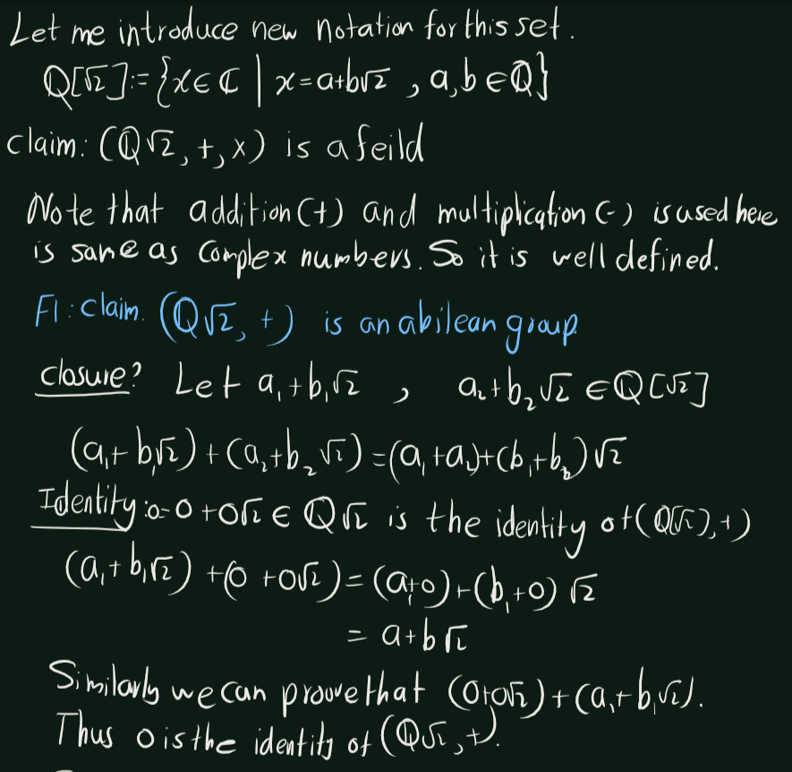 
```
```{r echo=FALSE}
  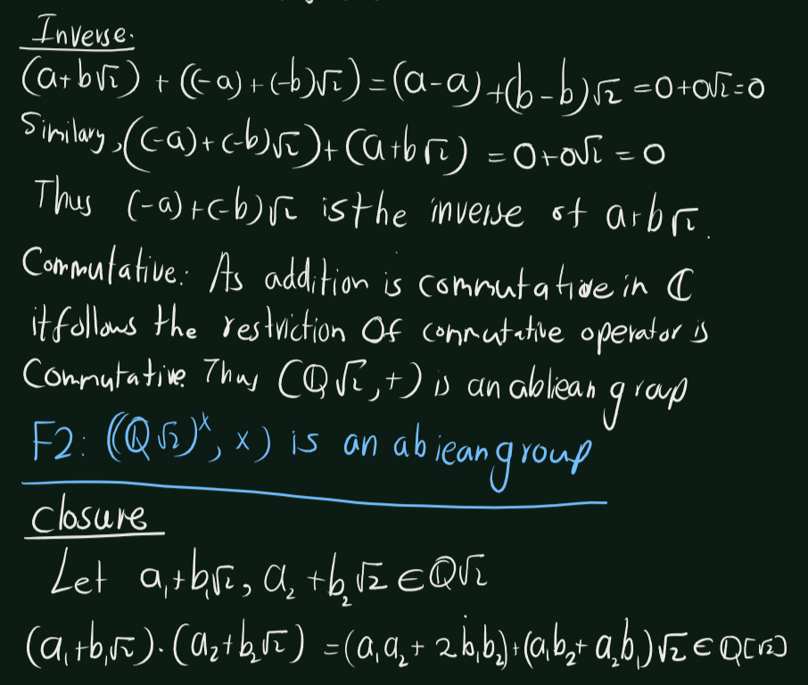 
```
```{r echo=FALSE}
  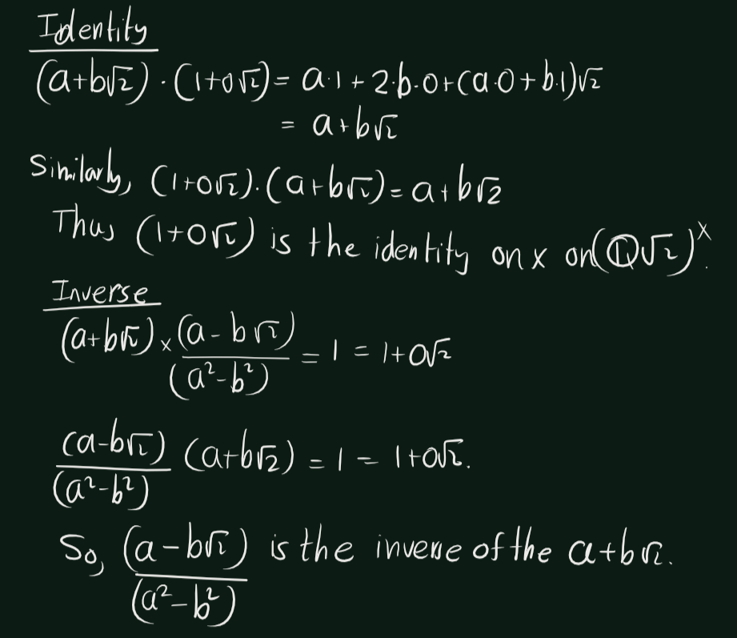 
```
```{r echo=FALSE}
  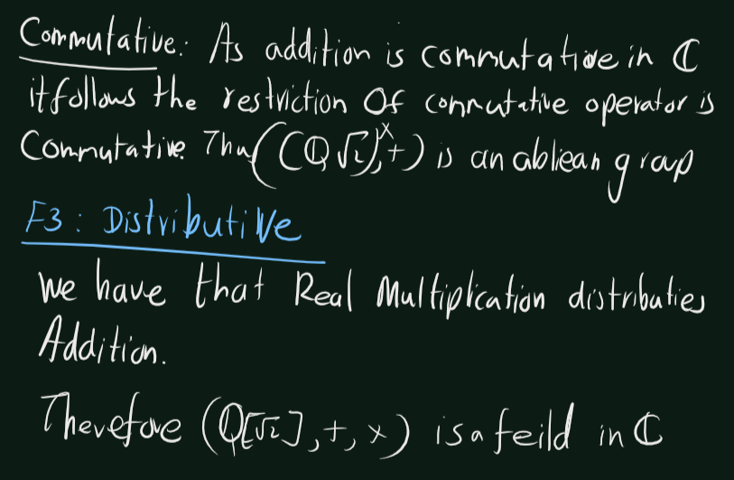 
```

```{exercise,name='Artin 3.1.2'}
Find the inverse of $5$ modulo $p$, for $p= 7, 11, 13,$ and $17$.
```

```{r echo=FALSE}
  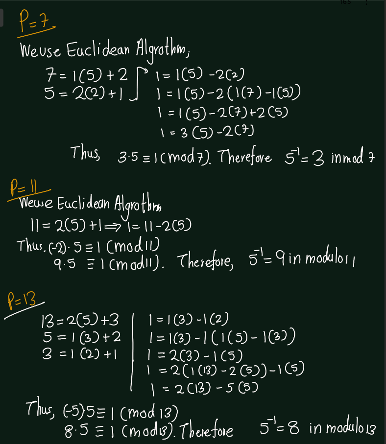 
```
```{r echo=FALSE}
   
```

```{exercise,name='Artin 3.1.3'}
Compute the product polynomial $(x^3 + 3x^2 + 3x + 1)(x^4 + 4x^3 + 6x^2 + 4x + 1)$ when the coefficients are regarded as elements of the field $\mathbb{F}_7$. Explain your answer.
```

```{r echo=FALSE}
  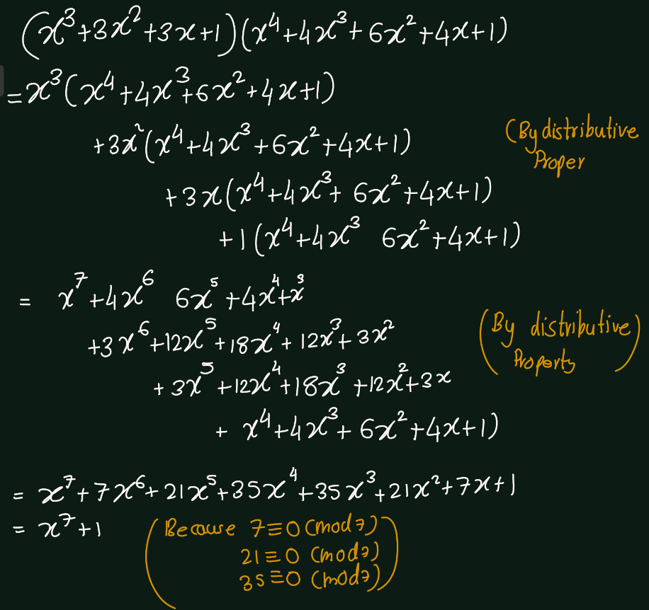 
```

```{exercise,name='Artin 3.1.4'}
Consider the system of linear equations 
\[\begin{bmatrix}6 & -3\\ 2 & 6\end{bmatrix}
\begin{bmatrix}x_1\\ x_2\end{bmatrix}
=\begin{bmatrix}3\\ 1\end{bmatrix}\]

a. Solve the system in $\mathbb{F}_p$ when $p = 5, 11,$ and $17$.
b. Determine the number of solutions when $p = 7$.
```

```{r echo=FALSE}
  knitr::include_graphics('figures/ch_3/ex-1.4-1.png') 
```

```{r echo=FALSE}
  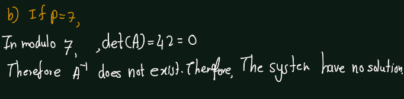 
```


```{exercise,name='Artin 3.1.5'}
Determine the primes $p$ such that the 
\[A =\begin{bmatrix} 1 & 2 & 0 \\ 0 & 3 & -1 \\ -2 & 0 & 2 \end{bmatrix}\]
is invertible, when its entries are considered to be in $\mathbb{F}_p$.
```

```{r echo=FALSE}
  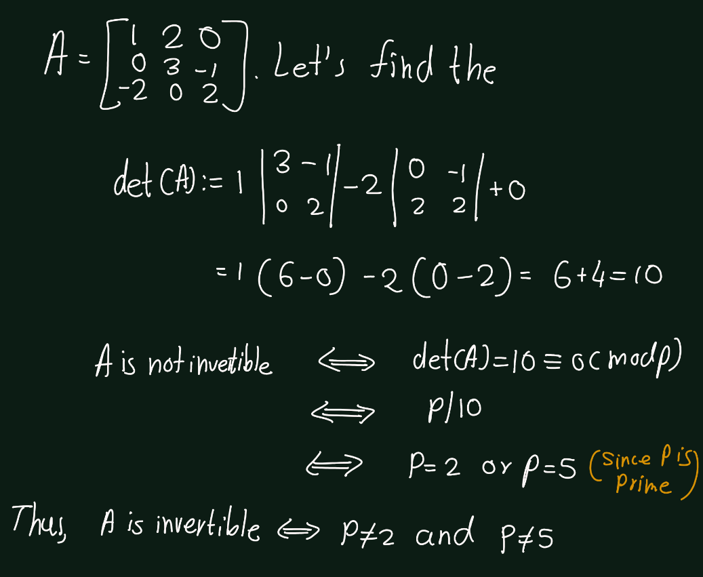 
```

```{exercise,name='Artin 3.1.5'}
Solve completely the systems of linear equations $AX = 0$ and $AX = B$, where
$$
A = \begin{bmatrix} 1 & 1 & 0 \\ 1 & 0 & 1 \\ 1 & -1 & -1 \end{bmatrix} \quad \text{and} \quad B = \begin{bmatrix} 1 \\ -1 \\ 1 \end{bmatrix}
$$

(a) in $\mathbb{Q}$, 
(b) in $\mathbb{F}_2$, 
(c) in $\mathbb{F}_3$, 
(d) in $\mathbb{F}_7$

```

```{r echo=FALSE}
  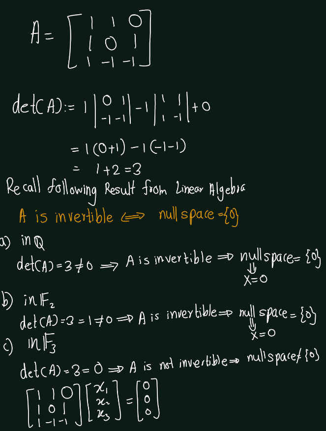 
```
```{r echo=FALSE}
  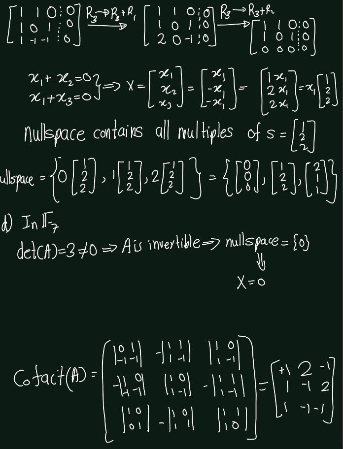 
```
```{r echo=FALSE}
  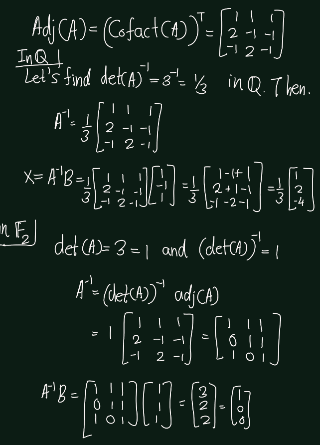 
```
```{r echo=FALSE}
  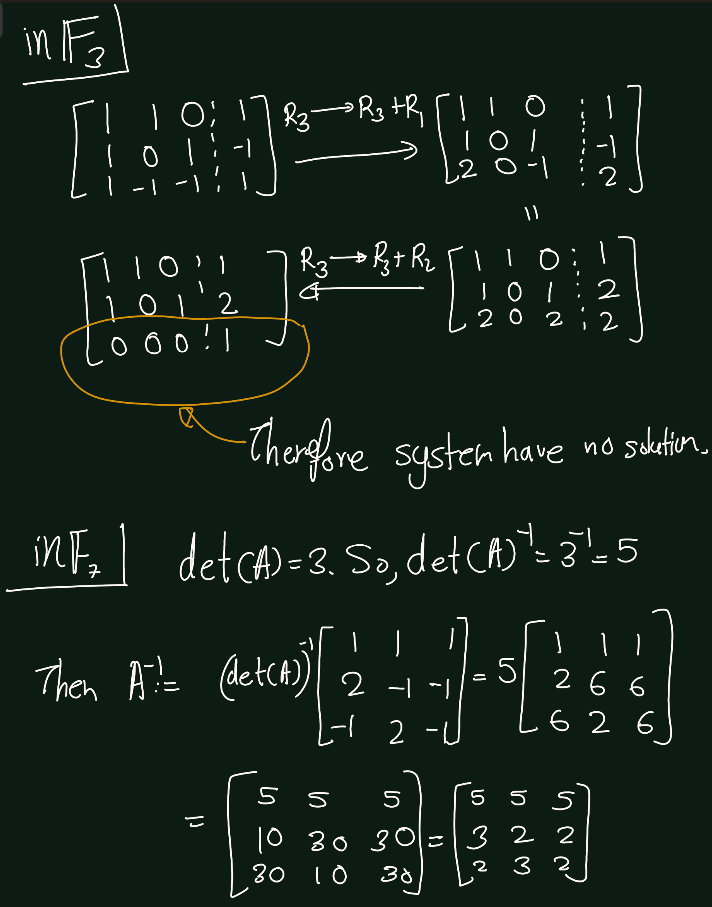 
```
```{r echo=FALSE}
  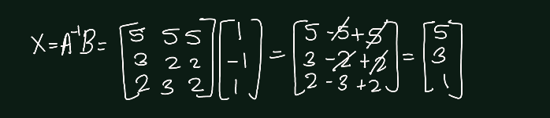 
```

```{exercise,name='Artin 3.1.7'}
By finding primitive elements, verify that the multiplicative group $\mathbb{F}_P^\times$;is cyclic for all primes $p < 20$.
```

```{r echo=FALSE}
  knitr::include_graphics('figures/ch_2/fig100.png') 
```

```{exercise,name='Artin 3.1.8'}
Let $p$ be a prime integer.
(a) Prove Fermat's Theorem: For every integer $a$, $a^p \equiv a modulo p$.
(b) Prove Wilson's Theorem: $(p -1)!\equiv -1(modulo p)$.
```
```{r echo=FALSE}
  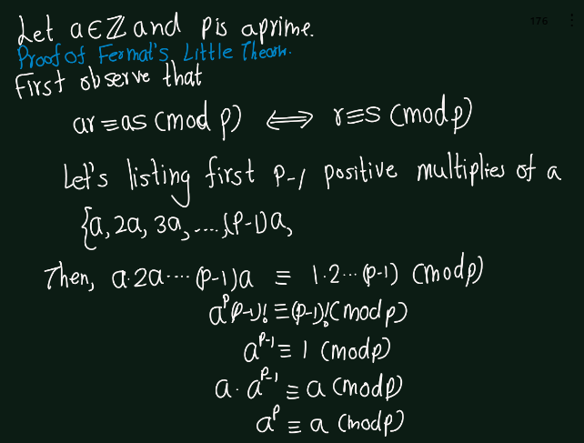 
```
```{r echo=FALSE}
  knitr::include_graphics('figures/ch_3/ex-1.8-2.png') 
```

```{exercise,name='Artin 3.1.9'}
Determine the orders of the matrices 
$\begin{bmatrix} 1 & 1 \\ 0 & 1 \end{bmatrix}$ 
and 
$\begin{bmatrix} 2 & 0 \\ 0 & 1 \end{bmatrix}$
in the group $GL_2(\mathbb{F}_7)$.
```

```{r echo=FALSE}
  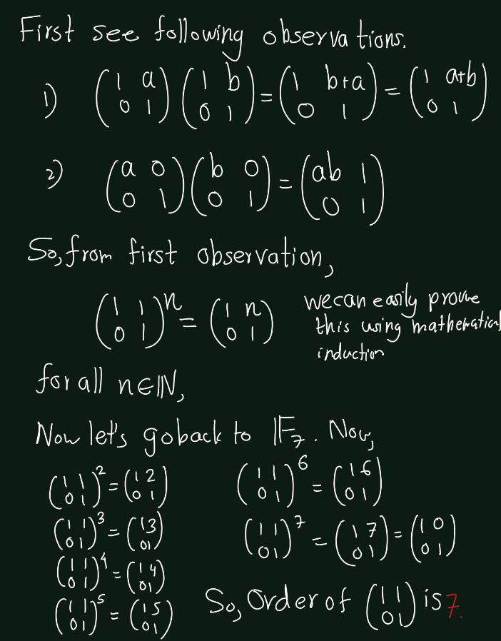 
```
```{r echo=FALSE}
  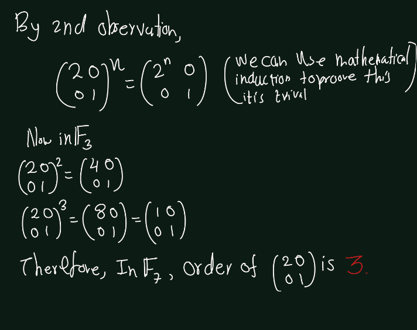 
```

```{exercise,name='Artin 3.1.10'}
Interpreting matrix entries in the field $\mathbb{F}_2$, prove that the four matrices
\begin{align*}
\begin{bmatrix} 0 & 0 \\ 0 & 0 \end{bmatrix}, 
\begin{bmatrix} 1 & 0 \\ 0 & 1 \end{bmatrix}, 
\begin{bmatrix} 1 & 1 \\ 1 & 0 \end{bmatrix}, 
\begin{bmatrix} 0 & 1 \\ 1 & 1 \end{bmatrix}
\end{align*}
form a field.

Hint: You can cut the work down by using the fact that various laws are known to hold for addition and multiplication of matrices.
```
First Observe followings

- **Addition**: 

| $+$ | $\begin{bmatrix} 0 & 0 \\ 0 & 0 \end{bmatrix}$ | $\begin{bmatrix} 1 & 0 \\ 0 & 1 \end{bmatrix}$ | $\begin{bmatrix} 1 & 1 \\ 1 & 0 \end{bmatrix}$ | $\begin{bmatrix} 0 & 1 \\ 1 & 1 \end{bmatrix}$ |
|---|---|---|---|---|
| $\begin{bmatrix} 0 & 0 \\ 0 & 0 \end{bmatrix}$ | $\begin{bmatrix} 0 & 0 \\ 0 & 0 \end{bmatrix}$ | $\begin{bmatrix} 1 & 0 \\ 0 & 1 \end{bmatrix}$ | $\begin{bmatrix} 1 & 1 \\ 1 & 0 \end{bmatrix}$ | $\begin{bmatrix} 0 & 1 \\ 1 & 1 \end{bmatrix}$ |
| $\begin{bmatrix} 1 & 0 \\ 0 & 1 \end{bmatrix}$ | $\begin{bmatrix} 1 & 0 \\ 0 & 1 \end{bmatrix}$ | $\begin{bmatrix} 0 & 0 \\ 0 & 0 \end{bmatrix}$ | $\begin{bmatrix} 0 & 1 \\ 1 & 1 \end{bmatrix}$ | $\begin{bmatrix} 1 & 1 \\ 1 & 0 \end{bmatrix}$ |
| $\begin{bmatrix} 1 & 1 \\ 1 & 0 \end{bmatrix}$ | $\begin{bmatrix} 1 & 1 \\ 1 & 0 \end{bmatrix}$ | $\begin{bmatrix} 0 & 1 \\ 1 & 1 \end{bmatrix}$ | $\begin{bmatrix} 0 & 0 \\ 0 & 0 \end{bmatrix}$ | $\begin{bmatrix} 1 & 0 \\ 0 & 1 \end{bmatrix}$ |
| $\begin{bmatrix} 0 & 1 \\ 1 & 1 \end{bmatrix}$ | $\begin{bmatrix} 0 & 1 \\ 1 & 1 \end{bmatrix}$ | $\begin{bmatrix} 1 & 1 \\ 1 & 0 \end{bmatrix}$ | $\begin{bmatrix} 1 & 0 \\ 0 & 1 \end{bmatrix}$ | $\begin{bmatrix} 0 & 0 \\ 0 & 0 \end{bmatrix}$ |1 & 0 \end{bmatrix}$| $\begin{bmatrix} 0 & 1 \\ 1 & 1 \end{bmatrix}$|


 - _Closure ?_: By above table we can verify Closure.
 - _Identity ?_: Identity element is $\begin{bmatrix} 0 & 0 \\ 0 & 0 \end{bmatrix}$.
 - _Inverse ?_ : Inverse of each  elements is itself.(We can verify it from  the above table.)
 - _Associativity ?_: Associativity property we can get from the matrix addition.
 - _Commutative ?_: We can verify communicativeness of addition from   the above table.

Thus, it makes abelian group under $+$.

- **Multiplication**:

| $*$ | $\begin{bmatrix} 1 & 0 \\ 0 & 1 \end{bmatrix}$ | $\begin{bmatrix} 1 & 1 \\ 1 & 0 \end{bmatrix}$ | $\begin{bmatrix} 0 & 1 \\ 1 & 1 \end{bmatrix}$ |
|---|---|---|---|---|
| $\begin{bmatrix} 1 & 0 \\ 0 & 1 \end{bmatrix}$ | $\begin{bmatrix} 1 & 0 \\ 0 & 1 \end{bmatrix}$ | $\begin{bmatrix} 1 & 1 \\ 1 & 0 \end{bmatrix}$ | $\begin{bmatrix} 0 & 1 \\ 1 & 1 \end{bmatrix}$ |
| $\begin{bmatrix} 1 & 0 \\ 0 & 1 \end{bmatrix}$ |  $\begin{bmatrix} 1 & 0 \\ 0 & 1 \end{bmatrix}$ | $\begin{bmatrix} 1 & 0 \\ 0 & 1 \end{bmatrix}$ | $\begin{bmatrix} 1 & 0 \\ 0 & 1 \end{bmatrix}$ |
| $\begin{bmatrix} 0 & 1 \\ 1 & 1 \end{bmatrix}$ | $\begin{bmatrix} 0 & 1 \\ 1 & 1 \end{bmatrix}$ | $\begin{bmatrix} 1 & 1 \\ 1 & 0 \end{bmatrix}$ | $\begin{bmatrix} 0 & 1 \\ 1 & 1 \end{bmatrix}$ |


  - _Closure ?_: By above table we can verify Closure.
  - _Identity ?_: Identity element is $\begin{bmatrix} 0 & 1 \\ 1 & 0 \end{bmatrix}$.
  - _Inverse ?_ : Inverse of each  elements is itself.(We can verify it from  the above table.)
  - _Associativity ?_: Associativity property we can get from the matrix multiplication
  - _Commutative ?_: We can verify communicativeness of addition from   the above table.

Thus, the set of non-zero elements of given set is an abelian group.

**Distributive property**: Multiplications is distributive over addition.

Thus, The given set  forms a field.

```{exercise,name='Artin 3.1.9'}
Prove that the set of symbols $\{a + bi \mid a, b \in \mathbb{F}_3\}$ forms a field with nine elements, if the laws of composition are made to mimic addition and multiplication of complex numbers. Will the same method work for $\mathbb{F}_5$? For $\mathbb{F}_7$? Explain.
```

```{r echo=FALSE}
  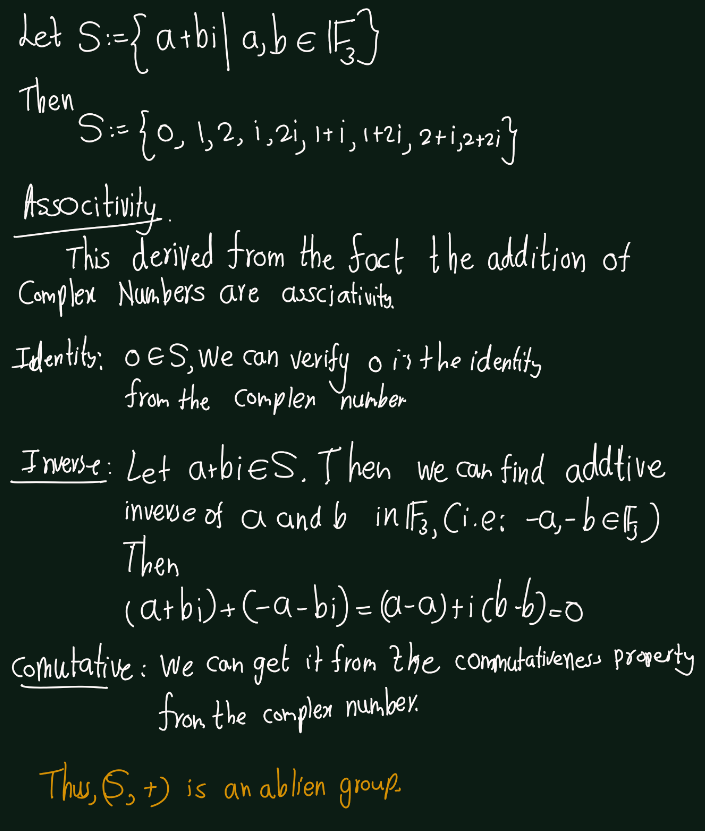 
```
```{r echo=FALSE}
  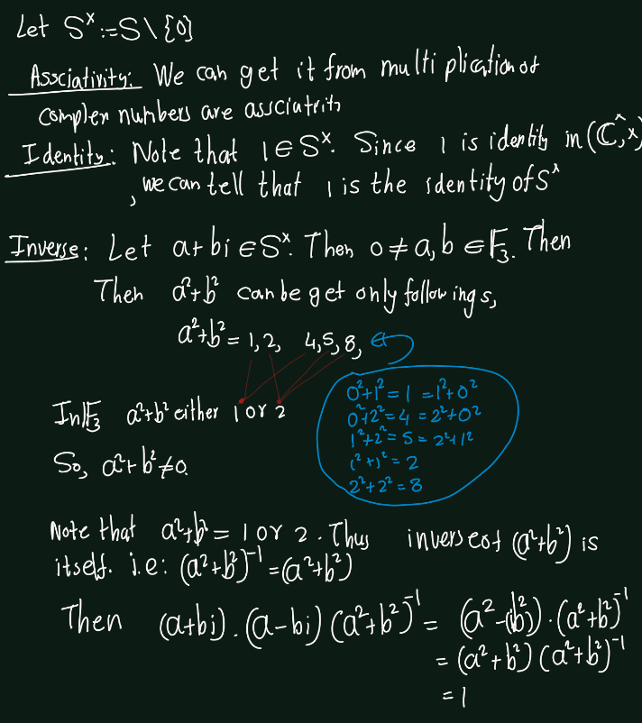 
```
```{r echo=FALSE}
  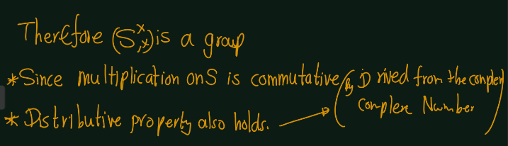 
```

### VectorSpaces

```{exercise,name='Artin 3.2.1'}
2. (a) Prove that the scalar product of a vector with the zero element of the field $F$ is the zero vector.
(b) Prove that if $w$ is an element of a subspace $W$, then $-w$ is in $W$ too.
```

```{r echo=FALSE}
  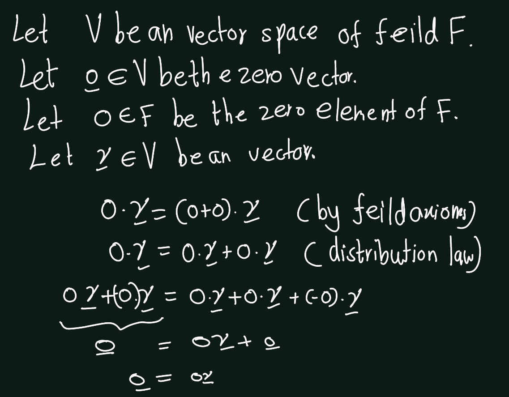 
```
```{r echo=FALSE}
  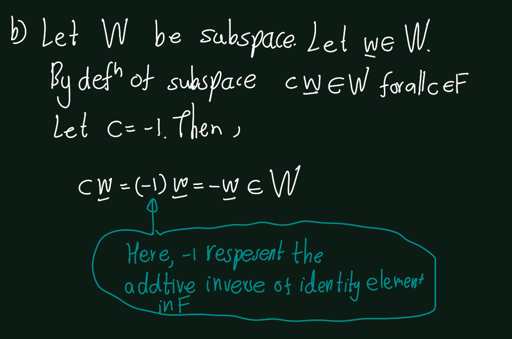 
```

```{exercise,name='Artin 3.2.2'}
Which of the following subsets is a sub space of the vector space $F^{n\times n}$ of $n\times n$ matrices with coefficients in $F$?

(a) symmetric matrices($A = A^T)$, 
(b) invertible matrices, 
(c) upper triangular matrices.
```

```{r echo=FALSE}
  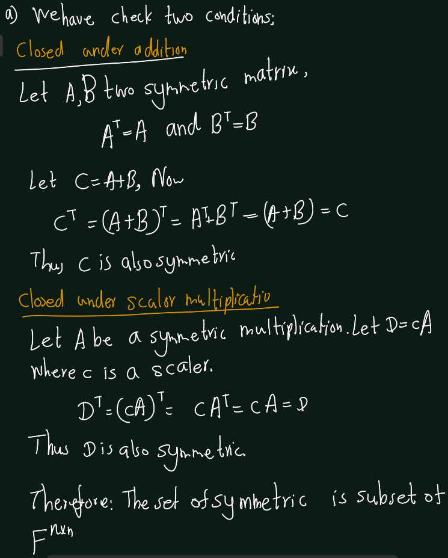 
```
```{r echo=FALSE}
  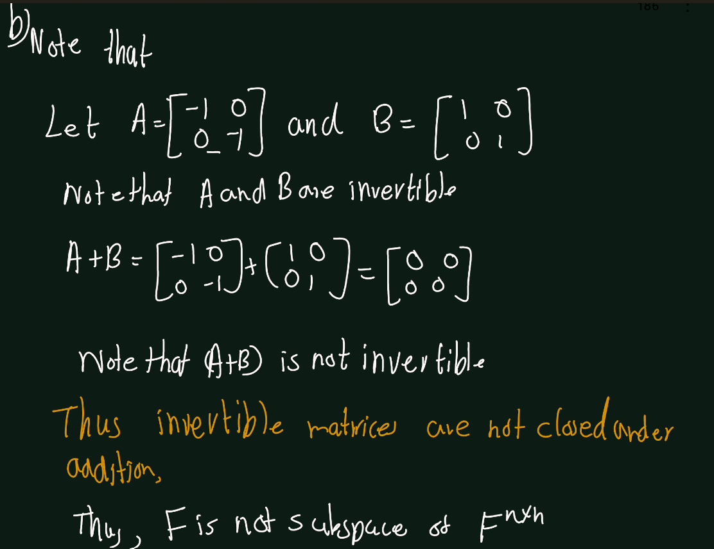 
```
```{r echo=FALSE}
  knitr::include_graphics('figures/ch_3/ex-2.2-c.png') 
```

### Bases and Dimension

```{exercise,name='Artin 3.3.1'}
Find a basis for the space of $n \times n$ symmetric matrices $(A^T = A)$.
```

```{r echo=FALSE}
  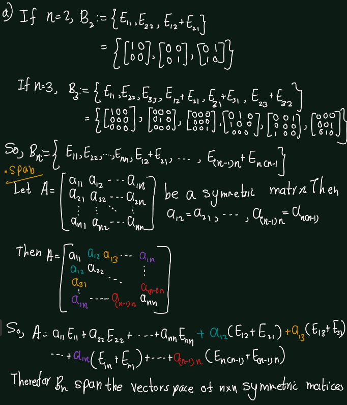 
```
```{r echo=FALSE}
  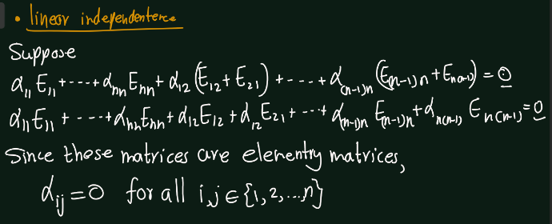 
```

```{exercise,name='Artin 3.3.2'}
Let $W \subset \mathbb{R}^4$ be the space of solutions of the system of linear equations $AX = 0$, where
$A =\begin{bmatrix} 2 & 1 & 2 & 3 \\ 1 & 1 & 3 & 0 \end{bmatrix}$.
Find a basis for $W$.
```

```{r echo=FALSE}
  knitr::include_graphics('figures/ch_3/ex-3.2-1.png') 
```
```{r echo=FALSE}
  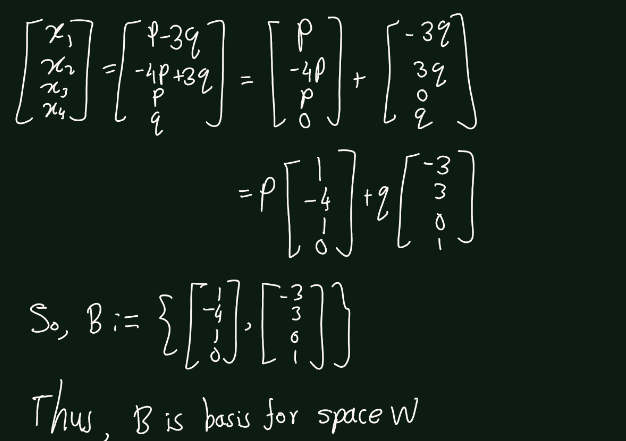 
```

```{exercise,name='Artin 3.3.3'}
Prove that the three functions $x^2, \cos(x)$, and $e^x$ are linearly independent.
```

```{proof}
Suppose that \[\alpha x^2+ \beta \cos(x) +\gamma e^x =0\quad \text{for all } x\in \mathbb{R}\]
where $\alpha,\beta,\gamma$ scalers.


1.  The original equation, when substitute $x=0$ gives us $b \cdot \cos(0) + c \cdot e^0 = 0$, which simplifies to $b + c = 0$.
2. Differentiating once gives $2a \cdot x - b \cdot \sin(x) + c \cdot e^x = 0$. Substituting $x = 0$ gives $-b + c = 0$.
3. Differentiating twice gives $2a - b \cdot \cos(x) + c \cdot e^x = 0$. Substituting $x = 0$ gives $2a + b + c = 0$.

These equations show that the only solution is $a = b = c = 0$. Therefore, the functions $x^2$, $\cos(x)$, and $e^x$ are linearly independent.
```


```{exercise,name='Artin 3.3.4'}
Let $A$ be an $m \times n$ matrix, and let $A'$ be the result of a sequence of elementary row operations on $A$. Prove that the rows of $A$ span the same space as the rows of $A'$.
```

