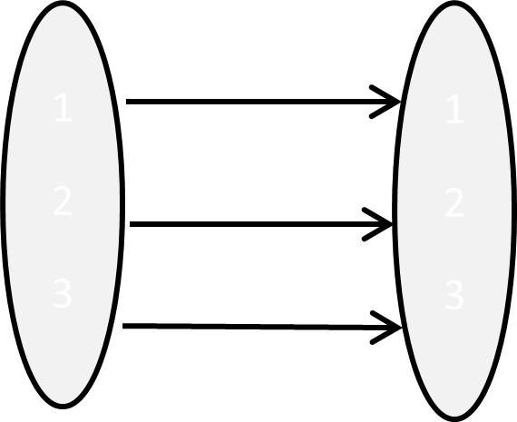
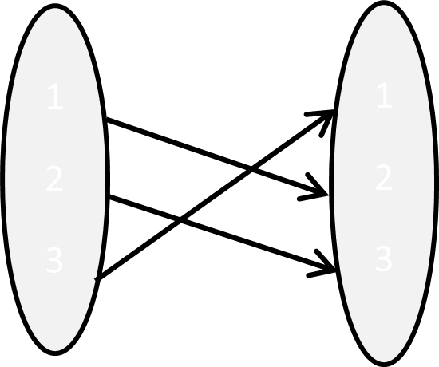
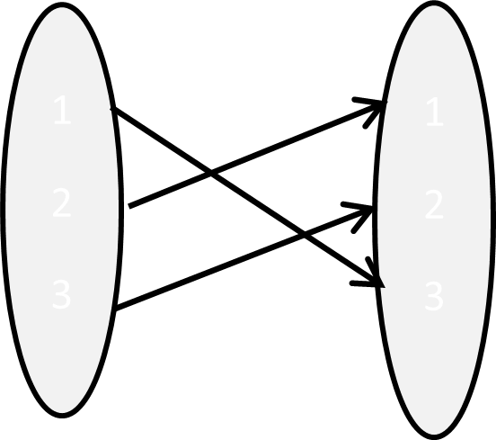
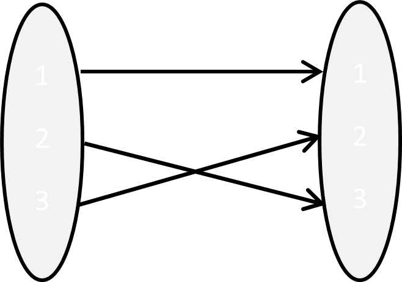
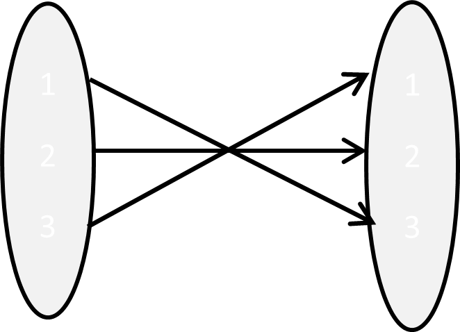
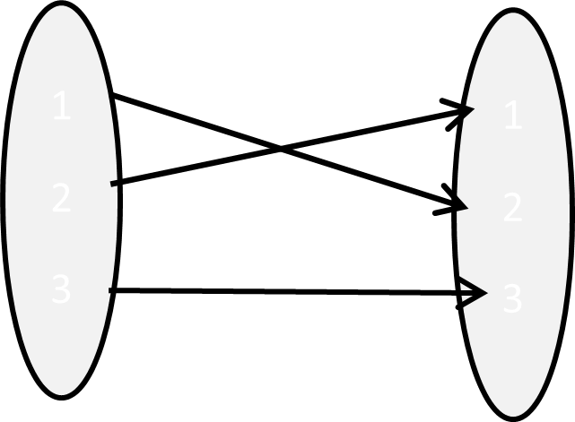
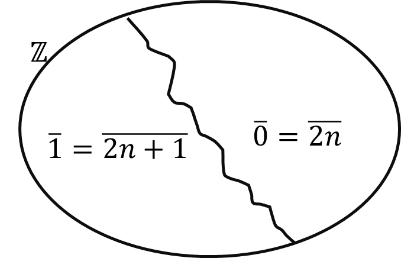

# My note

## Group

```{definition,name="group"}

A group is an ordered pair ($G\ ,\ \ *)$, where $G$ is a
non-empty set and $*$ is a binary operation on $G$ such that the
following properties hold:

1.  For all $a,b\ ,c \in G,\ \ \ a*(b*c) = (a*b)*c$ (associative law)

2.  There exists $e \in G$ such that for all $a \in G$, $a*e = e*a = a$
    (existence of an identity)

3.  For all $a \in G,\ $ there exists $b \in G$ such that
    $a*b = e = b*a$ (existence of an inverse)

$b$ is called inverse of $a$ and we write it as $a^{- 1}$
$$a + ( - a) = 0 ~~~~~~~~~~~~~~~~ a\ .\ \frac{1}{a} = 1$$
```

```{example}

1.  $\left( \mathbb{Z,\  +} \right)$, $\left( \mathbb{Q,\  +} \right)$,
    $\left( \mathbb{R,\  +} \right)$, $\left( \mathbb{C,\  +} \right)$

2.  $\left( \mathbb{Q\backslash}\text{\{}0\},\ \  \cdot \right)$,
    $\left( \mathbb{R\backslash}\text{\{}0\},\ \  \cdot \right)$,
    $\left( \mathbb{C\backslash}\text{\{}0\},\ \  \cdot \right)$

3.  $\mathbb{\ Z}^{+}$ with operation + is not a group. Because there is
    no identity element + in $\mathbb{\ Z}^{+}$.

4.  The set of nonnegative integers (including 0) with operation + is
    still not a group (no inverse).

5.  $\mathbb{\ Z}^{+}$ with multiplication is not a group (no inverse).

6.  $(M_{m \times n}\left( \mathbb{R} \right),\  + )$ is a group.
    $m \times n$ matrix with all entries 0 is the identity matrix.
```

```{exercise}

1.  Show that $(\mathbb{Q}^{+},\ *\ )$ is a group, where
    $a*b = \ \frac{ab}{2}$ for all $a,\ \ b\  \in \mathbb{Q}^{+}$.

2.  Let
    $U_{n} = \left\{ \theta_{n}^{q}\ |\ \theta_{n} = \cos\left( \frac{2\pi}{n} \right) + i\sin\left( \frac{2\pi}{n} \right);q = 0,\ 1,\ldots,n - 1 \right\}$
    where $\theta_{n}^{k} \cdot \theta_{n}^{j} = \theta_{n}^{k + j}$

Verify that ${(U}_{n},\ \  \cdot \ )$ forms a group. $U_{n}$ is the n^th^ of unity $x^{n} = 1$ in $\mathbb{C}$.
Here $U_{1} = \{ 1\}$, $U_{2} = \{ - 1,\ 1\}$,
$U_{3} = \{ 1,\  - \frac{1}{2} + \frac{\sqrt{3}}{2}i,\  - \frac{1}{2} - \ \frac{\sqrt{3}}{2}i\}$,
$U_{4} = \{ 1,\ \ i,\  - 1,\  - i\}$

```{definition}

A group G is said to be [finite group if it has finite
number of elements. The number of elements in G is called the [order of
G and denoted by $|G|.$
```
```{example}
 ${(U}_{n},\ \  \cdot \ )$
```


```{definition}

A group G is said to be [abelian group if $a*b = b*a$ for
all $a,\ b \in G$.
```

```{example}
$\mathbb{Z,\ Q,\ R\ }and\mathbb{\ C}$ with usual addition are
abelian groups.

$\left( \mathbb{Q\backslash}\text{\{}0\},\ \  \cdot \right)$,
$\left( \mathbb{R\backslash}\text{\{}0\},\ \  \cdot \right)$,
$\left( \mathbb{C\backslash}\text{\{}0\},\ \  \cdot \right)$
```

```{exercise}
Show that the subset S of $M_{n}\left( \mathbb{R} \right)$ consisting of
all invertible $n \times n$ matrices with matrix multiplication is a
group but not an abelian group.
```

```{example}

Let $A = \{ 1,\ 2,\ 3\}$
```
```{r, echo=FALSE, results='asis'}
library(knitr)
kable(
  data.frame(
    Left = c(
      "",
      "",
      "",
      "",
      "",
      ""
    ),
    Right = c(
      "$$\\mathbb{i} = \\begin{pmatrix}
1 & 2 & 3 \\\\
1 & 2 & 3 \\\\
\\end{pmatrix}$$",
      "$$\\sigma_{1} = \\begin{pmatrix}
1 & 2 & 3 \\\\
2 & 3 & 1 \\\\
\\end{pmatrix}$$",
      "$$\\sigma_{2} = \\begin{pmatrix}
1 & 2 & 3 \\\\
3 & 1 & 2 \\\\
\\end{pmatrix}$$",
      "$$\\tau_{1} = \\begin{pmatrix}
1 & 2 & 3 \\\\
1 & 3 & 2 \\\\
\\end{pmatrix}$$",
      "$$\\tau_{2} = \\begin{pmatrix}
1 & 2 & 3 \\\\
3 & 2 & 1 \\\\
\\end{pmatrix}$$",
      "$$\tau_3 = \\begin{pmatrix}
4 & 5 & 6 \\\\
4 & 5 & 6 \\\\
\\end{pmatrix}$$"
    )
  ),
  col.names = NULL,  # Remove headers
  escape = FALSE
)
```

  ----------------------------------------------------------------------------------------------------------
  $$\circ$$        $$i$$      $$\sigma_{1}$$   $$\sigma_{2}$$   $$\tau_{1}$$   $$\tau_{2}$$   $$\tau_{3}$$
  ---------------- ---------- ---------------- ---------------- -------------- -------------- --------------
  $$i$$                                                                                       

  $$\sigma_{1}$$                                                                              

  $$\sigma_{2}$$                                                                              

  $$\tau_{1}$$                                                                                

  $$\tau_{2}$$                                                                                

  $$\tau_{3}$$                                                                                
  ----------------------------------------------------------------------------------------------------------

```{lemma}

If ($G\ ,\ \ *)$ is a group, then

1.  Its identity element is unique.

2.  Every $a \in G$ has a unique inverse $a^{- 1} \in G$.

3.  If $a \in G$, $\left( a^{- 1} \right)^{- 1} = a$.

4.  For all $a,\ b \in G$, $(a*b)^{- 1} = b^{- 1}*a^{- 1}$.

5.  $a*b = a*c$ implies $b = c{\ \&\ \ b}*a = c*a$ implies $b = c$ for
    $a,\ b,\ c\  \in G$.
```

```{proof}

1.  Suppose $e$ and $f$ are identity elements of G.

\[\begin{align}
  ae &= a = ea\ \ \ \ \forall a \in G\\
  af &= a = fa \ \ \ \ \forall a \in G
  \end{align}\]

Then $ef = f$ as $e$ is an identity and also $ef = e$ as $f$ is an
identity. Therefore $e = f$.

2.  Suppose $x$ and $y$ are inverses of $a$
\[\begin{align}
xa &= e = ax \ \ \\
ya &= e = a
  \end{align}\]
This gives $x = xe = x(ay) = (xa)y = ey = y$

Hence inverse of $a$ is unique.

3.  If $a \in G$, then $a^{- 1}*a = e = a*a^{- 1}$ and so $a$
    is an inverse of $a^{- 1}$. Since the inverse of an element is
    unique in a group and since $\left( a^{- 1} \right)^{- 1}$ denotes
    the inverse of $a^{- 1}$, it follows that
    $\left( a^{- 1} \right)^{- 1} = a$.

4. 
\[\begin{align}
(ab)\left( b^{- 1}a^{- 1} \right) &= e\\
\left( b^{- 1}a^{- 1} \right)(ab) &= e
\end{align}\]

$\therefore(ab)^{- 1} = b^{- 1}a^{- 1}$

5.  Suppose $a*b = a*c$
\[\begin{align}
 a^{- 1}*a*b &= a^{- 1}*a*c\\
         e*b &= e*c\\
           b &= c
\end{align}\]
Similarly, $b*a = c*a \Rightarrow b = c$.
```


## Subgroup

```{definition}

A non-empty subset $H$ of a group $G$ is called a subgroup of $G$ if $H$
itself a group relative to the binary operation in $G$. We shall let
$H \subset G$ denotes that $H$ is a subgroup of $G$.
```

```{example}

- $\left( \mathbb{Z,\  +} \right) \subset \left( \mathbb{R, +} \right)$
- $\left( 2\mathbb{Z,\  +} \right) \subset \left( \mathbb{Z, +} \right)$
- $\left( \mathbb{Q,\ \  \cdot} \right) ⊄ \left( \mathbb{R, +} \right)$
- Let $G$ be a group $e$ be the identity of $G$ then $\left\{ e \right\} \subset G$
```


```{definition}
- If $G$ is a group, then the subgroup consisting of $G$ itself is the
**improper subgroup of $G$**.  \
All other subgroups are **proper subgroups**. 
- The subgroup $\ \left\{ e \right\}$ is the **trivial subgroup of $G$**.\ All other subgroups are nontrivial.
```

```{lemma}

A non-empty subset $H$ of a group $G$ is a subgroup if and only if,

i.  $a*\ b \in H$ ($\forall a,b \in H$)

ii. $a^{- 1} \in H$ (for any $a \in H$)
```

```{proof}
($\Rightarrow$) (obvious)

($\Leftarrow$) Suppose we have (i.) and (ii.)

$H$ is non-empty.

$a*(b*c) = (a*b)*c$ ($\forall a,b,\ c \in H$)

Because $a,b,\ c \in G$

By (ii.) for any $a \in H,\ \ a^{- 1} \in H$

Since $a$ and $\ a^{- 1}$ are elements of $\ H$, by (i.)
$a*a^{- 1} = e\  \in H$

Hence $H \subset G$.
```

```{remark}
i. $a*b∈H    \forall a,b\in H \Leftrightarrow a^{*}b^{- 1} \in H$
i.  $a^{- 1} \in H$ for any $a \in H \Leftrightarrow a^{*}b^{- 1} \in H$
```

```{proof}
Homework
```

```{example}
Let $G$ be a group and
$Z(G) = \left\{ b \in G|\ ab = ba\ \ for\ all\ a \in G \right\}$. Show
that $Z(G)$ is commutative subgroup of $G$.

Since $ae = a = ea$ for all
$a \in G,\ \ e \in Z(G)$ and $Z(G) \neq \phi$.

Let $a,\ b \in Z(G)$.

Then $bc = cb$ for all $c \in G$.
\begin{align}
       bc &= cb\\
b^{- 1}bc &= b^{- 1}cb\\
cb^{- 1}  &= b^{- 1}cbb^{- 1}\\
cb^{- 1}  &= b^{- 1}c \text{ for all } c \in G\\
\end{align}

Hence $b^{- 1} \in Z(G)$.

Now
$\left( ab^{- 1} \right)c = a\left( b^{- 1}c \right) = a\left( cb^{- 1} \right) = ac\left( b^{- 1} \right) = (ac)b^{- 1} = (ca)b^{- 1} = c\left( ab^{- 1} \right)$
for all $c \in G$.

$\Rightarrow ab^{- 1} \in Z(G)$

Hence $Z(G)\  \subset G$.

By definition $Z(G)$ is commutative.
```


$Z(G)$ is called the **center** of $G$.

## Lagrange's Theorem

**Recall**

A relation $\sim$ on $S$ called an equivalence relation if it satisfies,

i.  $a \sim a$ for any $a \in S$ (reflexive)

ii. $a\sim b \Rightarrow b\sim a$ (symmetric)

iii. $a\sim b\ \&\ b\sim c \Rightarrow a\sim c$ (transitive)

```{example}

1.  Let $n> 1$ be fixed integer. Define on
    $\mathbb{Z,\ \ }a,b\mathbb{\in Z}$

$$a\sim b \Leftrightarrow \left. \ n \right|a - b$$

where, $\sim$ is an equivalence relation.

This relation is called congruence modulo $n$ and write
$a \equiv b\ (mod\ n)$.

2.  Let $G$ be a group and $H$ be a subgroup of $G$. For $a,\ b \in G$
    define $a\sim b \Leftrightarrow ab^{- 1} \in H$.

Show that $\sim$ is an equivalence relation.
```

```{definition}

If $\sim$  is an equivalence relation on set $S$ then $\overline{a}$
the class of $a$ is defined by,

$\overline{a} = \left\{ b \in \left. \ S \right|\ b\sim a \right\}$
```

```{example}

Define an equivalence relation on $\mathbb{Z}$ as follows.

$a\sim b \Leftrightarrow 2|a - b$

$\overline{0} = \left\{ y \in \left. \ \mathbb{Z} \right|\ y\sim 0 \right\} = \ \left\{ y\mathbb{\in Z}|\ 2|y \right\} = 2\mathbb{Z}$

$\overline{1} = \left\{ y \in \left. \ \mathbb{Z} \right|\ y\sim 1 \right\} = \left\{ y\mathbb{\in Z}|\ 2|y - 1 \right\} = \left\{ y \in \left. \ \mathbb{Z} \right|y = 2k + 1 \right\} =$
set of all odd integers

$\overline{2} = \left\{ y \in \left. \ \mathbb{Z} \right|\ y\sim 2 \right\} = \left\{ y\mathbb{\in Z}|\ 2|y - 2 \right\} = 2\mathbb{Z}$
```




```{example}
$G$ be any group and $H$ be a subgroup of $G$.
$a\sim b \Leftrightarrow ab^{- 1} \in H$. Find $\overline{a}.$

$\overline{a} = \left\{ ha\  \right|h \in H\} = Ha$
```

```{theorem}
If $\sim$ is an equivalence relation on $S$ then $S = \bigcup\overline{a}$ where the union runs over one element from each class and $\overline{a} \neq \overline{b}$ implies that $\overline{a} \cap \overline{b} = \phi$
```


```{proof}
Let $a \in S$. Then $a \in \overline{a} \subseteq \bigcup\overline{a}$.
$\Rightarrow S \subseteq \bigcup\overline{a}$
Also, $\bigcup\overline{a\ } \subseteq S$
$\Rightarrow S = \bigcup\overline{a}$
Let $a,b \in S$. Suppose $\overline{a} \cap \overline{b} \neq \phi$.
Then there exists $u \in \overline{a} \cap \overline{b}$. Thus
$u \in \overline{a}$ and $u \in \overline{b}$.
i.e., $u\sim a\ and\ u\sim b$. Since $\sim$ is symmetric $u\sim b$, we
have $b\sim u$. Now $b\sim u$ and $u\sim a$ and so
transitivity of $\sim$, $b\sim a$. This implies that
$b \in \overline{a}$. Hence $\overline{a} = \overline{b}$.
```


```{theorem,name="Lagrange's Theorem"}
If $G$ is a finite group and $H$ is a subgroup of $G$, then order of $H$
divides order of $G$.
```

```{theorem}
If $G$ is a group of prime order then $G$ has only trivial subgroups
$\left\{ e \right\}$ and $G$.
```


```{proof}

$|G| = p$ -- prime

Let $H \subset G$, then

- $|H|=1 \Rightarrow H=\left\{ \mathbb{e} \right\}$
- $|H|=p \Rightarrow H=G$
```


```{exercise}

Let $n> 1$ be a fixed integer. $a,b\mathbb{\in Z}$. Define $$a\sim b \Leftrightarrow n|a - b \Leftrightarrow a - b \in n\mathbb{Z\ }$$

i.  Find $\overline{a}$.

ii. Show $\overline{0,}\ \overline{1},\ \ .\ .\ .,\ \overline{n - 1}$
    are disjoint and
    $\mathbb{Z =}\overline{0}\  \cup \overline{1} \cup .\ .\ .\  \cup \overline{n - 1}$.

iii. Let
     $\mathbb{Z}_{n} = \left\{ \overline{0,}\ \overline{1},\ \ .\ .\ .,\ \overline{n - 1} \right\}$.
     Show that $\mathbb{Z}_{n}$ forms a group under the binary operation

$$\overline{x} + \overline{y} = \overline{x + y}$$.
```


Let
$\overline{a},\ \overline{b},\ \overline{c},\ \overline{d} \in \mathbb{Z}_{n}$.
Suppose $\overline{a} = \overline{c}$ and $\overline{b} = \overline{d}$.

Then $n|a - c\ and\ n|b - d$.

i.e., $\exists\ s\ and\ t$ such that $ns = {a - c}$ and ${nt} = b - d$

hence $n(s + t) = (a + b) - (c + d)$ and

$\left. \ n \right|(a + b) - (c + d)$

$\Rightarrow \overline{a + b} = \overline{c + d}$

Hence + is well defined.

Since
$\left( \overline{a} + \overline{b} \right) + \overline{c} = \overline{a} + \left( \overline{b} + \overline{c} \right)$, +
is associative.

Now $\overline{0} \in \mathbb{Z}_{n}$ and for all
$\overline{a} \in \mathbb{Z}_{n}$

$\overline{a} + \overline{0} = \overline{a + 0} = \overline{a} = \overline{0 + a} = \overline{0} + \overline{a}$

This shows that $\overline{0}$ is the identity element.

Also, for all $\overline{a} \in \mathbb{Z}_{n}$,
$\overline{- a} \in \mathbb{Z}_{n}$ and

$\overline{a} + \overline{- a} = (\overline{a + - a)} = \overline{0} = (\overline{- a + a)} = \overline{- a} + \overline{a}$

Thus $\overline{- a}$ is the inverse of $\overline{a}$.

Hence ($\mathbb{Z}_{n},\  +$) is a group.

Is it commutative?

Yes,
$\overline{a} + \overline{b} = \overline{a + b} = \overline{b + a} = \overline{b} + \overline{a}$

Define multiplication in $\mathbb{Z}_{n}$ as

$\overline{a}.\overline{b} = \overline{a.b}$

Let
$\overline{a},\ \overline{b},\ \overline{c},\ \overline{d} \in \mathbb{Z}_{n}$.
Suppose $\overline{a} = \overline{c}$ and $\overline{b} = \overline{d}$

Then $n|a - c\ and\ n|b - d$

i.e., $\exists\ s\ and\ t$ such that $ns = {a - c\ and}{nt} = b - d$
\begin{align}
a = ns + c  (\#eq:eq1) \\
b = nt + d   (\#eq:eq2)
\end{align}

By \@ref(eq:eq1) and \@ref(eq:eq2),

$a\cdot b = (ns + c)\left( {nt}{+ d} \right) = n^{2}st + nsd + ntc + c\cdot d$

$a\cdot b = n\cdot k + c\cdot d$

$n\cdot k = a \cdot b - c\cdot d$

$\Rightarrow {n\ |\ a\cdot b} - c \cdot d$

$\Rightarrow \overline{a \cdot b} = \overline{c \cdot d}$

Hence $.$ is well defined.

Since
$\left( \overline{a}\cdot \overline{b} \right)\cdot \overline{c} = \overline{a} \cdot \left( \overline{b} \cdot \overline{c} \right)$,
$\cdot$ is associative.

Now $\overline{1} \in \mathbb{Z}_{n}$ and for all
$\overline{a} \in \mathbb{Z}_{n}$

$\overline{a} \cdot \overline{1} = \overline{a.1} = \overline{a} = \overline{1 \cdot a} = \overline{1} \cdot \overline{a}$

This implies that $\overline{1}$ is the identity element.

Does $\overline{a}$ has an inverse in $\mathbb{Z}_{n}$ for any
$\overline{a} \in \mathbb{Z}_{n}$?

No.

If $\overline{a} \in \mathbb{Z}_{n}$ and
$\overline{a} \neq \overline{0}$, then $\overline{a}$ has an inverse if
and only if gcd($a,n$) = 1.

```{proof}

Let $\overline{a} \in \mathbb{Z}_{n}$ and
$\overline{a} \neq \overline{0}$. Suppose gcd($a,n$) = 1.

Then there exists $b,r\mathbb{\in Z}$ such that $ab + nr = 1$.

$\Rightarrow ab - 1 = - nr$

This implies that $\overline{ab} = \overline{1}$ or
$\overline{a}.\overline{b} = \ \overline{1}$

Since $ab = ba$,
$\overline{b}.\overline{a} = \overline{ba} = \overline{ab} = \ \overline{1}$

Thus $\exists\overline{b} \in \mathbb{Z}_{n}$ such that
$\overline{a}.\overline{b} = \ \overline{1} = \ \overline{b}.\overline{a}$
and so $\overline{a}$ has an inverse.

Conversely suppose $\overline{a} \in \mathbb{Z}_{n}$,
$\overline{a} \neq \overline{0}$ and $\overline{a}$ has an inverse.

Then there exists $\overline{b} \in \mathbb{Z}_{n}$ such that
$\overline{a}\cdot \overline{b} = \overline{1}$.

This implies that $n\ |\ ab - 1$

Hence $ab - 1 = nr$ for some $r\mathbb{\in Z}$.

Thus $ab - nr = 1,\ \ \gcd(a,n) = 1$.

Let $U_{n}$ be the set of all elements of
$\mathbb{Z}_{n} \smallsetminus \left\{ \overline{0} \right\}$ that have an inverse in
$\mathbb{Z}_{n} \smallsetminus \left\{ \overline{0} \right\}$.

i.e.,
$U_{n} = \left\{ \overline{a} \in \mathbb{Z}_{n} \smallsetminus \left. \ \left\{ \overline{0} \right\} \right|\gcd(a,n) = 1 \right\}$

Then $(U_{n},\ \  \cdot )$ is a group.
```


```{example}

If $n = 6$,

$\mathbb{Z}_{6} = \left\{ \overline{0},\overline{1},\ \overline{2},\overline{3},\overline{4},\overline{5}\}\ \ \ \  \right.\ $

$U_{6} = \left\{ \overline{1,}\ \overline{5} \right\}$

$U_{8} = \left\{ \overline{1},\overline{3},\overline{5},\ \overline{7} \right\}$

$U_{7} = \left\{ \overline{1},\overline{2},\overline{3},\overline{4,}\overline{5},\ \overline{6} \right\}$

Let ($G,\ \ *$) be a group, $a \in G$ and $n\mathbb{\in Z}$. We now
define the integral power $a^{n}$ of $a$ as follows.

\begin{align}
a^{0} &= \mathbb{e}\\
a^{n} &= a*a^{n - 1} \text{ if } n 0\\
a^{n} &= \left( a^{- 1} \right)^{- n} \text{ if } n < 0
\end{align}


Note that $a^{n} = \left( a^{- n} \right)^{- 1}$ if $n < 0$.
```


```{definition}
Let ($G,\ \ *$) be a group and $a \in G$. If there exists a positive integer $n$ such that $a^{n} = \mathbb{e}$, then the smallest such positive integer is called the [order] of $a$. If no such positive integer $n$ exists, then we say that $a$ is of infinite order. We denote the order of an element $a$ by $O(a)$.
```

```{example}

Consider $\left( \mathbb{Z}_{6},\  + \right)$, $\mathbb{Z}_{6}$ has
order 6.

$\overline{0,}\overline{1},\ \overline{2,}\overline{3},\overline{4,}\overline{5}$
have orders 1, 6, 3, 2, 3, 6 respectively.

${\overline{3}}^{2} = \overline{3} + \overline{3} = \overline{6} = \overline{0}$
and 2 is the smallest positive $n$ such that
${\overline{3}}^{n} = \overline{0}$.
```


```{theorem}

Let ($G,\ \ *$) be a group and $a$ be an element of $G$ such that
$O(a) = n.$

i.  If $a^{m} = \mathbb{e}$ for some positive integer $m$, then $n$
    divides $m$.

ii. For every positive integer $t$,  $0\left( a^{t} \right) = \frac{n}{\gcd(t,n)}$
```


```{proof}

i.  By the division algorithm, $\exists q,\ r\mathbb{\in Z}$ such that
    $m = nq + r\ \ \ 0 \leq r < n$.
Now $a^{r} = a^{m - nq} = a^{m}.a^{- nq} = \mathbb{e}.\left( a^{n} \right)^{- q} = \mathbb{e}.\mathbb{e}^{- q} = \mathbb{e}. Since $n$ is the smallest positive integer such that
$a^{n} = \mathbb{e}$ and $a^{r} = \mathbb{e}$, it follows that $r = 0$. Thus $m = nq$. This implies that $n$ divides $m$.

ii. Let $0\left( a^{t} \right) = k$. Then $a^{tk} = e.$ By (i.) $n$ divides $kt$. Thus $\exists r\mathbb{\in Z}$ such that $kt = nr$. Let $\gcd(t,n) = d$. Then $\exists u,v\mathbb{\in Z}$ such that $t = du,\ \ n = \mathbb{d}v$ and $\gcd(u,v) = 1$ 
Now $kt = nr \Rightarrow k\mathbb{d}u = dvr$
$\Rightarrow {ku} = rv$
Thus $v$ divides $ku$.
Since $\gcd(u,v) = 1$, $v$ divides $k$.
Thus $\frac{n}{d}$ divides $k$.
Now
$\left( a^{t} \right)^{\frac{n}{d}} = a^{\frac{nt}{d}} = a^{\frac{n\mathbb{d}u}{d}} = a^{nu} = \left( a^{n} \right)^{u} = \mathbb{e}^{u} = \mathbb{e}$.
Since $0\left( a^{t} \right)^{k} = k$, $k$ divides $\frac{n}{d}$.
Since $k$ and $\frac{n}{d}$ are positive integers, $k = \ \frac{n}{d}$
Hence $0\left( a^{t} \right) = k = \frac{n}{d} = \frac{n}{\gcd(t,n)}$.
```

```{lemma}

Let $G$ be a group. If $a \in G$ and $O(a) = m,$ then $A = \left\{ \mathbb{e},a,a^{2},\ .\ .\ .,a^{m - 1}\  \right\}$ is a subgroup of $G$.
```


```{proof} 
HW
```


```{theorem}
Let $G$ be a finite group. Then $O(a)|\ |G|.$
```


```{proof}

Let $O(a) = m$

Take $A = \left\{ \mathbb{e},a,a^{2},\ .\ .\ .,a^{m - 1}\  \right\}$ We have seen that $A \subset G$ and $|A| = m = O(a)$ By Lagrange's theorem, $|A|\ |\ |G| \Rightarrow O\left. \ (a) \right|\ |G|$ Since $O\left. \ (a) \right|\ |G|$, we have $n = |G| = kO(a)$ $a^{n} = a^{kO(a)} = \left( a^{O(a)} \right)^{k} = \mathbb{e}^{k} = \mathbb{e}$
Hence we have proved that if $G$ is a finite group of order
$n,\ then\ a^{n} = \mathbb{e}$ for any $a \in G$.
Hence the order of any element of a finite group is finite.
```


