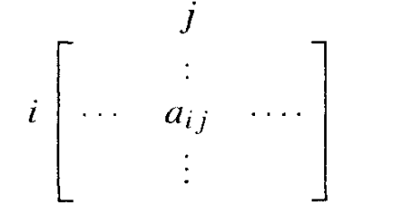

--- 
title: "Artin's Algebra"
author: "Ashan Jayamal"
date: "`r Sys.Date()`"
site: bookdown::bookdown_site
documentclass: book
bibliography: [book.bib, packages.bib]
# url: your book url like https://bookdown.org/yihui/bookdown
# cover-image: path to the social sharing image like images/cover.jpg
description: |
 Artins albgrae
link-citations: yes
github-repo: rstudio/bookdown-demo
---
# Matrices 
## Basic Operations
Let \( m \) and \( n \) be positive integers. An \( m \times n \) matrix is a collection of \( mn \) numbers arranged in a rectangular array.

```{r echo=FALSE,fig.cap='$~$',label='fig01'}
  knitr::include_graphics('figures/ch_1/fig01.jpg') 
```
```{example}
\[A:=\begin{bmatrix}
8 & 0 & 3\\
78 & -5 & 2
\end{bmatrix}\]
$A$ is $2 \times 3$ matrix.(two rows and three columns)

```
The numbers in a matrix are the matrix entries. They may be denoted by \(a_{ij}\), where \(i\) and \(j\) are indices (integers) with \(1 < i < m\) and \(1 < j < n\). The index \(i\) represents the row index, and \(j\) represents the column index. So \(a_{ij}\) is the entry that appears in the \(i\)th row and \(j\)th column of the matrix.

```{r echo=FALSE,fig.cap='$~$',label='fig02'}
   
```

<!--chapter:end:index.Rmd-->

# Group Theory

## Laws of Compositions


### Exercises 
```{exercise}
Let \( S \) be a set. Prove that the law of composition defined by \( ab = a \) for all \( a \) and \( b \) in \( S \) is associative? For which sets does this law have an identity?
```
**Solution**: Let $a,b,c\in S$.
Now consider following
\[(ab)c=(ac)=a=(ab)=a(bc)\]
Thus, the given law of composition is associative.

If the given law of composition  has an identity element whenever every element $a\in S$ has a multiplicative inverse./
In other words, for every element $a\in S$, there exists an element $e \in S$ such that \[ae = ea = a.\] 
Thus, $ae=a=ea=e$. So, the identity element is the same as every element in S, and the law has an identity for all sets S. Thus, only singletons sets have this given law of compositions have identity.


## Groups and Subgroups
```{definition,name='Group'}
A group is a set \(G\) together with a law of composition that has the following properties:

- The law of composition is associative: \((ab)c = a(bc)\) for all \(a\), \(b\), \(c\) in \(G\).
- \(G\) contains an identity element \(1\), such that \(la = a\) and \(al = a\) for all \(a\) in \(G\).
- Every element \(a\) of \(G\) has an inverse, an element \(b\) such that \(ab = 1\) and \(ba = 1\).
```
**Noatation**: If set '$G$' with composition '$\ccdot$' is a group, then we denote it by $(G,\cdot)$
```{definition,name='Ableian Group'}
Group G is called abliean if its law of composition is commutative. i.e.
\[\forall x\in G, xy=yx\]
```

```{example}
- $\mathbb{R}^\times:=\mathbb{R}\setminus \{0\}$ is an abliean group under multiplication 
- $GL_n(\mathbb{R}):=\{A\in M_n(\mathbb{R}): \text{ A is invertible}\}$ with materix multiplication is non-abliean group. This group is called _general linear group_. 
```

```{definition,name='Order of group'}
The order of a group $G$ is the number of elements that it contains. We \[| G | := \text{number of elements of }G=\text{ the order of G}\]

If the order is finite, $G$ is said to be a finite group. If not, $G$ is an infinite group. 
```
Here is our notation for some familiar infinite abelian groups:

```{example}
- $(\mathbb{Z},+)$ :The set of integers, with addition as itslaw of composition (the additive group of integers)
- $(\mathbb{R},+)$ :The set of real numbers, with addition as its law of 
composition (the additive group of real numbers)
- $(\mathbb{R}^\times,\times)$ :The set of nonzero real numbers, with multiplication as its law of composition(the multiplicative group)
$(\mathbb{C},+)$ :the set of complex numbers, with addition as its law of composition (the additive group of complex numbers)
- $(\mathbb{C}^\times,\times)$ :The set of nonzero complex numbers, with multiplication as its law of composition(the multiplicative group of complex numbers)
```

```{proposition,name='Cancellation Law'}
Let $G$ be group and let $a, b, c \in  G$ whose law of composition is written multiplicatively.

- If $ab = ac$ or if $ba = ca$, then $b = c$. 
- If $a b = a$ or if $ba = a$, then $b = 1$
```
```{proof}
Multiply both sides of $ab=ac$ on the left by$a^{-1}$ to obtain $b = c$. The other proofs are analogous.
```
```{remark}
As you saw $a^{-1}$ plays amajor rule in above proof. So the cancelation rule does not holds when elemenet $a$ is not invertible.
```

```{example,name='Example that not holding the cancelation law'}
\[\begin{bmatrix} 1 & 1 \\ 0 & 0\end{bmatrix}
\begin{bmatrix} 1 & 1 \\ 2 & 0\end{bmatrix}=
\begin{bmatrix} 1 & 1 \\ 0 & 0\end{bmatrix}
\begin{bmatrix} 3 & 0 \\ 0 & 1\end{bmatrix}\]
```

```{example}
Let $T$ be a set and $G:=\{f:T\to T: f \text{ is a bijection}\}$. Then $G$ with composition is a group. We use notation $sys(T) $ to denote the 
```

```{example}
The group of permutations of the set of indices $\{l, 2, ... , n\}$ is called the _symmetric group_,and is denoted by $S_n$. Then $|S_n|=n
!$. So, $S_n$ is a finite group of order $n!$.

Let's disscuss some individualcases for n.

- **$n=2$**\
The permutations of a set $\{1, 2\}$ of two elements are the identity $i$ and the transposition $\tau=(12)$.
\[S_2:=\{id,(12)\}\]

|$\circ$|$id$|$(12)$|
|-------|----|------|
|$id$   |$id$|$(12)$|
|$(12)$|$(12)$|$id$|
|------|------|-----|
- $n=3$\
$S_3$ has order $3!=6$. $S_3$ serves as a convenient example because it is the smallest group whose law of composition isn’t commutative. We will refer to it often. To describe it, we pick two particular permutations in terms of which we can write all others. We take the cyclic permutation $(123)$, and the transposition $(12)$, and label them as $x$ and $y$, respectively.Then
\begin{eqnarray}
x^3 &=& (123)^3=(123)(123)(123)=(123)(132)=id\\
y^2 &=& (12)^2=(12)(12)=id\\
yx  &=& (12)(123)=(13)=(132)(12)=((123)(123))(12)=(123)^2(12)
\end{eqnarray}
As a summary,
\[x^3=1,Y^2=1,yx=x^2y\]
```


## Subgroups of the Additive Group of Integers
## Cyclic Groups
## Homomorphisms
```{definition}
Let $(G, *)$ and $(G', \odot)$ be groups. A **homomorphism** $\phi: G \rightarrow G'$ is a map from $G$ to $G'$ such that for all $a$ and $b$ in $G$:

\begin{equation}
    \phi(a * b) = \phi(a) \odot \phi(b).
\end{equation}
```
### Examples of Homomorphisms

1. **Determinant Function**: $\text{det}: GL_n(\mathbb{R}) \to \mathbb{R}^\times$
2. **Exponential Map**: $\text{exp}: (\mathbb{R}, +) \to (\mathbb{R}^\times, \times)$ defined by $x \mapsto e^x$
3. **Map $\phi$**: $(\mathbb{Z}, +) \to G$ defined by $\phi(n) = a^n$, where $a$ is a given element of $G$
4. **Absolute Value Map**: $|\cdot| : (\mathbb{C}^\times, \times) \to (\mathbb{R}^\times, \times)$

### Trivial Homomorphism

The trivial homomorphism $\phi: G \rightarrow G'$ between any two groups maps every element of $G$ to the identity in $G'$.

### Inclusion Map

If $H$ is a subgroup of $G$, the inclusion map $i: H \rightarrow G$ defined by $i(x) = x$ for $x$ in $H$ is a homomorphism.

---

**Proposition 5.1.1**

Let $\phi: G \rightarrow G'$ be a group homomorphism.

(a) If $a_i, \ldots, a_k$ are elements of $G$, then $\phi(a_i \ldots a_k) = \phi(a_i) \ldots \phi(a_k)$.

(b) $\phi$ maps the identity to the identity: $\phi(1_G) = 1_{G'}$.

(c) $\phi$ maps inverses to inverses: $\phi(a^{-1}) = \phi(a)^{-1}$.


## Isomorphisms
## Equivalence Relations and Partitions
## Cosets
## Modular Arithmetic


```{exercise}
What are the possible values of $a^2$ modulo 4? modulo 8?
```
**solution**
\_In modulo 4_\
\begin{eqnarray*}
    \overline{0}^2&\equiv & 0 \pmod{4}\\
    \overline{1}^2&\equiv & 1 \pmod{4}\\
    \overline{2}^2&\equiv & 0 \pmod{4}\\
    \overline{3}^2&\equiv & 1 \pmod{4}\\
\end{eqnarray*}
The possible values of $a^2\pmod{4}$ are 0 and 1. 

\_In modulo 8_\
\begin{eqnarray*}
    \overline{0}^2&\equiv & 0 \pmod{8}\\
    \overline{1}^2&\equiv & 1 \pmod{8}\\
    \overline{2}^2&\equiv & 4 \pmod{8}\\
    \overline{3}^2&\equiv & 1 \pmod{8}\\
    \overline{4}^2&\equiv & 0 \pmod{8}\\
    \overline{5}^2&\equiv & 1 \pmod{8}\\
    \overline{6}^2&\equiv & 4 \pmod{8}\\
    \overline{7}^2&\equiv & 1 \pmod{8}\\
\end{eqnarray*}
The possible values of $a^2\pmod{8}$ are 0,1 and 4.


```{exercise}
Prove that every integer $a$ is congruent to the sum of its decimal digits modulo 9.
```
```{proof}
    Let $x\in  \mathbb{Z}$. Now we can represent x as follows
    \[x=a_010^0+a_110^1+\cdots +a_n10^n=\sum_{i=0}^n a_{i}10^i\text{  forsome } n\in \mathbb{Z},\text{ and }a_i\in \{0,1,...,9\}\]
    
    We need to show $x \equiv  \sum_{i=0}^na_i\pmod{9$}.So, now consider,
    \begin{eqnarray*}
        x-\sum_{i=0}^n a_{i}&=&\sum_{i=0}^n a_{i}10^i-\sum_{i=0}^n a_{i}\\
        &=& \sum_{i=0}^n (a_{i}10^i- a_{i})\\
        &=& \sum_{i=0}^n a_{i}(10^i- 1)
    \end{eqnarray*}
    By follwing calim we can get that,
\begin{eqnarray*}
    x-\sum_{i=0}^n a_i &equiv & 0 \pmod{9}\\
    x &\equiv & \sum_{i=0}^na_i\pmod{9}
\end{eqnarray*}
```
\textbf{Claim}: $9|(10^k-1)$ for any $k\in \mathbb{N}$.


```{proof}
We use mathematical induction.\
_$k=1$_\
This case is trivial. Because $9|10-1$.\
_$k=n\in\mathbb{Z}$_\
Now asuume when $n=k, 9|(10^n-1)$.\
_$k=n+1$_
\[10^{n+1}-1 =10\cdot 10^{n}-1=9\cdot 10^n + (10^n - 1) \]
Thus $9\vert (10^{n+1}-1)$. \
Therefore,by mathematical induction, $9|(10^n-1)$ for any $n\in \mathbb{N}$.
```


```{exercise}
Solve the congruence $2x \equiv 5$ modulo 9 and modulo 6.
```
Done Later add.
```{exercise}
Determine the integers $n$ for which the pair of congruences $2x - y \equiv 1$ and $4x + 3y \equiv 2$ modulo $n$ has a solution.
```
Done Later add.
```{exercise}
Prove the Chinese Remainder Theorem: Let $a, b, u, v$ be integers, and assume that the greatest common divisor of $a$ and $b$ is 1. Then there is an integer $x$ such that $x \equiv u$ modulo $a$ and $X \equiv v$ modulo $b$. \
Hint: Do the case $u = 0$ and $v = 1$ first.
```

```{exercise}
Determine the order of each of the matrices A and B when the matrix entries are interpreted modulo 3.
```


## The Correspondence Theorem

```{definition}
Let $\phi: G \rightarrow G^\prime$ be a group homomorphism, and let $H$ be a subgroup of $G$. We may restrict $\phi$ to $H$, obtaining a homomorphism
\[\phi|_H: H \rightarrow G^\prime\]
```

In other words, we take the same map but restrict its domain.

**Notation**: We use this notation for clarity $[\phi|_H](h)$.

Further, we can see that follwoing observatons.

- By definition, $\forall h\in H,\phi|_H(h) = \phi(h)$
- The restriction $\phi|_H$ is a homomorphism (Since $\phi$ is homomorphism).
- The kernel of $\phi|_H$ is the intersection of the kernel of $\phi$ with $H$:
\[ker(\phi|_H) = (ker\phi) \cap H\]
There is no need to prove this. This is trivial by definition of kernel.
- Image of $\phi|_H$ is the same as the image $\phi(H)$ of $H$ under the map $\phi$.
\[Im(\phi_H)=\phi(H)\]
- If $|H|$ and $|G'|$ have no common factor, $\phi(H) = \{1\}$, so $H$ is contained in the kernel.
(Since, by Artin's book corollary 2.8.13,

\begin{eqnarray}
|Im(\phi_H)|&\biggr |&|H|\\
|Im(\phi_H)|&\biggr |& |G'|
\end{eqnarray}, Thus,, if $|H|$ and $|G'|$ have no common factors,$|Im(\phi_H)|=|\phi(H)| =1.$ So, $Im(\phi_H)=\phi(H)= \{1\}$)

Now let's see an example.

```{example}
Define sign homorphism $\sigma: S_n \to \{\pm 1\}$ by $\sigma(x)=1$ if $x$ is even, and  $\sigma (x)=−1$ if $x$ is odd. Then the image of the sign homomorphism is,
\[Im(\sigma)=\{\pm 1\}\]
it has order $2$. 

Let $H=\{x \in S_n : \text{if $x$ has odd order}\}$. Then $H$ is a subgroup. So,, $H \subset \ker(\sigma)$ (We can easily verify this.) 

Furthur, The sub group of $S_n$ with even permutations is called _Alternating group_ ($A_n$).

```
### **PROBLEM**
```{proposition,label='2104'}
Let \(\phi:G \to G^{\prime}\) be a homomorphism with kernel \(K\), and let \(H^\prime\leq G^\prime\). Denote the inverse image \(\phi^{-1}(H^\prime)\) by \(H\). i.e.: 

\[H=\phi^{-1}(H^\prime)=\{x\in G: \phi(x)\in H^\prime\}\]
Then,

- \(\phi^{-1}(H^\prime)\) is a subgroup of \(G\) that contains \(K\). 
- If \(H\) is a normal subgroup of \(G^\prime\), then \(\phi^{-1}(H^\prime)\) is also a normal subgroup of \(G\). 
- If \(\phi\) is surjective and \(H\) is a normal subgroup of \(G\), then \(\phi^{-1}(H^\prime)\) is a normal subgroup of \(G^\prime\).
```
```{remark}
$\phi^{-1}$ is not a map.
```
```{proof}
- **Claim 1**: \(K\subseteq \phi^{-1}(H^\prime)=H\)\
Let $x\in K$. Then $\phi(x)=1_{G^\prime}$. Since $1_{G^\prime}\in H^\prime$. Thus, $x\in \phi^{-1}(H^\prime)=H$. Therfore, \(K\subseteq \phi^{-1}(H^\prime)=H\)
- **Claim 2**: \(\phi^{-1}(H^\prime)\) is a subgroup of \(G\)\
  - _Closure_ :Suppose $x,y\in H= \phi^{-1}(H^\prime)$. Then $\phi(x),\phi(y)\in \phi(H^\prime)$. Since $\phi$ is hormophism $\phi(x)\phi(y)=\phi(xy)$. Since $H^\prime\leq G^\prime$, then  $\phi(xy)=\phi(x)\phi(y)\in H^\prime$. Thus, \(xy\in \phi^{-1}(H^\prime)=H\) 
  - _Identity_ : Since \(\phi(1_G)=1_{G^\prime}\), \(1_G\in \phi^{-1}(H^\prime)=H\)
  - _Inverse_ : Let $x\in \phi^{-1}(H^\prime)=H$. Then $\phi(x)\in H^\prime$ and since $H^\prime \leq G^\prime$,then \((\phi(x))^{-1}\in H^\prime\). Since $\phi$ is a homomorphism, \((\phi(x))^{-1}=\phi(x^{-1})\), Thus \((\phi(x))^{-1}=\phi(x^{-1})\in H^\prime\). Hence, $x^{-1}\in \phi^{-1}(H^\prime)$.

- **Claim 3**: If \(H^\prime\) is a normal subgroup of \(G^\prime\), then \(\phi^{-1}(H^\prime)\) is also a normal subgroup of \(G\).\
Now suppose that \(H^\prime\) is a normal subgroup of \(G^\prime\). Let $x\in H$ and $g\in G$. Then, since $\phi$ is hormorphism,
\[\phi(gxg^{-1})=\phi(g)\phi(x)\phi(g^{-1})=\phi(g)\phi(x)(\phi(g))^{-1}\]
So, \(\phi(gxg^{-1})\) is conjugate of $\phi(x)$. Since $x\in H=\phi^{-1}(H^\prime)$,the $\phi(x)\in H^\prime$. Thus, \(\phi(gxg^{-1})=\phi(g)\phi(x)(\phi(g))^{-1}\in H^\prime\). Hence,
$gxg^{-1}\in \phi^{-1}(H^\prime)=H\)$.
- **Claim 4**: If \(\phi\) is surjective and \(H\) is a normal subgroup of \(G\), then \(\phi^{-1}(H^\prime)\) is a normal subgroup of \(G^\prime\).\
Suppose that \(\phi\) is surjective and \(H\) is a normal subgroup of \(G\). Let $a\in H^\prime$ and $b\in G^\prime$. Since $\phi$ is surjcetive, There are elements $x\in H$ and $y\in G$ such that $\phi(x) = a$ and $\phi(y) = b$. Since $H$ is normal  $yxy^{- 1}\in H$, thus $\phi(yxy^{-1})=bab^{-1}\in H^\prime$.
```

```{example}
let denote the determinant homomorphism \[det:GL_n(\mathbb{R})\to \mathbb{R}^\times\]. Note that $\mathbb{R}^+\unlhd \mathbb{R}^\times$. (It is very clear that $The set of  positive real numbers is a subgroup of $\mathbb{R}^\times$, and since  $\mathbb{R}^\times$ is abliean, $\mathbb{R}^+$ is normal.) Now consider the inverse image of $\mathbb{R}^+$,
\[det^{-1}(\mathbb{R}^+)=\{A\in GL_n(\mathbb{R}):det(A)\in \mathbb{R}^+\}=SL_n(\mathbb{R})\]. By above proposition we can ge that $SL_n(\mathbb{R})$ is normal subgroup. (Because $\mathbb{R}^+\unlhd \mathbb{R}^\times$ and $det$ is surjective map.)
```


```{theorem,'CorrespondenceTheorem',name='Correspondence Theorem'}
Let $\phi: G \to G^\prime$ be a surjective group homomorphism with kernel $K$. There is a bijective correspondence between subgroups of $G^\prime$ and subgroups of $G$ that contain $K$:
  \[\{\text{subgroups of $G$ that contain $K$}\}\longleftrightarrow \{\text{subgroups of $G^\prime$}\}\]
This corresponde nce is defined as follows:
$$\begin{aligned}
\text{a subgroup $H$ of $G$ that contains K} &\rightsquigarrow \text{ its image} (\phi(H) \in G^\prime,\\
\text{a subgroup $H^\prime$ of $G^\prime$} &\rightsquigarrow \text{ its inverse image $\phi^{-1}(H^\prime)$ in $G$}.
\end{aligned}$$

  
- If $H$ and $H^\prime$ are corresponding subgroups, then $H$ is normal in $G$ if and only if is normal in $G^\prime$.
- If  If $H$ and $H^\prime$ are corresponding subgroups, then 
\[|H|= |H^\prime||K |\]
```

```{proof}
Let $H$ be subgroup of $G$ that contain $K$. Let $H^\prime$ be a subgroup of $G^\prime$. Now we need to check folllwings,

- $\phi(H)$ is a subgroup of $G^\prime$.
- $\phi^{-1}(H^\prime)$ is a subgroup of $G$, and it contains $K$.
- $H^\prime$ is a normal subgroup of $G^\prime$ if and only if $\phi^{-1}(H^\prime)$ is a normal subgroup of $G$.
- (_bijectivity of the correspondence_) $\phi(\phi^{-1}(H^\prime)) =H^\prime$ and $\phi^{-1}(\phi(H))=H$
- $|(\phi^{-1} (H^\prime)| = |H^\prime||K|$.
     
     
- **Claim 1**: $\phi(H)$ is a subgroup of $G^\prime$.\
  - _Closure_: Let $$x,y\in phi(H)$. Then there is $a,b\in H$ such that $\phi(a)=x$ and $\phi(b)=y$. Since $\phi$ is hormorphism, $xy=\phi(a)\phi(b)=\phi(ab)$. Sine $H\leq G$, $ab\in H,~ xy=\phi(ab)\in \phi(H)$.
  - _Identity_ : Since $1_G\in H$, $\phi(1_G)=1_{G^\prime}\in \phi(H)$
  - _Inverse_ : Let $x\in \phi(H)$. Then there exist $a\in H$ such that $\phi(a)=x$. Since $H\leq G$, $a^{-1}$ exists in $H$.  $\phi(a^{-1})=\phi(a)^{-1}=x^{-1}\in \phi(G)$.

- **Claim 2**: $\phi^{-1}(H^\prime)$ is a subgroup of $G$, and it contains $K$.\
This is true from proportion \@ref(prp:2104)

- **Claim 3**: $H^\prime$ is a normal subgroup of $G^\prime$ if and only if $\phi^{-1}(H^\prime)$ is a normal subgroup of $G$.\
Alreday this prooved in proportion \@ref(prp:2104)

- **Claim 4.1**: $\phi(\phi^{-1}(H^\prime))=H^\prime$
  - $\phi(\phi^{-1}(H^\prime))\subset H^\prime$\
Lett $x\in \phi(\phi^{-1}(H^\prime))$. 
Then there exist $y\in\phi^{-1}(H^\prime)$ such that $\phi(y)=x$. Then by definiton of the pre  image $x=\phi(y)\in H^\prime$. 
  
  - $\phi(\phi^{-1}(H^\prime))\supset H^\prime$\
Let $a\in H^\prime$. Since $\phi$ is surjective, there exists $b\in G$ such that $\phi(b)=a\in H^\prime$. Thus $b\in \phi^{-1}(H^\prime)$. Hence $a=\phi(b)=\phi(\phi^{-1}(H^\prime))$. 

Therefore, $\phi(\phi^{-1}(H^\prime))=H^\prime$.

- **Claim 4.2**: $\phi^{-1}(\phi(H))=H$
  - $\phi^{-1}(\phi(H))\supset H$\
Let $x\in H$. Then $\phi(x) \in \phi(H)$. So, $x\in \phi^{-1}(\phi(H))$.
  - $\phi^{-1}(\phi(H))subset H$\
Let $y\in \phi^{-1}(\phi(H))$. By definition of inverse image, $\phi(y)\in \phi(H)$. Then there exist $z\in H$ such that $\phi(y)=\phi(z)$. Then $z^{-1}y$ is in the kernal $K$.(by Artins book proposition 2.5.8). Since $K \subset H$, $z^{-1}y\in H$. So, $a\in H$ and $a^{-1}z\in H$. Thus, $a(a^{-1}x)=x\in H$. Hence  $\phi^{-1}(\phi(H))\subset H$

Therefore,   $\phi^{-1}(\phi(H))=H$
- **Claim 5** : $|(\phi^{-1} (H^\prime)| = |H^\prime||K|$.\

```
### Problem


```{example}
Recall

$$\begin{aligned}
S_4 &= \left\{ id, (1 2), (1 3), (1 4), (2 3), (2 4), (3 4), (1 2 3), (1 2 4), (1 3 2), (1 3 4), (1 4 2), (1 4 3), (2 3 4), (1 2 3 4) \right\}\\
S_3 &= \left\{ id, (1 2), (1 3), (2 3), (1 2 3), (1 3 2) \right\}
\end{aligned}$$

There are 6 such subgroups of $S_3$,\[ <(1 2)>, <(1 3)>, <(2 3)>, <(1 2 3)>= <(1 3 2)>,S_3\].
There is one proper subgroup of order 3. That is $<(123)>$. There are 3 subgroups of order 2. They are $<(1 2)>, <(1 3)>, <(2 3)>$
  
The Correspondence Theorem tells us that there are four proper 
subgroups of $S_4$ that contain $K$.
```
### Problem


## Product Groups

Let $G,G'$ be two groups. The product set $G \times G'$, the set of pairs of elements $(a, a')$ with
a in G and a' in G', can be made into a group by component-wise multiplication, 

multiplication of pairs is defined by the  rule,

\[(a,a')\cdot(b,b')=(ab,a'b')\quad \text{for } a,b\in  G \text{ and for } a',b'\in G\]
Let's prove that $G\times G'$ is a group.

```{proof}
Let Let $G,G'$ be two groups and let $a,b,c\in G$ and $a',b',c'\in G'$
  
- _Closure_ : $(a,a')\cdot(b,b')=(ab,a'b')$. So, since $a,b\in G and $a',b'\in G'$ and $G$ and $G'$ be a group, then $ab\in G$ and $a'b'\in G$. Thus, $(a,a')\cdot(b,b')=(ab,a'b')\in G \times G'$.
- _Asscitivity_:  We can obtain following using asscivity property of group $G$ and $G'$.
\[((a,a')\cdot(b,b'))\cdot(c,c')=(ab,a'b')\cdot(c,c')
=(abc,a'b'c')=
(a,a')\cdot(bc,b'c')=(a,a')\cdot((b,b')\cdot(c,c'))\]
- _identity_: (1_G,1_{G'}) is the idenitity\
\[(1_G,1_{G'})\cdot(b,b')=(1_Gb,1_{G'}b')=(b,b')
=(b1_G,b'1_{G'})=(b,b')\cdot(1_G,1_{G'})\]
- _Inverse_ : The inverse of $(a,a')$ is $(a^{-1},(a')^{-1})$\
\[(a,a')\cdot(a^{-1},(a')^{-1})=(aa^{-1},a'(a')^{-1})=(1_G,1_{G'})=(a^{-1}a,(a')^{-1}a')=(a^{-1},(a')^{-1})\cdot(a,a')\]
```
So, The group obtained in this way is called the product of $G$ and $G'$.

It is related to the two factors $G$ and $G'$ in a simple way that we can sum up in terms of some homomorphisms.
```{r echo=FALSE,label='fig2-1'}
  knitr::include_graphics('figures/ch_2/fig01.jpg') 

```
The homomorphisms are defined as follows,
\begin{eqnarray}
i:G &\rightarrow& G \times G' \\
x &\mapsto& (x,1)\\\\
i':G' &\rightarrow& G \times G' \\
x &\mapsto& (x',1)\\\\
p:G \times G' &\rightarrow& G' \\
(x,x') &\mapsto& x\\\\
p':G' \times G' &\rightarrow& G' \\
(x,x') &\mapsto& x'\\\\
\end{eqnarray}

Observe that $i$ and $i'$ are injective and \[Im(i)=G\times 1_G'\leq G\times G' \text{ and }Im(i')=1_G\times G'\leq G\times G'\] 
The maps $p$ and $p '$ are called projections and they are surjective. 
\[\ker(p)=1\times G'\text{ and }\ker(p')=G\times 1_{G'}\]
It is obviously desirable to decompose a given group $G$ as a product, that is, to find investigate groups $H$ and $H '$ such that $G$ is isomorphic to the product $H \times H'$.


## Quotient Groups
## Exercises

<!--chapter:end:01-GroupTheory.Rmd-->

# Lienaer Operators

<!--chapter:end:02-LinearOperators.Rmd-->

# Vector spaces.

<!--chapter:end:Vector.Rmd-->

