--- 
title: "Artin's Algebra"
author: "Ashan Jayamal"
date: "2024-03-01"
site: bookdown::bookdown_site
documentclass: book
bibliography: [book.bib, packages.bib]
# url: your book url like https://bookdown.org/yihui/bookdown
# cover-image: path to the social sharing image like images/cover.jpg
description: |
 Artins albgrae
link-citations: yes
github-repo: rstudio/bookdown-demo
---
# Matrices 
## Basic Operations
Let \( m \) and \( n \) be positive integers. An \( m \times n \) matrix is a collection of \( mn \) numbers arranged in a rectangular array.

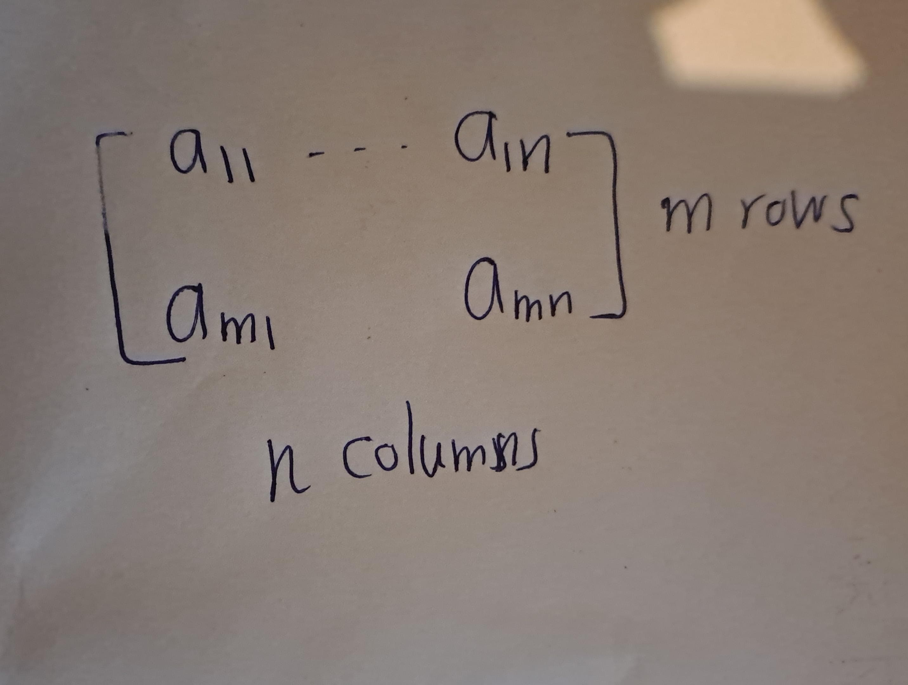 
::: {.example #unnamed-chunk-1}
\[A:=\begin{bmatrix}
8 & 0 & 3\\
78 & -5 & 2
\end{bmatrix}\]
$A$ is $2 \times 3$ matrix.(two rows and three columns)

:::
The numbers in a matrix are the matrix entries. They may be denoted by \(a_{ij}\), where \(i\) and \(j\) are indices (integers) with \(1 < i < m\) and \(1 < j < n\). The index \(i\) represents the row index, and \(j\) represents the column index. So \(a_{ij}\) is the entry that appears in the \(i\)th row and \(j\)th column of the matrix.

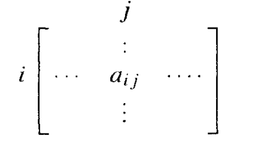 

<!--chapter:end:index.Rmd-->

# Group Theory

## Laws of Compositions

### Exercises 
::: {.exercise #unnamed-chunk-2}
Let \( S \) be a set. Prove that the law of composition defined by \( ab = a \) for all \( a \) and \( b \) in \( S \) is associative? For which sets does this law have an identity?
:::
**Solution**: Let $a,b,c\in S$.
Now consider following
\[(ab)c=(ac)=a=(ab)=a(bc)\]
Thus, the given law of composition is associative.

If the given law of composition  has an identity element whenever every element $a\in S$ has a multiplicative inverse./
In other words, for every element $a\in S$, there exists an element $e \in S$ such that \[ae = ea = a.\] 
Thus, $ae=a=ea=e$. So, the identity element is the same as every element in S, and the law has an identity for all sets S. Thus, only singletons sets have this given law of compositions have identity.

## Groups and Subgroups
::: {.definition #unnamed-chunk-3 name="Group"}
A group is a set \(G\) together with a law of composition that has the following properties:

- The law of composition is associative: \((ab)c = a(bc)\) for all \(a\), \(b\), \(c\) in \(G\).
- \(G\) contains an identity element \(1\), such that \(la = a\) and \(al = a\) for all \(a\) in \(G\).
- Every element \(a\) of \(G\) has an inverse, an element \(b\) such that \(ab = 1\) and \(ba = 1\).
:::
**Noatation**: If set '$G$' with composition '$\ccdot$' is a group, then we denote it by $(G,\cdot)$
::: {.definition #unnamed-chunk-4 name="Ableian Group"}
Group G is called abliean if its law of composition is commutative. i.e.
\[\forall x\in G, xy=yx\]
:::

::: {.example #unnamed-chunk-5}
- $\mathbb{R}^\times:=\mathbb{R}\setminus \{0\}$ is an abliean group under multiplication 
- $GL_n(\mathbb{R}):=\{A\in M_n(\mathbb{R}): \text{ A is invertible}\}$ with materix multiplication is non-abliean group. This group is called _general linear group_. 
:::

::: {.definition #unnamed-chunk-6 name="Order of group"}
The order of a group $G$ is the number of elements that it contains. We \[| G | := \text{number of elements of }G=\text{ the order of G}\]

If the order is finite, $G$ is said to be a finite group. If not, $G$ is an infinite group. 
:::
Here is our notation for some familiar infinite abelian groups:

::: {.example #unnamed-chunk-7}
- $(\mathbb{Z},+)$ :The set of integers, with addition as itslaw of composition (the additive group of integers)
- $(\mathbb{R},+)$ :The set of real numbers, with addition as its law of 
composition (the additive group of real numbers)
- $(\mathbb{R}^\times,\times)$ :The set of nonzero real numbers, with multiplication as its law of composition(the multiplicative group)
$(\mathbb{C},+)$ :the set of complex numbers, with addition as its law of composition (the additive group of complex numbers)
- $(\mathbb{C}^\times,\times)$ :The set of nonzero complex numbers, with multiplication as its law of composition(the multiplicative group of complex numbers)
:::

::: {.proposition #unnamed-chunk-8 name="Cancellation Law"}
Let $G$ be group and let $a, b, c \in  G$ whose law of composition is written multiplicatively.

- If $ab = ac$ or if $ba = ca$, then $b = c$. 
- If $a b = a$ or if $ba = a$, then $b = 1$
:::
::: {.proof}
Multiply both sides of $ab=ac$ on the left by$a^{-1}$ to obtain $b = c$. The other proofs are analogous.
:::
::: {.remark}
As you saw $a^{-1}$ plays amajor rule in above proof. So the cancelation rule does not holds when elemenet $a$ is not invertible.
:::

::: {.example #unnamed-chunk-11 name="Example that not holding the cancelation law"}
\[\begin{bmatrix} 1 & 1 \\ 0 & 0\end{bmatrix}
\begin{bmatrix} 1 & 1 \\ 2 & 0\end{bmatrix}=
\begin{bmatrix} 1 & 1 \\ 0 & 0\end{bmatrix}
\begin{bmatrix} 3 & 0 \\ 0 & 1\end{bmatrix}\]
:::

::: {.example #unnamed-chunk-12}
Let $T$ be a set and $G:=\{f:T\to T: f \text{ is a bijection}\}$. Then $G$ with composition is a group. We use notation $sys(T) $ to denote the 
:::

::: {.example #unnamed-chunk-13}
The group of permutations of the set of indices $\{l, 2, ... , n\}$ is called the _symmetric group_,and is denoted by $S_n$. Then $|S_n|=n
!$. So, $S_n$ is a finite group of order $n!$.

Let's disscuss some individualcases for n.

- **$n=2$**\
The permutations of a set $\{1, 2\}$ of two elements are the identity $i$ and the transposition $\tau=(12)$.
\[S_2:=\{id,(12)\}\]

|$\circ$|$id$|$(12)$|
|-------|----|------|
|$id$   |$id$|$(12)$|
|$(12)$|$(12)$|$id$|
|------|------|-----|
- $n=3$\
$S_3$ has order $3!=6$. $S_3$ serves as a convenient example because it is the smallest group whose law of composition isn’t commutative. We will refer to it often. To describe it, we pick two particular permutations in terms of which we can write all others. We take the cyclic permutation $(123)$, and the transposition $(12)$, and label them as $x$ and $y$, respectively.Then
\begin{eqnarray}
x^3 &=& (123)^3=(123)(123)(123)=(123)(132)=id\\
y^2 &=& (12)^2=(12)(12)=id\\
yx  &=& (12)(123)=(13)=(132)(12)=((123)(123))(12)=(123)^2(12)
\end{eqnarray}
As a summary,
\[x^3=1,Y^2=1,yx=x^2y\]
:::

## Subgroups of the Additive Group of Integers
## Cyclic Groups
## Homomorphisms
::: {.definition #unnamed-chunk-14}
Let $(G, *)$ and $(G', \odot)$ be groups. A **homomorphism** $\phi: G \rightarrow G'$ is a map from $G$ to $G'$ such that for all $a$ and $b$ in $G$:

\begin{equation}
    \phi(a * b) = \phi(a) \odot \phi(b).
\end{equation}
:::
### Examples of Homomorphisms

1. **Determinant Function**: $\text{det}: GL_n(\mathbb{R}) \to \mathbb{R}^\times$
2. **Exponential Map**: $\text{exp}: (\mathbb{R}, +) \to (\mathbb{R}^\times, \times)$ defined by $x \mapsto e^x$
3. **Map $\phi$**: $(\mathbb{Z}, +) \to G$ defined by $\phi(n) = a^n$, where $a$ is a given element of $G$
4. **Absolute Value Map**: $|\cdot| : (\mathbb{C}^\times, \times) \to (\mathbb{R}^\times, \times)$

### Trivial Homomorphism

The trivial homomorphism $\phi: G \rightarrow G'$ between any two groups maps every element of $G$ to the identity in $G'$.

### Inclusion Map

If $H$ is a subgroup of $G$, the inclusion map $i: H \rightarrow G$ defined by $i(x) = x$ for $x$ in $H$ is a homomorphism.

---

**Proposition 5.1.1**

Let $\phi: G \rightarrow G'$ be a group homomorphism.

(a) If $a_i, \ldots, a_k$ are elements of $G$, then $\phi(a_i \ldots a_k) = \phi(a_i) \ldots \phi(a_k)$.

(b) $\phi$ maps the identity to the identity: $\phi(1_G) = 1_{G'}$.

(c) $\phi$ maps inverses to inverses: $\phi(a^{-1}) = \phi(a)^{-1}$.

## Isomorphisms
## Equivalence Relations and Partitions
## Cosets
## Modular Arithmetic

::: {.exercise #unnamed-chunk-15}
What are the possible values of $a^2$ modulo 4? modulo 8?
:::
**solution**
\_In modulo 4_\
\begin{eqnarray*}
    \overline{0}^2&\equiv & 0 \pmod{4}\\
    \overline{1}^2&\equiv & 1 \pmod{4}\\
    \overline{2}^2&\equiv & 0 \pmod{4}\\
    \overline{3}^2&\equiv & 1 \pmod{4}\\
\end{eqnarray*}
The possible values of $a^2\pmod{4}$ are 0 and 1. 

\_In modulo 8_\
\begin{eqnarray*}
    \overline{0}^2&\equiv & 0 \pmod{8}\\
    \overline{1}^2&\equiv & 1 \pmod{8}\\
    \overline{2}^2&\equiv & 4 \pmod{8}\\
    \overline{3}^2&\equiv & 1 \pmod{8}\\
    \overline{4}^2&\equiv & 0 \pmod{8}\\
    \overline{5}^2&\equiv & 1 \pmod{8}\\
    \overline{6}^2&\equiv & 4 \pmod{8}\\
    \overline{7}^2&\equiv & 1 \pmod{8}\\
\end{eqnarray*}
The possible values of $a^2\pmod{8}$ are 0,1 and 4.

::: {.exercise #unnamed-chunk-16}
Prove that every integer $a$ is congruent to the sum of its decimal digits modulo 9.
:::
::: {.proof}
    Let $x\in  \mathbb{Z}$. Now we can represent x as follows
    \[x=a_010^0+a_110^1+\cdots +a_n10^n=\sum_{i=0}^n a_{i}10^i\text{  forsome } n\in \mathbb{Z},\text{ and }a_i\in \{0,1,...,9\}\]
    
    We need to show $x \equiv  \sum_{i=0}^na_i\pmod{9$}.So, now consider,
    \begin{eqnarray*}
        x-\sum_{i=0}^n a_{i}&=&\sum_{i=0}^n a_{i}10^i-\sum_{i=0}^n a_{i}\\
        &=& \sum_{i=0}^n (a_{i}10^i- a_{i})\\
        &=& \sum_{i=0}^n a_{i}(10^i- 1)
    \end{eqnarray*}
    By follwing calim we can get that,
\begin{eqnarray*}
    x-\sum_{i=0}^n a_i &equiv & 0 \pmod{9}\\
    x &\equiv & \sum_{i=0}^na_i\pmod{9}
\end{eqnarray*}
:::
\textbf{Claim}: $9|(10^k-1)$ for any $k\in \mathbb{N}$.

::: {.proof}
We use mathematical induction.\
_$k=1$_\
This case is trivial. Because $9|10-1$.\
_$k=n\in\mathbb{Z}$_\
Now asuume when $n=k, 9|(10^n-1)$.\
_$k=n+1$_
\[10^{n+1}-1 =10\cdot 10^{n}-1=9\cdot 10^n + (10^n - 1) \]
Thus $9\vert (10^{n+1}-1)$. \
Therefore,by mathematical induction, $9|(10^n-1)$ for any $n\in \mathbb{N}$.
:::

::: {.exercise #unnamed-chunk-19}
Solve the congruence $2x \equiv 5$ modulo 9 and modulo 6.
:::
Done Later add.
::: {.exercise #unnamed-chunk-20}
Determine the integers $n$ for which the pair of congruences $2x - y \equiv 1$ and $4x + 3y \equiv 2$ modulo $n$ has a solution.
:::
Done Later add.
::: {.exercise #unnamed-chunk-21}
Prove the Chinese Remainder Theorem: Let $a, b, u, v$ be integers, and assume that the greatest common divisor of $a$ and $b$ is 1. Then there is an integer $x$ such that $x \equiv u$ modulo $a$ and $X \equiv v$ modulo $b$. \
Hint: Do the case $u = 0$ and $v = 1$ first.
:::

::: {.exercise #unnamed-chunk-22}
Determine the order of each of the matrices A and B when the matrix entries are interpreted modulo 3.
:::

## The Correspondence Theorem

::: {.definition #unnamed-chunk-23}
Let $\phi: G \rightarrow G^\prime$ be a group homomorphism, and let $H$ be a subgroup of $G$. We may restrict $\phi$ to $H$, obtaining a homomorphism
\[\phi|_H: H \rightarrow G^\prime\]
:::

In other words, we take the same map but restrict its domain.

**Notation**: We use this notation for clarity $[\phi|_H](h)$.

Further, we can see that follwoing observatons.

- By definition, $\forall h\in H,\phi|_H(h) = \phi(h)$
- The restriction $\phi|_H$ is a homomorphism (Since $\phi$ is homomorphism).
- The kernel of $\phi|_H$ is the intersection of the kernel of $\phi$ with $H$:
\[ker(\phi|_H) = (ker\phi) \cap H\]
There is no need to prove this. This is trivial by definition of kernel.
- Image of $\phi|_H$ is the same as the image $\phi(H)$ of $H$ under the map $\phi$.
\[Im(\phi_H)=\phi(H)\]
- If $|H|$ and $|G'|$ have no common factor, $\phi(H) = \{1\}$, so $H$ is contained in the kernel.
(Since, by Artin's book corollary 2.8.13,

\begin{eqnarray}
|Im(\phi_H)|&\biggr |&|H|\\
|Im(\phi_H)|&\biggr |& |G'|
\end{eqnarray}, Thus,, if $|H|$ and $|G'|$ have no common factors,$|Im(\phi_H)|=|\phi(H)| =1.$ So, $Im(\phi_H)=\phi(H)= \{1\}$)

Now let's see an example.

::: {.example #unnamed-chunk-24}
Define sign homorphism $\sigma: S_n \to \{\pm 1\}$ by $\sigma(x)=1$ if $x$ is even, and  $\sigma (x)=−1$ if $x$ is odd. Then the image of the sign homomorphism is,
\[Im(\sigma)=\{\pm 1\}\]
it has order $2$. 

Let $H=\{x \in S_n : \text{if $x$ has odd order}\}$. Then $H$ is a subgroup. So,, $H \subset \ker(\sigma)$ (We can easily verify this.) 

Furthur, The sub group of $S_n$ with even permutations is called _Alternating group_ ($A_n$).

:::
### **PROBLEM**
::: {.proposition #2104}
Let \(\phi:G \to G^{\prime}\) be a homomorphism with kernel \(K\), and let \(H^\prime\leq G^\prime\). Denote the inverse image \(\phi^{-1}(H^\prime)\) by \(H\). i.e.: 

\[H=\phi^{-1}(H^\prime)=\{x\in G: \phi(x)\in H^\prime\}\]
Then,

- \(\phi^{-1}(H^\prime)\) is a subgroup of \(G\) that contains \(K\). 
- If \(H\) is a normal subgroup of \(G^\prime\), then \(\phi^{-1}(H^\prime)\) is also a normal subgroup of \(G\). 
- If \(\phi\) is surjective and \(H\) is a normal subgroup of \(G\), then \(\phi^{-1}(H^\prime)\) is a normal subgroup of \(G^\prime\).
:::
::: {.remark}
$\phi^{-1}$ is not a map.
:::
::: {.proof}
- **Claim 1**: \(K\subseteq \phi^{-1}(H^\prime)=H\)\
Let $x\in K$. Then $\phi(x)=1_{G^\prime}$. Since $1_{G^\prime}\in H^\prime$. Thus, $x\in \phi^{-1}(H^\prime)=H$. Therfore, \(K\subseteq \phi^{-1}(H^\prime)=H\)
- **Claim 2**: \(\phi^{-1}(H^\prime)\) is a subgroup of \(G\)\
  - _Closure_ :Suppose $x,y\in H= \phi^{-1}(H^\prime)$. Then $\phi(x),\phi(y)\in \phi(H^\prime)$. Since $\phi$ is hormophism $\phi(x)\phi(y)=\phi(xy)$. Since $H^\prime\leq G^\prime$, then  $\phi(xy)=\phi(x)\phi(y)\in H^\prime$. Thus, \(xy\in \phi^{-1}(H^\prime)=H\) 
  - _Identity_ : Since \(\phi(1_G)=1_{G^\prime}\), \(1_G\in \phi^{-1}(H^\prime)=H\)
  - _Inverse_ : Let $x\in \phi^{-1}(H^\prime)=H$. Then $\phi(x)\in H^\prime$ and since $H^\prime \leq G^\prime$,then \((\phi(x))^{-1}\in H^\prime\). Since $\phi$ is a homomorphism, \((\phi(x))^{-1}=\phi(x^{-1})\), Thus \((\phi(x))^{-1}=\phi(x^{-1})\in H^\prime\). Hence, $x^{-1}\in \phi^{-1}(H^\prime)$.

- **Claim 3**: If \(H^\prime\) is a normal subgroup of \(G^\prime\), then \(\phi^{-1}(H^\prime)\) is also a normal subgroup of \(G\).\
Now suppose that \(H^\prime\) is a normal subgroup of \(G^\prime\). Let $x\in H$ and $g\in G$. Then, since $\phi$ is hormorphism,
\[\phi(gxg^{-1})=\phi(g)\phi(x)\phi(g^{-1})=\phi(g)\phi(x)(\phi(g))^{-1}\]
So, \(\phi(gxg^{-1})\) is conjugate of $\phi(x)$. Since $x\in H=\phi^{-1}(H^\prime)$,the $\phi(x)\in H^\prime$. Thus, \(\phi(gxg^{-1})=\phi(g)\phi(x)(\phi(g))^{-1}\in H^\prime\). Hence,
$gxg^{-1}\in \phi^{-1}(H^\prime)=H\)$.
- **Claim 4**: If \(\phi\) is surjective and \(H\) is a normal subgroup of \(G\), then \(\phi^{-1}(H^\prime)\) is a normal subgroup of \(G^\prime\).\
Suppose that \(\phi\) is surjective and \(H\) is a normal subgroup of \(G\). Let $a\in H^\prime$ and $b\in G^\prime$. Since $\phi$ is surjcetive, There are elements $x\in H$ and $y\in G$ such that $\phi(x) = a$ and $\phi(y) = b$. Since $H$ is normal  $yxy^{- 1}\in H$, thus $\phi(yxy^{-1})=bab^{-1}\in H^\prime$.
:::

::: {.example #unnamed-chunk-27}
let denote the determinant homomorphism \[det:GL_n(\mathbb{R})\to \mathbb{R}^\times\]. Note that $\mathbb{R}^+\unlhd \mathbb{R}^\times$. (It is very clear that $The set of  positive real numbers is a subgroup of $\mathbb{R}^\times$, and since  $\mathbb{R}^\times$ is abliean, $\mathbb{R}^+$ is normal.) Now consider the inverse image of $\mathbb{R}^+$,
\[det^{-1}(\mathbb{R}^+)=\{A\in GL_n(\mathbb{R}):det(A)\in \mathbb{R}^+\}=SL_n(\mathbb{R})\]. By above proposition we can ge that $SL_n(\mathbb{R})$ is normal subgroup. (Because $\mathbb{R}^+\unlhd \mathbb{R}^\times$ and $det$ is surjective map.)
:::

::: {.theorem #CorrespondenceTheorem name="Correspondence Theorem"}
Let $\phi: G \to G^\prime$ be a surjective group homomorphism with kernel $K$. There is a bijective correspondence between subgroups of $G^\prime$ and subgroups of $G$ that contain $K$:
  \[\{\text{subgroups of $G$ that contain $K$}\}\longleftrightarrow \{\text{subgroups of $G^\prime$}\}\]
This corresponde nce is defined as follows:
$$\begin{aligned}
\text{a subgroup $H$ of $G$ that contains K} &\rightsquigarrow \text{ its image} (\phi(H) \in G^\prime,\\
\text{a subgroup $H^\prime$ of $G^\prime$} &\rightsquigarrow \text{ its inverse image $\phi^{-1}(H^\prime)$ in $G$}.
\end{aligned}$$

  
- If $H$ and $H^\prime$ are corresponding subgroups, then $H$ is normal in $G$ if and only if is normal in $G^\prime$.
- If  If $H$ and $H^\prime$ are corresponding subgroups, then 
\[|H|= |H^\prime||K |\]
:::

::: {.proof}
Let $H$ be subgroup of $G$ that contain $K$. Let $H^\prime$ be a subgroup of $G^\prime$. Now we need to check folllwings,

- $\phi(H)$ is a subgroup of $G^\prime$.
- $\phi^{-1}(H^\prime)$ is a subgroup of $G$, and it contains $K$.
- $H^\prime$ is a normal subgroup of $G^\prime$ if and only if $\phi^{-1}(H^\prime)$ is a normal subgroup of $G$.
- (_bijectivity of the correspondence_) $\phi(\phi^{-1}(H^\prime)) =H^\prime$ and $\phi^{-1}(\phi(H))=H$
- $|(\phi^{-1} (H^\prime)| = |H^\prime||K|$.
     
     
- **Claim 1**: $\phi(H)$ is a subgroup of $G^\prime$.\
  - _Closure_: Let $$x,y\in phi(H)$. Then there is $a,b\in H$ such that $\phi(a)=x$ and $\phi(b)=y$. Since $\phi$ is hormorphism, $xy=\phi(a)\phi(b)=\phi(ab)$. Sine $H\leq G$, $ab\in H,~ xy=\phi(ab)\in \phi(H)$.
  - _Identity_ : Since $1_G\in H$, $\phi(1_G)=1_{G^\prime}\in \phi(H)$
  - _Inverse_ : Let $x\in \phi(H)$. Then there exist $a\in H$ such that $\phi(a)=x$. Since $H\leq G$, $a^{-1}$ exists in $H$.  $\phi(a^{-1})=\phi(a)^{-1}=x^{-1}\in \phi(G)$.

- **Claim 2**: $\phi^{-1}(H^\prime)$ is a subgroup of $G$, and it contains $K$.\
This is true from proportion \@ref(prp:2104)

- **Claim 3**: $H^\prime$ is a normal subgroup of $G^\prime$ if and only if $\phi^{-1}(H^\prime)$ is a normal subgroup of $G$.\
Alreday this prooved in proportion \@ref(prp:2104)

- **Claim 4.1**: $\phi(\phi^{-1}(H^\prime))=H^\prime$
  - $\phi(\phi^{-1}(H^\prime))\subset H^\prime$\
Lett $x\in \phi(\phi^{-1}(H^\prime))$. 
Then there exist $y\in\phi^{-1}(H^\prime)$ such that $\phi(y)=x$. Then by definiton of the pre  image $x=\phi(y)\in H^\prime$. 
  
  - $\phi(\phi^{-1}(H^\prime))\supset H^\prime$\
Let $a\in H^\prime$. Since $\phi$ is surjective, there exists $b\in G$ such that $\phi(b)=a\in H^\prime$. Thus $b\in \phi^{-1}(H^\prime)$. Hence $a=\phi(b)=\phi(\phi^{-1}(H^\prime))$. 

Therefore, $\phi(\phi^{-1}(H^\prime))=H^\prime$.

- **Claim 4.2**: $\phi^{-1}(\phi(H))=H$
  - $\phi^{-1}(\phi(H))\supset H$\
Let $x\in H$. Then $\phi(x) \in \phi(H)$. So, $x\in \phi^{-1}(\phi(H))$.
  - $\phi^{-1}(\phi(H))subset H$\
Let $y\in \phi^{-1}(\phi(H))$. By definition of inverse image, $\phi(y)\in \phi(H)$. Then there exist $z\in H$ such that $\phi(y)=\phi(z)$. Then $z^{-1}y$ is in the kernal $K$.(by Artins book proposition 2.5.8). Since $K \subset H$, $z^{-1}y\in H$. So, $a\in H$ and $a^{-1}z\in H$. Thus, $a(a^{-1}x)=x\in H$. Hence  $\phi^{-1}(\phi(H))\subset H$

Therefore,   $\phi^{-1}(\phi(H))=H$
- **Claim 5** : $|(\phi^{-1} (H^\prime)| = |H^\prime||K|$.\

:::
### Problem

::: {.example #unnamed-chunk-29}
Recall

$$\begin{aligned}
S_4 &= \left\{ id, (1 2), (1 3), (1 4), (2 3), (2 4), (3 4), (1 2 3), (1 2 4), (1 3 2), (1 3 4), (1 4 2), (1 4 3), (2 3 4), (1 2 3 4) \right\}\\
S_3 &= \left\{ id, (1 2), (1 3), (2 3), (1 2 3), (1 3 2) \right\}
\end{aligned}$$

There are 6 such subgroups of $S_3$,\[ <(1 2)>, <(1 3)>, <(2 3)>, <(1 2 3)>= <(1 3 2)>,S_3\].
There is one proper subgroup of order 3. That is $<(123)>$. There are 3 subgroups of order 2. They are $<(1 2)>, <(1 3)>, <(2 3)>$
  
The Correspondence Theorem tells us that there are four proper 
subgroups of $S_4$ that contain $K$.
:::
### Problem

## Product Groups

Let $G,G'$ be two groups. The product set $G \times G'$, the set of pairs of elements $(a, a')$ with
a in G and a' in G', can be made into a group by component-wise multiplication, 

multiplication of pairs is defined by the  rule,

\[(a,a')\cdot(b,b')=(ab,a'b')\quad \text{for } a,b\in  G \text{ and for } a',b'\in G\]
Let's prove that $G\times G'$ is a group.

::: {.proof}
Let Let $G,G'$ be two groups and let $a,b,c\in G$ and $a',b',c'\in G'$
  
- _Closure_ : $(a,a')\cdot(b,b')=(ab,a'b')$. So, since $a,b\in G and $a',b'\in G'$ and $G$ and $G'$ be a group, then $ab\in G$ and $a'b'\in G$. Thus, $(a,a')\cdot(b,b')=(ab,a'b')\in G \times G'$.
- _Asscitivity_:  We can obtain following using asscivity property of group $G$ and $G'$.
\[((a,a')\cdot(b,b'))\cdot(c,c')=(ab,a'b')\cdot(c,c')
=(abc,a'b'c')=
(a,a')\cdot(bc,b'c')=(a,a')\cdot((b,b')\cdot(c,c'))\]
- _identity_: (1_G,1_{G'}) is the idenitity\
\[(1_G,1_{G'})\cdot(b,b')=(1_Gb,1_{G'}b')=(b,b')
=(b1_G,b'1_{G'})=(b,b')\cdot(1_G,1_{G'})\]
- _Inverse_ : The inverse of $(a,a')$ is $(a^{-1},(a')^{-1})$\
\[(a,a')\cdot(a^{-1},(a')^{-1})=(aa^{-1},a'(a')^{-1})=(1_G,1_{G'})=(a^{-1}a,(a')^{-1}a')=(a^{-1},(a')^{-1})\cdot(a,a')\]
:::
So, The group obtained in this way is called the product of $G$ and $G'$.

It is related to the two factors $G$ and $G'$ in a simple way that we can sum up in terms of some homomorphisms.
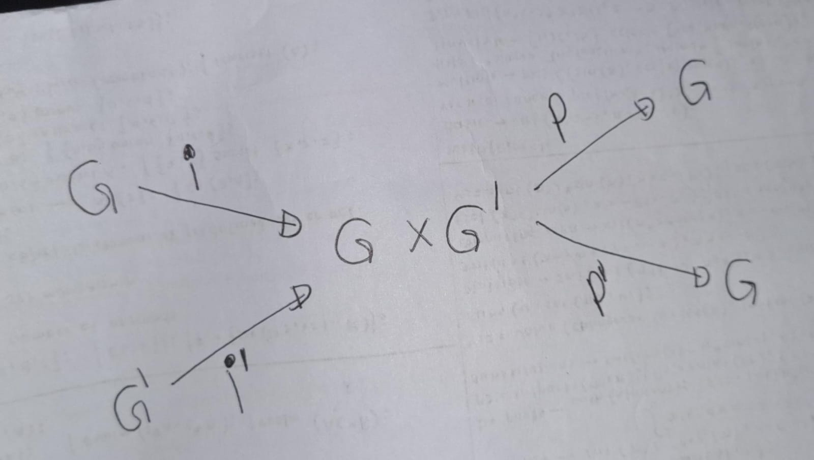<!-- --> 
The homomorphisms are defined as follows,
\begin{eqnarray}
i:G &\rightarrow& G \times G' \\
x &\mapsto& (x,1)\\\\
i':G' &\rightarrow& G \times G' \\
x &\mapsto& (x',1)\\\\
p:G \times G' &\rightarrow& G' \\
(x,x') &\mapsto& x\\\\
p':G' \times G' &\rightarrow& G' \\
(x,x') &\mapsto& x'\\\\
\end{eqnarray}

Observe that $i$ and $i'$ are injective and \[Im(i)=G\times 1_G'\leq G\times G' \text{ and }Im(i')=1_G\times G'\leq G\times G'\] 
The maps $p$ and $p '$ are called projections and they are surjective. 
\[\ker(p)=1\times G'\text{ and }\ker(p')=G\times 1_{G'}\]
It is obviously desirable to decompose a given group $G$ as a product, that is, to find investigate groups $H$ and $H '$ such that $G$ is isomorphic to the product $H \times H'$. The groups $H$ and $H'$ will be simpler, and the relation between $H\times H'$ and its factors is easily understood. It is rare that a group is a product, but it does happen occasionally

::: {.example #unnamed-chunk-31}
Consider a cyclicgroup of order $6$ can be decomposed. It migheted be suprised you. A cyclic group $C_6$ of order $6$ isisomorphic to the product $C_2 \times C_3$ of cyclic groups of orders $2$ and $3$.
\[C_6\equiv C_2 \times C_3\]
Let say 

\begin{eqnarray}
C_2&=&<y>=\{1,y\},\text{ with } y^2=1\\
C_3&=&<z>=\{1,z,z^2\}, \text{ with } y^3=1
\end{eqnarray}

Let $x\in C_2\times c_3$. Then there exist $p\in C_2$ and $q\in C_3$ such that $x=(p, q)$. Let's find order of $x$, that is the smallest positive integer $k$ such that $x^k =(y^k,z^k)$ is the identity $(1, 1)$.

- _Case-I_: $k=1, x^1=(y^1,z^1)=(y,z)$
- _Case-II_: $k=2, x^2=(y^2,z^2)=(1,z^2)$
- _Case-III_: $k=3, x^3=(y^3,z^3)=(y,1)$
- _Case-IV_: $k=4, x^4=(y^4,z^4)=(1,z)$
- _Case-V_: $k=5, x^5=(y^5,z^5)=(1,z^2)$
- _Case-VI_: $k=6, x^5=(y^6,z^6)=(1,1)$

Thus, the smallest positive integer $k$ such that $x^k=(1, 1)$ is 6. So, order of $x$ is $6$. Since $C_2\times C_3$ has order $6$. Furthur,
\[C_2\times C_3 =<x>\]
The powers of $x$ are
\[(1,1),(y,z),(1,z^2),(y,1),(1,z),(y,z^2)\]

:::

<!-- --> 
Here $i=0,1,2...5$

So let's try to see above result more generally.

::: {.proposition #unnamed-chunk-32}
Let $r$ and $s$ be relatively prime integers.
A cyclic group of order $rs$ is isomorphic to the product of a cyclic group of order $r$ and a cyclic group of order $s$.
:::
::: {.example #unnamed-chunk-33 name="s"}
On the other hand, a cyclic group of order $4$ is not isomorphic to a product of two cyclic
groups of order $2$. 
\[C_4\not\equiv C2 \times C_2\]
Because , every element of $C_2 \times C_2$ has order $1$ or $2$,whereasa cyclic group of order
$4$ contains two elements of order $4$.

:::

The next proposition describes product groups.

::: {.proposition #prp2114}
Let $G$ be a group and let $H,K\leq G$, and let $f: H \times K \rightarrow G$ be the multiplication map, defined by $f(h, k) = hk$. Its image is the set $HK = \{hk | h \in H, k \in K\}$.

a. $f$ is injective if and only if $H \cap K = \{1\}$.
a. $f$ is a homomorphism from the product group $H \times K$ to $G$ if and only if elements of $K$ commute with elements of $H$: $hk = kh$.
a. If $H$ is a normal subgroup of $G$, then $HK$ is a subgroup of $G$.
a. $f$ is an isomorphism from the product group $H \times K$ to $G$ if and only if $H \cap K = \{1\}$, $HK = G$, and also $H$ and $K$ are normal subgroups of $G$.

It is important to note that the multiplication map may be bijective though it isn't a group homomorphism. This happens, for instance, when $G = S_3$, and with the usual notation, $H = \langle x \rangle$ and $K = \langle y \rangle$.

:::

::: {.proof}
a. 
  - ($\Longrightarrow$) We are going to use proof by contrapositive. So, suppose that $x\in H\cap K$ such that $x \neq 1$. Since $x\in H$ then $x^{-1} \in H$. 
\[f(x^{-1},x)=x^{-1}\cdot x=1=1\cdot 1=f(1,1)\]
Thus, $f$ is not injective. Thus, if $f$ is injective then $H \cap K = \{1\}$.
  -($\Longleftarrow$) 
Now Suppose that $H \cap K = \{1\}$. Let $(h_1, k_1),(h_2, k_2)\in H \times K$ such that $h_1k_1 = h_2k_2$. Now multiply both sides of this equation on the left by $h_1^{-1}$ and on the right by $k_2^{-1}$,
\begin{eqnarray}
h_1k_1 &=& h_2k_2\\
h_1^{-1}(h_1k_1)k_2^{-1} &=& h_1^{-1}(h_2k_2)k_2^{-1}\\
(h_1^{-1}h_1)k_1k_2^{-1} &=& h_1^{-1}h_2(k_2k_2^{-1})\\
k_1k_2^{-1} &=& h_1^{-1}h_2
\end{eqnarray}
Note that $(k_1k_2^{-1})\in K$ and $h_1^{-1}h_2\in H$. Since $H \cap K = \{1\}$, \[k_1k_2^{-1} = h_1^{-1}h_2 = 1\]. Then,
\[
k_1=k_2~~\text{and}~~~~h_1=h_2.
\]
Then \[(h_1, k_1) = (h_2, k_2)\]

b. Let $(h_1, k_1),(h_2, k_2)\in H \times K$.  Now consider,
\begin{eqnarray}
f((h_1,k_1)\cdot (h_2,k_2))&=&f((h_1h_2,k_1k_2))=h_1h_2k_1k_2\\
f((h_1,k_1))\cdot f((h_2,k_2))&=& (h_1k_1)\cdot(h_2k_2)=h_1k_1h_2k_2
\end{eqnarray}
\begin{eqnarray}
f\text{ is homorphism} &\iff & 
f((h_1,k_1)\cdot (h_2,k_2))=f((h_1,k_1))\cdot f((h_2,k_2))\\
&\iff & h_1h_2k_1k_2=h_1k_1h_2k_2\\
&\iff & h_1^{-1}(h_1h_2k_1k_2)k_2^{-1}=h_1^{-1}(h_1k_1h_2k_2)k_2^{-1}\\
&\iff & (h_1^{-1}h_1)h_2k_1(k_2k_2^{-1})=(h_1^{-1}h_1)k_1h_2(k_2k_2^{-1})\\
&\iff & (h_1^{-1}h_1)h_2k_1(k_2k_2^{-1})=(h_1^{-1}h_1)k_1h_2(k_2k_2^{-1})\\
&\iff & h_2k_1=k_1h_2
\end{eqnarray}
c. 
  - Suppose that $H$ is a normal sub group of G. Note that \[KH=\bigcup_{k\in K}kH~~\text{   and     } ~~HK=\bigcup_{k\in K}Hk\] 
Since, $H$ is normal, $kH=Hk$ for all $k\in K$. So, $HK=KH$. We are going to use sub group test,
    
    - _non-emptyness_: Clearly, $1=1\cdot 1\in HK$ (because $1\in H$ and $1\in K$
    - _closure_: 
  \[HKHK=HHKK=HK\]
Thus, $HK$ is closed under multiplication.
    - _closed under inverse_: Let $hk\in HK$. Then 
\[(hk)^{-1} = k^{-1}\cdot h^{-1} \in KH=HK \]
This proves closure of $HK$ under inverses.
d. 
  - $(\Longleftarrow)$: Suppose that $H \cap K = \{1\}$, $HK = G$, and also $H,K \trianglelefteq  G$. According to the (b),  $f$ is a homomorphism from $H \times K$ to $G$ if and only if $hk = kh$ for all $h\in H$. Consider,
\[(hkh^{-1})k^{-1}=h(kh^{-1}k^{-1}).\]
Note that, Since $K \trianglelefteq G$, $hkh^{-1}\in K$. So,$(hkh^{-1})k^{-1}\in K$. Similary we can  show that $h(kh^{-1}k^{-1})\in H$.Thus,\[(hkh^{-1})k^{-1}=h(kh^{-1}k^{-1})\in H\cap K.\]  But from our hypothesis, $H\cap K=\{1\}$. Hence,
\begin{eqnarray}
hkh^{-1}k^{-1}&=&1\\
hk&=& kh
\end{eqnarray}
Therefore, by (b) we can $f$ is hormorphism. Now we have to proove bijectivity,
      - _Injectivity_: Already prooved in \@ref(prp:prp2114) (a)
      - _Surjectivity_: For any $g \in G$, we can write $g = hk$ for some $h \in H$ and $k \in K$ (since $Im(f)=HK = G$). Thus, $f(h, k) = hk = g$, so $f$ is surjective.

Therefore $f$ is an isomorphism.

  - $(\Longrightarrow)$ Now suppose that $f$ is isomorphism.

    - **Claim i**: $H \cap K = \{1\}$.\
Suppose that $x\in H \cap K$. Then,
\[f(1,x)=x=f(x,1)\]
Since $f$ is an isomorphism (and hence injective), we must have $x = 1$. Therefore, $H \cap K = \{1\}$.
    - **Claim ii** :$HK = G$.\
Since $f$ is surjective, for any $g \in G$, there exist $h \in H$ and $k \in K$ such that $f(h, k) = hk = g$. Therefore, $HK = G$.

    - **Claim iii** : $H$ and $K$ are normal in $G$.\
For any $h \in H$ and $g \in G$, we can write $g = hk$ for some $k \in K$. Then 
\[ghg^{-1} = (hk)h(hk)^{-1}
  =hk(hh^{-1})k^{-1}=h(kk^{-1})=h\in H.\]
Thus, $H\trianglelefteq G$.
Similarly, we can show that $K\trianglelefteq G$.
:::
\

::: {.proposition #unnamed-chunk-35}
There are two isomorphism classes of groups of order $4$, the class of the cyclic group $C_4$ of order $4$ and the class of the Klein Four Group,which is isomorphic to the product $C_2 \times C_2$ of two groups of order $2$.
:::

::: {.proof}
Let $G$ be a group of order 4. The order of any element $x$ of $G$ divides 4, so there are two cases to consider:

- Case 1: $G$ contains an element of order 4 (|G|=4). Then $G$ is a cyclic group of order 4.
- Case 2: Every element of $G$ except the identity has order 2.\
In this case, $x = x^{-1}$ for every element $x$ of $G$. Let $x$ and $y$ be two elements of $G$. Then $xy$ has order 2, so $(xy)(x^{-1}y^{-1}) = (xy)(xy) = 1$. This shows that $x$ and $y$ commute,
\begin{eqnarray}
xyx^{-1}y^{-1} &=& 1\\
xyx^{-1}(y^{-1} y)&=& y\\
xyx^{-1}&=& y\\
xy(x^{-1}x)&=& yx\\
xy &=& yx
\end{eqnarray}
since $x,y$ are arbitrary elements, $G$ is abelian. So every subgroup is normal. We choose distinct elements $x$ and $y$ in $G$, and we let $H$ and $K$ be the cyclic groups of order 2 that they generate. Proposition \@ref(prp:prp2114) (d) shows that $G$ is isomorphic to the product group $H \times K$.

:::

## Quotient Groups
::: {.definition #unnamed-chunk-37}
The set of cosets of a normal subgroup $N$ of a group $G$ is often denoted by $G / N$.
\[G / N \text{ is the set of cosets of $N$ in} G\]
:::
**Notation**: When we regard a coset $C$ as an element of the set of cosets, the bracket notation $[C]$ 
may be used. 
If $C = aN$, we may also use the bar notation to denote the element $[C]$ by $\overline{a}$,
and then we would denote the set of cosets by $\overline{G}$:
\[\overline{G} = G /N\]

::: {.theorem #2122}
Let $N$ be a normal subgroup of a group $G$, and let $G$ denote the set of cosets of $N$ in $G$. There is a law of composition on $G$ that makes this set into a group, such that the map $\pi: G \to \overline{G}$ defined by $\pi(a) = \overline{a}$ is a surjective homomorphism whose kernel is $N$.
:::
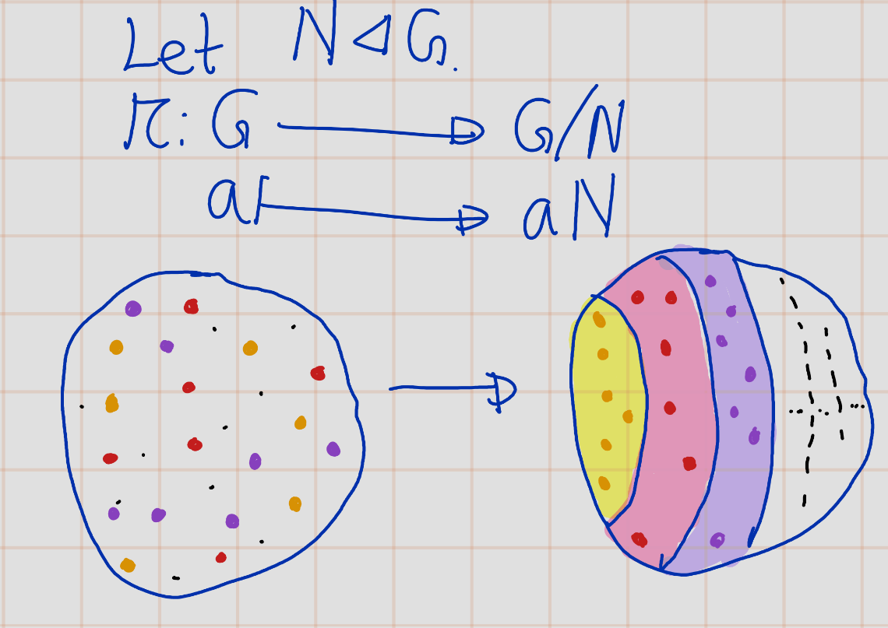<!-- --> 
::: {.remark}
 The map is often referred to as the canonical map from $G$ to $\overline{G}$. The word “**canonical**” 
indicates that this is the only map that we might reasonably be talking about
:::
The next corollary is very simple, but it is important enough to single out:

::: {.corollary #unnamed-chunk-39}
Let $N \trianglelefteq G$, and let $\overline{G}$ denote the set of cosets of $N$ in $G$. Let $\pi: G \to \overline{G}=G/N$ be the canonical homomorphism. Let $a_1, \ldots, a_k\in G$ such that the product $a_1 \cdots a_k\in N$. Then $\overline{a_1} \cdots \overline{a_k} = \overline{1}$.
:::

::: {.proof}
Let $p=a_1 \cdots a_k\in N$. This implies
\(\pi(p)=\overline{p}=\overline{1}\).\
Since is $pi$ a homomorphism, \(\pi(p)=\pi(a_1 \cdots a_k)=\pi(a_1)\cdots \pi(a_k)=\overline{a_1}\cdots\overline{a_n}\)
:::

_Proof of \@ref(thm:2122)_
There are several things to be done. We must

- define a law of composition on $\overline{G}$,
- prove that the law makes $\overline{G} into a group,
- prove that $\pi$ is a surjective homomorphism, and
- prove that the kernel of $\pi$ is $N$.

::: {.remark}
If $A,B \subseteq G$ then $AB$  denotes the set of products $ab$:
  \[AB:=\{x\in G: x=ab, a\in A, b\in B\}\]

- We will call this a product set, though in some other contexts the phrase “product set” refers 
to the set $A \times B$ of pairs of elements
:::

::: {.lemma #unnamed-chunk-42}
Let $N$ be a normal subgroup of a group $G$, and let $a N$ and $b N$ be cosets of $N$. The product set $(aN )(bN )$ is also a coset and \[(aN )(bN )=\{x\in G: x=anbn' ~\& ~ n,n'\in N\}=abN\].
:::
::: {.proof}
Since $N$ is a subgroup, $N N = N$.\
Since $N$ is normal, left and right cosets are equal: 
$N b = bN$.
\[(aN )(bN ) = a (N b )N = a (b N )N = a b N N = abN\]
:::

- This lemma allows us to define multiplication on the set $\overline{G} = G / N$. 
- Using the bracket 
notation, the definition is this: If \(C_1\) and $C_2$ are cosets, then \([C_1][C_2] = [C_1 C_2]\), 
Where \(C_1 C_2\) is the product set. 
- The lemma shows that this product set is another coset.    
- To compute the product $[C_1][C_2]$, take any elements $a \in C_1$ and $b \in C_2$. Then $C_1 = aN$ ,
$C_2 = bN$ , and $C_1 C_2$ is the coset $a b N$ that contains $ab$. So,
\[[aN][bN] = [abN] \text{ or } \overline{a}\overline{b} = \overline{ab}.\]
Then by definition of the map $\pi$ in theorm \@ref(thm:2122),
\[\pi(ab)=\overline{a}\overline{b} = \overline{ab}=\pi(a)\pi(b)\]
The fact that $\pi$ is a homomorphism will follow, once we show that G is a group. 
Since the canonical map $\pi$ is surjective , the next lemma proves this

::: {.lemma #unnamed-chunk-44}
Let \(G\) be a group, and let \(Y\) be a set with a law of composition (both laws written with multiplicative notation). Consider a surjective map \(\varphi : G \to Y\) with the homomorphism property: \(\varphi(ab) = \varphi(a)\varphi(b)\) for all \(a\) and \(b\) in \(G\). Then \(Y\) is a group, and \(\varphi\) is a homomorphism. 
:::

::: {.proof}
The group axioms that are true in \(G\) are carried over to \(Y\) by the surjective map \(\varphi\). 

- **Closure** : Let \(y_1,y_2\in Y\). Since \(\varphi\) is surjective, \(y_1=\varphi(x_1),y_2=\varphi(x_2)\) for some $x_1,x_2\in G$.
\[y_1y_2=\varphi(x_1)\varphi(x_2)=\varphi(x_1x_2)\in Y\]

- **Assciativity Property** : \
Let \(y_1\), \(y_2\), and \(y_3\) be elements of \(Y\). Since \(\varphi\) is surjective, \(y_i = \varphi(x_i)\) for some \(x_i\) in \(G\). Then

\begin{eqnarray}
(y_1 y_2) y_3 &=& (\varphi(x_1) \varphi(x_2)) \varphi(x_3) = \varphi(x_1 x_2) \varphi(x_3) = \varphi((x_1 x_2) x_3) \\
&=^*& \varphi(x_1 (x_2 x_3)) = \varphi(x_1) \varphi(x_2 x_3) = y_1 (y_2 y_3)
\end{eqnarray}

The equality marked with an asterisk $(=^*)$ is the associative law in \(G\). The other equalities follow from the homomorphism property of \(\varphi\). 

- **Identity**
  Let $y\in Y$. Since $\varphi$ is surjective, there exist $x\in G$ such that $y=\varphi(x)$. Let $1_G$ be identity of $G$ Then,
\[y\varphi(1_G)=\varphi(x)\varphi(1_G)=\varphi(x1_G)=\varphi(x)=y=
    \varphi(1_Gx)=\varphi(1_G)\varphi(x)=\varphi(1_G)y\]
Thus, $\varphi(1_G)$ is the identity of $Y$.

- **Inverse** : Let $y\in G$. Since $\varphi$ is surjective, there exist $x\in G$ such that $y=\varphi(x)$, 
\[y\varphi(x^{-1}=\varphi(x)\varphi(x^{-1})
           =\varphi(xx^{-1})=\varphi(1_G)=\varphi(x^{-1}x)=\varphi(x^{-1})\varphi(x)=\varphi(x^{-1})y\]
Thus, $y^{-1}=\varphi(x)$
:::

The only thing remaining to be verified is that the kernel of the homomorphism $\pi$ is the subgroup $N$.

\begin{eqnarray}
\pi (a) =\pi(1) &\iff & \bar{a}= \bar{1}\\
& \iff & [aN] = [1N]\\
& \iff & a \in N.
\end{eqnarray}
Thus, $\ker(\pi)=N$

## Exercises

### Groups and Subgroups
::: {.exercise #unnamed-chunk-46}
Make a multiplication table for the symmetric group $S_3$.
:::
**Solution**

| $\circ$  | **e** | (12) | (13) | (23) | (123) | (132) |
|---|---|---|---|---|---|---|
| **e** | e | (12) | (13) | (23) | (123) | (132) |
| **(12)** | (12) | e | (123) | (132) | (13) | (23) |
| **(13)** | (13) | (123) | e | (132) | (23) | (12) |
| **(23)** | (23) | (132) | (123) | e | (12) | (13) |
| **(123)** | (123) | (13) | (23) | (12) | (132) | e |
| **(132)** | (132) | (23) | (12) | (13) | e | (123) |

::: {.exercise #unnamed-chunk-47}
Let $S$ be a se t with an associative law of composition and with an identity element. Prove that the subset consisting of the invertible elements in $S$ is a group.
:::

::: {.proof}
Let $S^*\subseteq S$ with consisting of the invertible elements in $S$.

- _identity_ : We are given identity element $1 \in S$ and $(1^{−1})(1)=1 \implies 1 \in S^∗$

- _Closure_ :
So let $a,b\in S^∗$. Then $a,b$ are invertible. Let $a^{−1},b^{−1}\in S^∗$ be inverses of $a$ and $b$ respectively. Now we need to check $ab\in S^*$.\

\[(b^{−1}a^{−1})(ab)=b^{−1}(a^{−1}a)b=b^{−1}b=e=
  aa^{-1}=a(bb^{−1})a^{−1}=(ab)(b^{−1}a^{−1})\]
:::
Thus, $(ab)^{−1}=b^{−1}a^{−1}$. So, $ab\in S^*$
Therefore, $S^*$ is closed under the composition.

- _Associativity_: The associativity property inherit from the group $S$.

Therefore, $S^*$ is a group.

::: {.exercise #unnamed-chunk-49}
Let $G$ be a group.Let $x, y, z,w \in G$.

(a) Solve for $y$, given that $xyz^{-1}w = 1$.
(b) Suppose that $xyz = 1$. Does it follow that $yzx = 1$? Does it follow that $yxz = 1$?

:::
**Solution**: 

a. 
<!-- --> 
b. 

- \
<!-- --> 
- The given statement is false.
\begin{eqnarray}
          xyz&=&1\\
  x^{-1}(xyz)&=&x^{-1} \cdot 1\\
  (x^{-1}x)(yz)&=&x^{-1}\\
  1 \cdot(yz)&=&x^{-1}\\
  (yz)&=&x^{-1}\\
  (yz)z^{-1}&=&x^{-1}z^{-1}\\
  y(zz^{-1})&=&x^{-1}z^{-1}\\
  y \cdot 1&=&x^{-1}z^{-1}\\
  yx&=&x^{-1}z^{-1}x\\
  yxz&=&x^{-1}z^{-1}xz\\
\end{eqnarray}
If $G$ is not abelian or $z\neq x$. $xyz=1 \nRightarrow yxz=1$.

::: {.exercise #unnamed-chunk-50}
In which of the following cases is \(H\) a subgroup of \(G\)?

(a) \(G = GL_n(\mathbb{C})\) and \(H = GL_n(\mathbb{R})\).

(b) \(G = \mathbb{R}^\times\) and \(H = \{1, -1\}\).

(c) \(G = \mathbb{Z}^+\) and \(H\) is the set of positive integers.

(d) \(G = \mathbb{R}^+\) and \(H\) is the set of positive reals.

(e) \(G = GL_2(\mathbb{R})\) and \(H\) is the set of matrices $\begin{bmatrix} a & 0 \\ 0 & 0 \end{bmatrix}$ with all entries equal to 0.
:::

**Solution**:\

(a) 

- _Subset ?_ : Since every matrix with real entries can be interpreted as a matrix with complex entries, we conclude that $H \subset G$.

- _Closure ?_ : For every $A, B \in GL_n(\mathbb{R})$ we have $AB \in GL_n(\mathbb{R})$  since Product of invertible matrices is invertible. I proved this result in chapter 1. 

- _Identity ?_ :The identity in $G$ is $I_n$, the identity $n x n$ matrix. Observe that $I_n\in H=GL_n(\mathbb{R})$. (Because every entry of $I_n$ is 1 or 0)

- _Inverse ?_: $GL_n(\mathbb{R})$ is the set of $n \times n$ invertible matrices with real entries. So, all the elements in $H$ is invertible.

Therefore, $H \leq G$

(b) 

- _Subset ?_ : This is trivial $\{-1,1\}\subset \mathbb{R}^\times$

- _Closure ?_ : 
\begin{eqnarray}
1 \times 1 &=& 1\in H\\
(-1) \times 1 &=& (-1)\in H\\
1 \times (-1) &=& (-1)\in H\\
(-1) \times (-1) &=& -1\in H\\
\end{eqnarray}
Thus, $H$ is closed.
- _Identity ?_ : The identity in $G$ is $1$, which is also in $H$.

- _Inverse ?_ : 
\begin{eqnarray}
1 \times 1 = 1   &\implies & (1)^{-1}=1\in H\\
(-1) \times (-1) = 1 &\implies & (-1)^{-1}=(-1)\in H
\end{eqnarray}
x`Therefore, $H$ is sub group of $G$.

(c) Note that $2\in H$, but inverse of $2$ in $\mathbb{Z}^+$ is $(-2) \not \in H$.\
Therefore, $H$ is not a subgroup of $G$.

(d)
- _Subset ?_ : This is trivial. $H \subset \mathbb{R}^\times$

- _Closure ?_ : Product of positive real number is positive. Thus, $H$ is closed.

- _Identity ?_ : $1$ is the identity of $G$, which is in $H$.

- _Inverse ?_ : Let $a\in H$. Then, 
\[a\cdot \frac{1}{a}=\frac{1}{a}\cdot a=1\]
So, $\frac{1}{a}\in H$ is the inverse of $a$. Thus, $H$ is closed under inverses.

(e) Let $A=\begin{bmatrix} 2 & 0 \\ 0 & 0 \end{bmatrix}$ Then $A\in H$. But observe that $det(A)=0\implies A$ is not invertible. Thus, $A\not\in H$. Thus, this $H \not\subseteq G$. 

Therefore, $H$ is not a subgroup of $G$.

::: {.exercise #unnamed-chunk-51}
In the definition of a subgroup, the identity element in $H$ is required to be the identity 
of $G$. One might require only that H have an identity element, not that it need be the 
same as the identity in $G$. 
- Show that if $H$ has an identity at all, then it is the identity in $G$. 
- Show that the analogous statement is true for inverses.
:::
::: {.exercise #unnamed-chunk-52}
Let \( G \) be a group. We define an opposite group \( G^{\circ} \) with the law of composition \( a * b \) as follows: 
- The underlying set is the same as \( G \), 
- but the law of composition is \( a * b = ba \). 

Prove that \( G^{\circ} \) is a group.

:::

**Solution**:

<!-- --> 

### Subgroups of the Additive Group of Integers
::: {.exercise #unnamed-chunk-53}
 Let $a = 123$ and $b = 321$. 
Compute $d = gcd(a, b)$, and express $d$ as an integer 
combination $ra + bs$.
:::

**Solution**:
<!-- --> 

::: {.exercise #unnamed-chunk-54}
Prove that if $a$ and $b$ are positive integers whose sum is a prime $p$, their greatest common 
divisor is $1$.
:::
**Solution**:
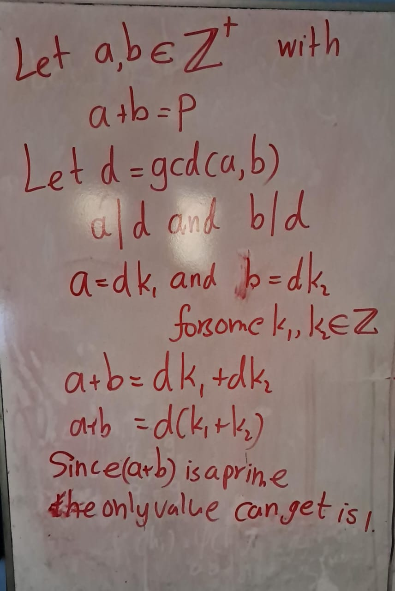<!-- --> 

::: {.exercise #unnamed-chunk-55}
Define the greatest common divisor of a set $\{a_1, ..., a_n\}$ of $n$ integers. Prove that it
exists, and that it is an integer combination of $a_1, ..., a_n$.
:::

### Cyclic group
::: {.exercise #unnamed-chunk-56}
Let $a$ and $b$ be elements of a group $G$. Assume that a has order $7$ and that $a^3b = ba^3$. 
Prove that $a b = ba$.
:::
**Solution**:
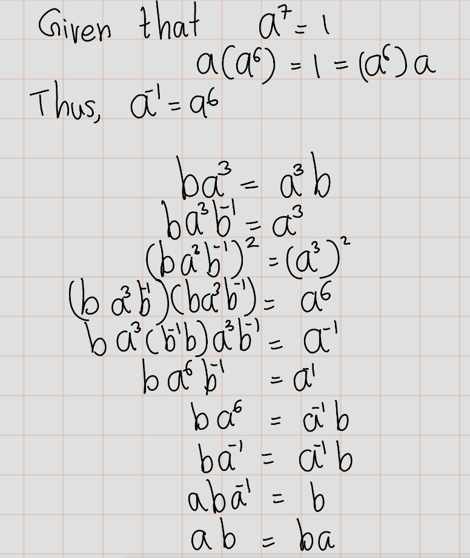<!-- --> 

::: {.exercise #unnamed-chunk-57}
An $n$th root of unity is a complex number $z$ such that $z^n = 1$.

(a) Prove that the nth roots of unity form a cyclic subgroup of $\mathbb{C}^\times$ of order $n$.
(b) Determine the product of all the $n$th roots of unity.
:::
**Solution**:
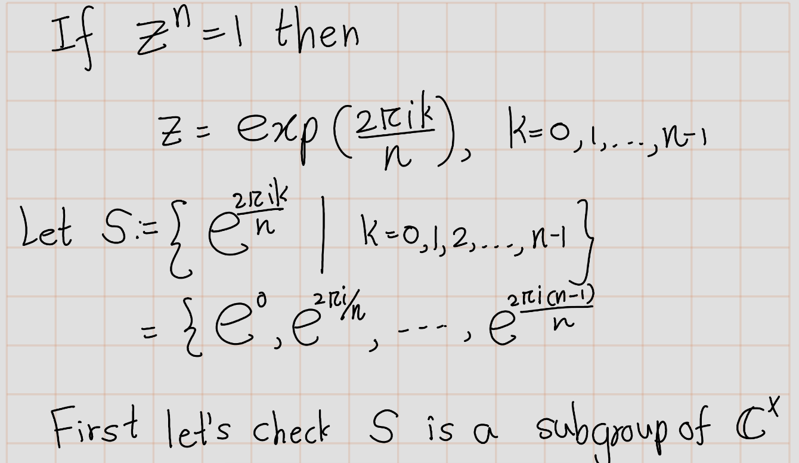<!-- --> 
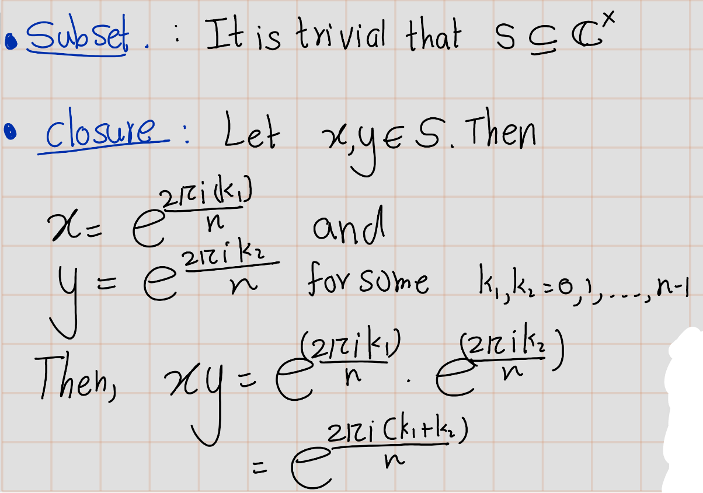<!-- --> 
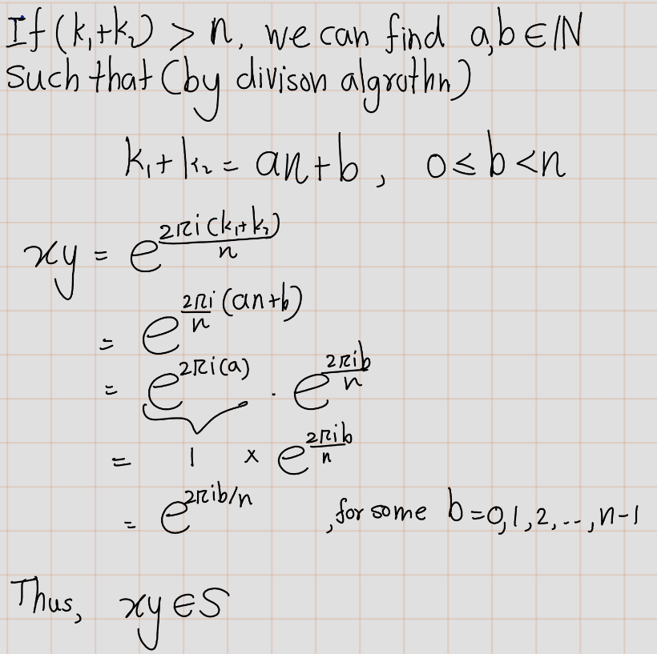<!-- --> 
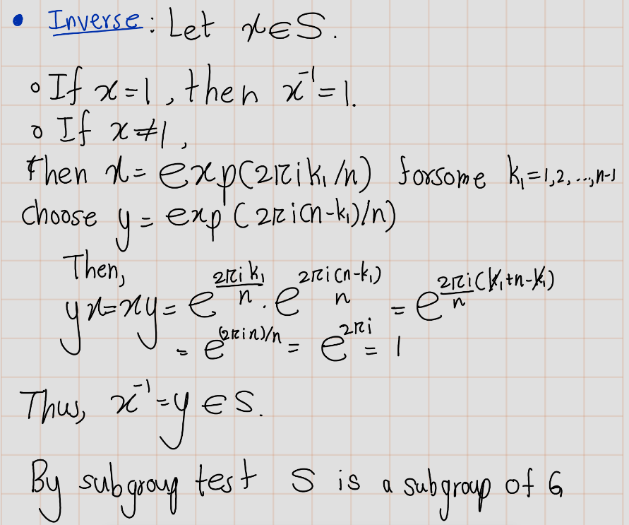<!-- --> 
<!-- --> 
<!-- --> 

::: {.exercise #unnamed-chunk-58}
Let $a$ and $b$ be elements of a group $G$. Prove that $ab$ and $ba$ have the same order
:::

::: {.proof}
Let \(a\) and \(b\) be elements in a group \(G\) with identity \(e\).

Suppose that \(ab\) has finite order \(n\). Then \((ab)^n = e\) and \(n\) is the smallest positive integer for which this equation is true. We also have that \[ (ba)^{n+1} = (ba)(ba) \cdots (ba) = b\underbrace{(ab) \cdots (ab)}_{n \text{ times}}a =b(ab)^na=a(ba)^m b =bea = ba. \]

Thus, since  \((ba)^{n+1} = (ba)^n(ba) \) we can conclude that \( (ba)^n(ba) = ba \) and then by the cancellation law, we have that $(ba)^n = e.$

Now, to show that the order of \(ba\) is \(n\), we need to demonstrate that \(n\) is the smallest positive integer such that \( (ba\)^n = e. \)

Suppose there exists a positive integer \(m < n\) such that \( (ba)^m = e. \)
Then,\[
(ab)^{m+1} =(ab)(ab)\cdots(ab)=a\underbrace{(ba)\cdots(ba)}_{m \text{ times}}b=a(ba)^m b=aeb= ab.
\]

Thus, since\((ab)^{m+1} =(ab)^m(ab) \)
we have that
\((ab)^m(ab)= ab \)
and then by the cancellation law, we have that
\((ab\)^m=e \)
which contradicts the fact that \(n\) is the smallest positive integer such that
\((ab)^n=e.\)

Hence, \(n\) is the smallest positive integer such that
\((ba)^n=e\)
and therefore
\((ba)\) has finite order \(n\).
:::

<!------------------------------------------>
### Product Group
::: {.exercise #unnamed-chunk-60}
Let $x$ be an element of order $r$ of a group $G$, and let $y$ be an element of $G'$ of order $s$. What is the order of $(x, y)$ in the product group $G \times G'$?
:::
**Solution**: The order of $(x, y)$ in the product group $G \times G'$ is **$lcm(r,s)$**\
Let $n\in \mathbb{Z}^+$  such that \[(x,y)^n=(x^n,y^n)=(1_G,1_{G'}).\]
This implies, $x^n=1_G$ and $y^n=1_{G'}$. Since order of $x$ and $y$ are $r$ and $s$ respectively, 
\[r|n~~~\text{ and }~~~s|n\]
So, we know that the least positive integer such that above property holds is $lcm(r,s)$. Hence,The order of $(x, y)$ in the product group $G \times G'$ is **$lcm(r,s)$**.

\
\
\

::: {.exercise #unnamed-chunk-61}
What does Proposition \@ref(prp:prp2114) tell us when, with the usual notation for the symmetric
group $S_3,K$ and $H$ are the subgroups $<y>$ and $<x>$?
:::
Recall: $y^2=1$ and $x^3=1$. Then 
\[H=<x>=\{1,x,x^2\}~~~\text{ and }~~~ K=<y>=\{1,y\}\]
Let the multiplication map, $f:H\times K \to S_3$ defined by $f(h,k)=hk$. Then, 
$Im(f)=HK=\{hk:h\in <x>, k\in <y>\}=\{1,x,x^2,y,xy,x^2y\}$.

**Claim 1**: $f$ is injective.\
Observe that $H \cap K=\{1\}$. by \@ref(prp:prp2114) a) $f$ is injective.

**Claim 2**: $f$ is surjective.\
Observe that $S_3=HK=\{1,x,x^2,y,xy,x^2y\}$. Thus, $f$ is surjective.

**Claim 3** : $f$ is not hormorphism.\
\begin{eqnarray}
f((x,y)\cdot (x,1))&=& f(x^2,y^2)=f(x^2,1)=x^2\cdot 1=x^2\\
f(x,y)\cdot f(x,1)&=& (x\cdot y)\cdot (x\cdot 1)=(xy)\cdot x=y
\end{eqnarray}
Thus, $f$ is not a homomorphism.

::: {.exercise #unnamed-chunk-62}
Prove that the product of two infinite cyclic groups is not infinite cyclic.
:::

::: {.proof}
\

- **Claim 1** : Infinite cyclic groups are isomorphic to $Z$.\
Let $G$ be a infinte cyclic group and $<a>=G$.
We can define a function $f: \mathbb{Z} \rightarrow G$ by $f(n) = a^n$ for all integers $n$. We need to show that $f$ is an isomorphism, which means it is bijective.

    - **Subclaim 1.1** : $f$ is a hormorphism.\
\[f(n+m)=a^{n+m}=a^n \cdot a^m =f(n)\cdot f(m)\]
Thus, $f$ is a hormorphism.
    - **Subclaim 1.2** :$f$ is a injective\
Suppose that $f(n)=f(m)$
  \begin{eqnarray}
    f(n)&=&f(m)\\
    a^n &=& a^m \\
    n&=& m ~~(\text{Since order is infinite})
  \end{eqnarray}
  - **Subclaim 1.3** : $f$ is surjective.\
Let $x\in G=<a>$. Then, $x=a^k$ for some $k\in \mathbb{Z}$.  Then, observe that 
    \[f(k)=a^k=a \].
    Thus, $f$ is surjective. 

Therefore, $f$ is an isomorphism. Thus, the infinite cyclic groups are isomorphic to $\mathbb{Z}$. 

\
\
We can consider $\mathbb{Z}\times \mathbb{Z}. Suppose that $(a, b)$ generate the product group. But then, we see that $(2a, b)$ cannot be obtained from adding $(a, b)$ to itself, which implies that  $\mathbb{Z}\times \mathbb{Z} is not infinite cyclic.
:::
\
\
\

::: {.exercise #unnamed-chunk-64}
In each of the following cases, determine whether or not $G$ is isomorphic to the product group $H \times K$.

(a) $G = \mathbb{R}^\times$, $H = \{\pm 1\}$, $K = \{$positive real numbers$\}$.

(b) $G = \{$invertible upper triangular $2 \times 2$ matrices$\}$, $H = \{$invertible diagonal matrices$\}$, $K = \{$upper triangular matrices with diagonal entries $1\}$.

(c) $G = e^x$, $H = \{$unit circle$\}$, $K = \{$positive real numbers$\}$.

:::

**Solution**:

(a) Observe that $G=\mathbb{R}^\times=\mathbb{R}\setminus\{0\}$ is abelian.  Then $H,K \trianglelefteq G$. Further, observe that $H\cap K=\{1\}$ and $HK=\mathbb{R}^\times=G$. Thus, by proposition \@ref(prp:prp2114) $G \cong H \times K$.

(b) 
- **Claim b.1**: $K\trianglelefteq G$.\
Let $g = \begin{bmatrix}
a & b \\
& c
\end{bmatrix}$ be an arbitary matrix in $G$ and $k = \begin{bmatrix}
1 & d \\
& 1
\end{bmatrix}\in K$.
Then,
$$ g^{-1} = \begin{bmatrix}
a^{-1} & -ba^{-1}c^{-1} \\
& c^{-1}
\end{bmatrix}$$
Then
$$gkg^{-1} = \begin{bmatrix}
a & b \\
& c
\end{bmatrix}\begin{bmatrix}
1 & d \\
& 1
\end{bmatrix}\begin{bmatrix}
a^{-1} & -ba^{-1}c^{-1} \\
& c^{-1}
\end{bmatrix}$$
$$= \begin{bmatrix}
a & b \\
& c
\end{bmatrix}\begin{bmatrix}
a^{-1} & dc^{-1} - ba^{-1}c^{-1} \\
& c^{-1}
\end{bmatrix} = \begin{bmatrix}
1 & adc^{-1} \\
& 1
\end{bmatrix} \in K$$
Thus, $H\trianglelefteq G$.

- **Claim b.2** : $H=Z(G)$ ($H$ is in the center of $G$).
    
    - _subclaim b.2.1_ : $H \subseteq Z(G)$.\
    Let $h=\begin{bmatrix}
x & 0 \\
& x
\end{bmatrix} \in H$. Then,
\[B=\begin{bmatrix}
x & 0 \\
& x
\end{bmatrix}=x\begin{bmatrix}
1 &  \\
& 1
\end{bmatrix}=BI\]
Then observe that,  for any $A\in G$,
\[BA=(xI)A = xA = Ax = A(xI)=AB\]
    - _subclaim b.2.2_ : $H \supseteq Z(G)$.\
    Let $\begin{bmatrix}
p & q \\
r & s
\end{bmatrix}\in Z(G)$, then,

\begin{eqnarray}
\begin{bmatrix}
p & q \\
r & s
\end{bmatrix}\begin{bmatrix}
1 & 0 \\
0 & -1
\end{bmatrix} &=& \begin{bmatrix}
1 & 0 \\
0 & -1
\end{bmatrix}\begin{bmatrix}
p & q \\
r & s
\end{bmatrix}\\
\begin{bmatrix}
p & -q \\
r & -s
\end{bmatrix}&=& \begin{bmatrix}
p & q \\
-r & -s
\end{bmatrix}\\
\end{eqnarray}
This yields $−q = q$ and $r = −r$ which imply $q = r = 0$. Now considering,

\begin{eqnarray}
\begin{bmatrix}
p & 0 \\
0 & s
\end{bmatrix}\begin{bmatrix}
0 & 1 \\
1 & 0
\end{bmatrix} &=& \begin{bmatrix}
0 & 1 \\
1 & 0
\end{bmatrix}\begin{bmatrix}
p & 0 \\
0 & s
\end{bmatrix}\\
\begin{bmatrix}
0 & p \\
q & 0
\end{bmatrix}&=& \begin{bmatrix}
0 & q \\
p & 0
\end{bmatrix}\\
\end{eqnarray}
This implies that $a = d$ and since the matrix is invertible, $a\neq 0$. Thus, $H \supseteq Z(G)$.

Therefore, $H = Z(G)$. In other words, $H$ is in the center of $G$.

- **Claim b.2** : $H\trianglelefteq G$.\
Since, $H$ is in the center of $G$, then $H$ is normal. 

- **Claim b.3** : $H\cap K=\{I\}$.\
This is trivial.

- **Claim b.4** : $HK=G$
Clearly, $HK\subseteq G$. Conversly,
for any $g\in G$, $a\neq 0, b\neq 0$,
\[g=\begin{bmatrix}
a & b \\
& c
\end{bmatrix}=\begin{bmatrix}
a &  \\
& c
\end{bmatrix}\begin{bmatrix}
1 & a^{-1}b \\
& 1
\end{bmatrix}\in HK\]. 
Thus, $HK=G$.

Therefore, by proposition \@ref(prp:prp2114) $G\cong HK$

(c) Since $C^\times$ is abelian, then $H$ and $K$ are normal. And, $H \cap K = \left\lbrace 1 \right\rbrace$.

<!-- --> 

Consider $a + bi \in C^\times$. Then 
$$a + bi = \left(\frac{a}{\sqrt{a^2+b^2}} + \frac{b}{\sqrt{a^2+b^2}}i\right)\sqrt{a^2+b^2} \in HK$$
So, $HK = G$. So,  by proposition \@ref(prp:prp2114) $G \cong H \times K$.

::: {.exercise #unnamed-chunk-65}
Let $G_1$ and $G_2$ be groups, and let $Z_i$ be the center of $G_i$. Prove that the center of the product group $G_1 \times G_2$ is $Z_1 \times Z_2$.
:::
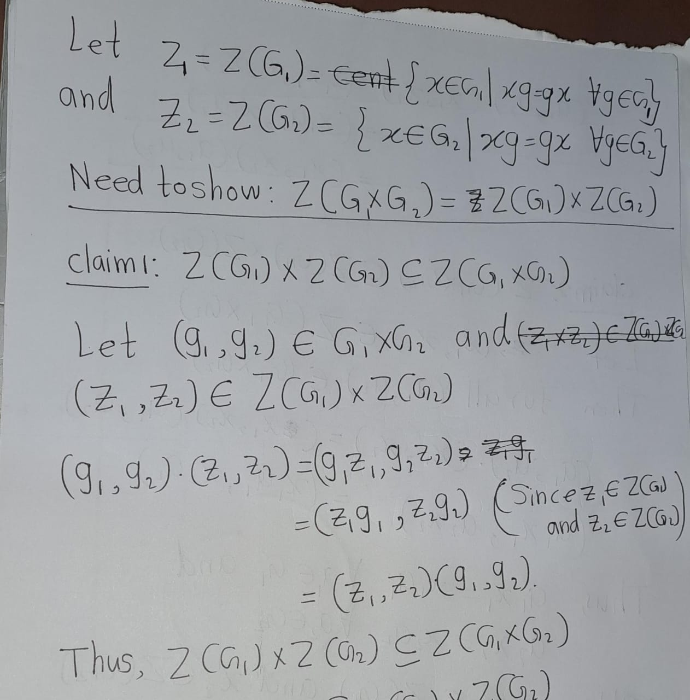<!-- --> 

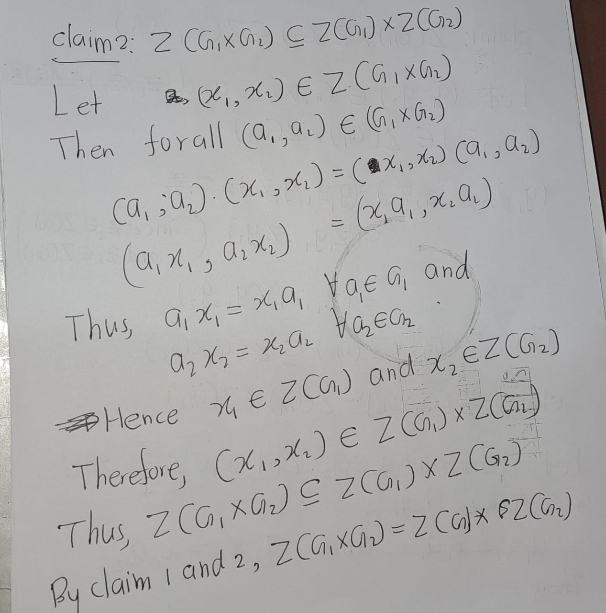<!-- --> 

::: {.exercise #unnamed-chunk-66}
Let $G$ be a group that contains normal subgroups of orders $3$ and $5$, respectively. Prove that $G$ contains an element of order $15$.

:::
::: {.exercise #unnamed-chunk-67}
Let $H$ be a subgroup of a group $G$, let $\phi:G \to H$ be a homomorphism whose restriction to $H$ is the identity map, and let $N$ be its kernel. What can one say about the product map $H \times N \to G$?
:::

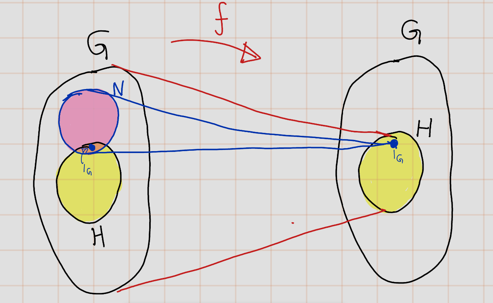<!-- --> 
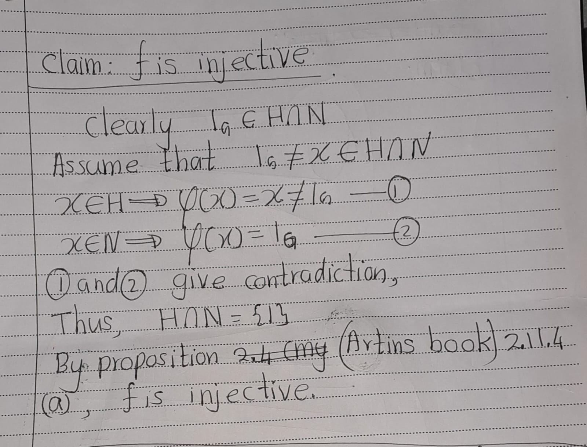<!-- --> 
<!-- --> 
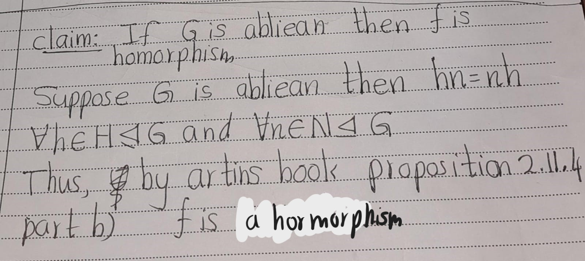<!-- --> 

::: {.exercise #unnamed-chunk-68}
Let $G$, $G'$, and $H$ be groups. Establish a bijective correspondence between homomorphisms $\phi : H \to G \times G'$ from $H$ to the product group and pairs $(\varphi, \varphi')$ consisting of a homomorphism $\varphi:H \to G$ and a homomorphism $\varphi':H \to G'$.
:::
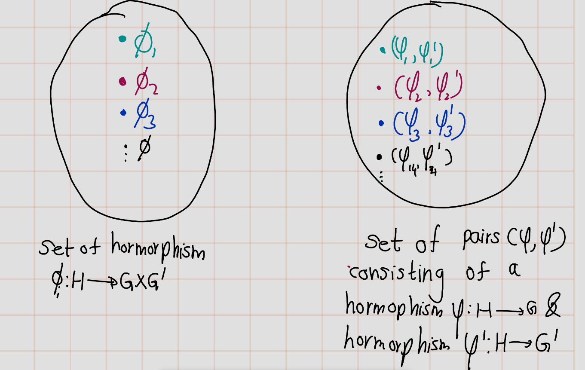<!-- --> 

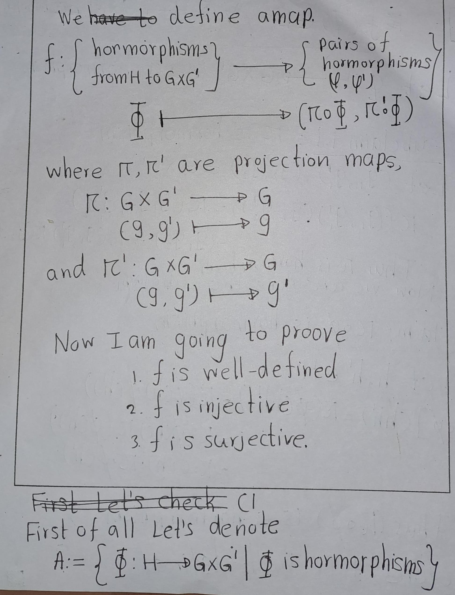<!-- --> 
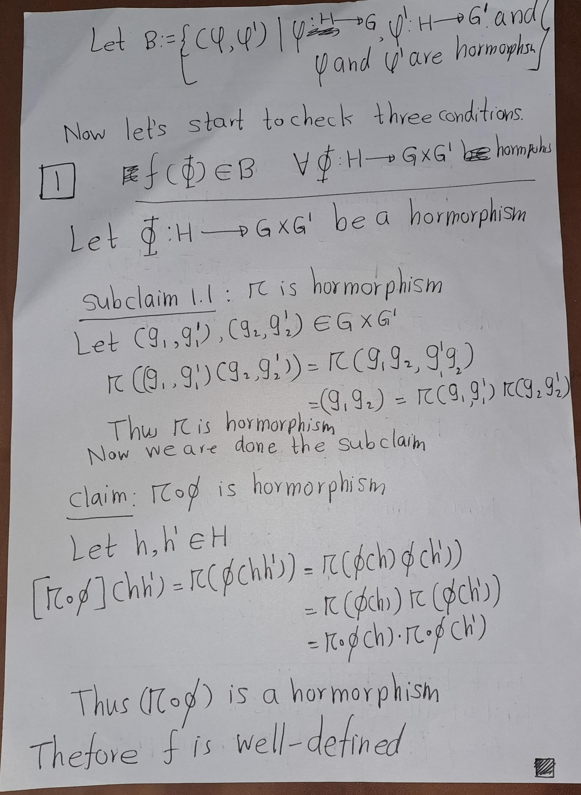<!-- --> 
<!-- --> 
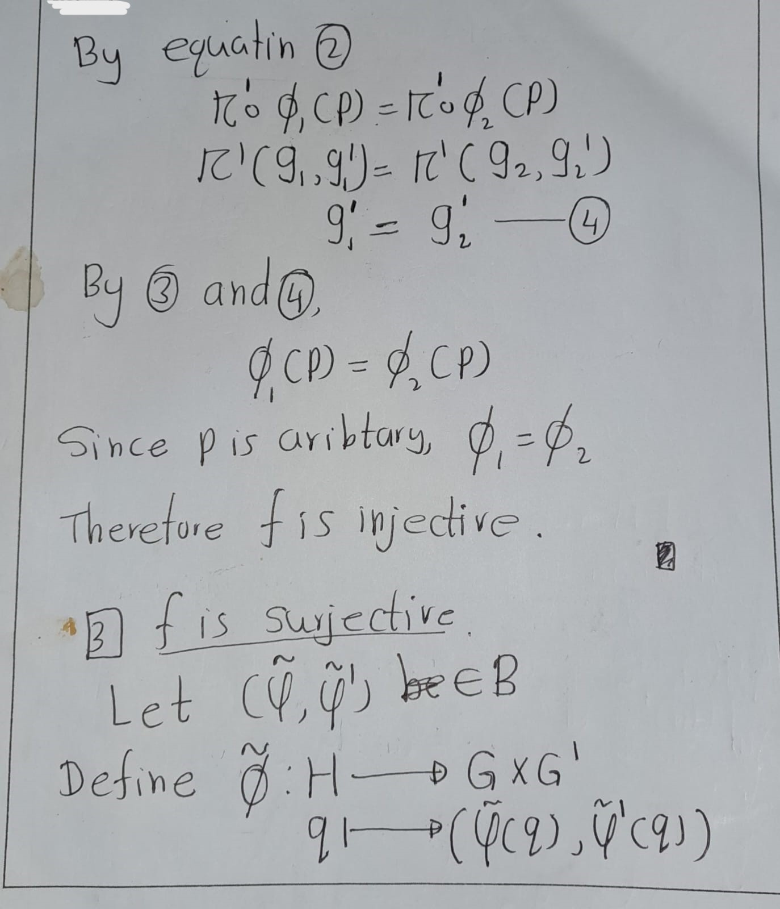<!-- --> 
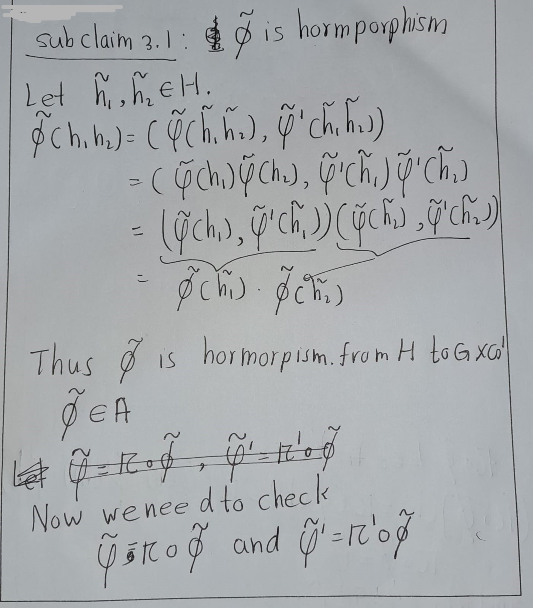<!-- --> 
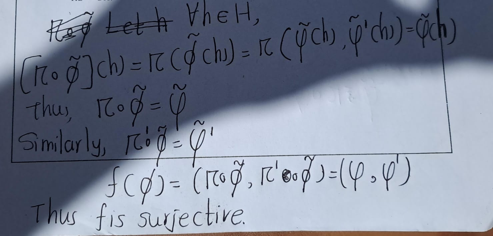<!-- --> 

::: {.exercise #unnamed-chunk-69}
Let \(H\) and \(K\) be subgroups of a group \(G\). Prove that the product set \(HK\) is a subgroup of \(G\) if and only if \(HK = KH\).
:::

**Solution** :

::: {.proof}
Let $G$ be group and $H,K\leq G$.

- $(\Longrightarrow)$: **Claim **: if $HK\leq G$ then $HK=KH$.\

  Suppose $HK\leq G$.
  - **sub claim**:
  Let $x\in KH$. Then $x=kh$ for some $h\in H$ and $k\in K$,
\[x=kh=1kh1=(1k)(h1)\in HK\]
(Since $1\in H$ and $1\in K$). Thus, $KH \subseteq HK$.\
  - **sub claim**: $KH \supseteq HK$.\
We can not use previous method.Because we still do not know $KH$ is sub group or not.\
Let $y\in HK$. Since  $HK\leq G$, $y^{-1}\in HK$. Then $y^{-1}=hk$ for some $h_0\in H$ and $k_0\in K$. \\
\[y=(y^{-1})^{-1}=(h_0k_0)^{-1}=k_0h_0\in KH\]
Thus, $KH \supseteq HK$.

Therefore, $KH=HK$.

- $(\Longleftarrow)$: **Claim **: If $HK=KH$ then  $HK\leq G$.\

Now suppose that $HK=KH$.Suppose that $HK=KH$ is empty. Then, $H,K$ is empty. Now we use sub group test.\
  - _Closure_: Let $x,y\in HK$. Then $x=h_1k_1$ and $y=h_2k_2$ for some $h_1,h_2\in H$ and $k_1,k_2\in K$.
\begin{eqnarray}
  xy&=&(h_1k_1)(h_2k_2)\\
  &=& h_1(k_1h_2)k_2) ~~(\text{By associavity property})\\
  &=& h_1(h_3k_3)k_2) ~\text{for some  }h_3\in H \text{ and } k_3\in K ~(\text{Since} KH=HK)\\
  &=& (h_1h_3)(k_3k_2)\in HK
\end{eqnarray}
  - _Inverse_: Let Let $x\in HK$. Then $x=h'k'$ for some $h'\in H$ and $k'\in K$.
  \[x^{-1}=(h'k')^{-1}=k'h'\in KH=HK\]
  Thus, $HK\leq G$. 
  
Therefore, the product set \(HK\) is a subgroup of \(G\) if and only if \(HK = KH\)
:::

<!--chapter:end:01-GroupTheory.Rmd-->

# Lienaer Operators

<!--chapter:end:02-LinearOperators.Rmd-->

# Vector spaces.

<!--chapter:end:Vector.Rmd-->

