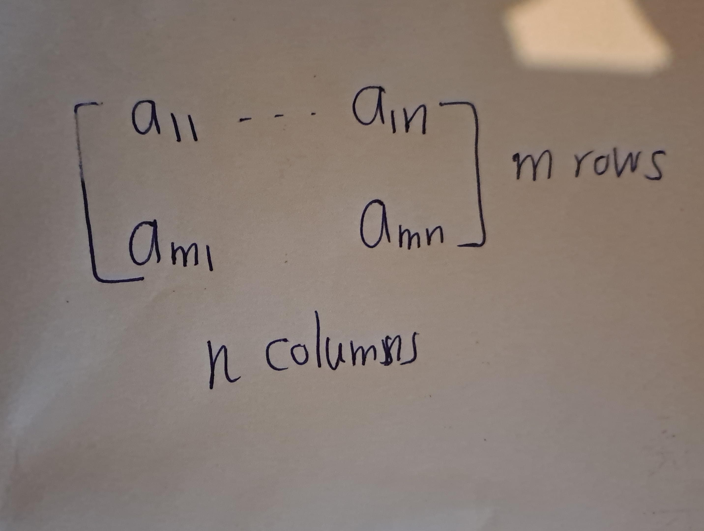
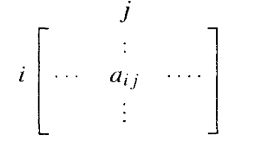

--- 
title: "Artin's Algebra"
author: "Ashan Jayamal"
date: "`r Sys.Date()`"
site: bookdown::bookdown_site
documentclass: book
bibliography: [book.bib, packages.bib]
url: https://ashanjayamal.github.io/Artins-Albegra
# cover-image: path to the social sharing image like images/cover.jpg
description: |
 Artins Algebra
link-citations: yes
favicon: favicon.ico
github-repo: rstudio/bookdown-demo
output:
  pdf_document: default
  html_document: default
---

# Matrices 
## Basic Operations
Let \( m \) and \( n \) be positive integers. An \( m \times n \) matrix is a collection of \( mn \) numbers arranged in a rectangular array.

```{r echo=FALSE,fig.cap='$~$',label='fig01'}
   
```
```{example}
\[A:=\begin{bmatrix}
8 & 0 & 3\\
78 & -5 & 2
\end{bmatrix}\]
$A$ is $2 \times 3$ matrix.(two rows and three columns)

```
The numbers in a matrix are the matrix entries. They may be denoted by \(a_{ij}\), where \(i\) and \(j\) are indices (integers) with \(1 < i < m\) and \(1 < j < n\). The index \(i\) represents the row index, and \(j\) represents the column index. So \(a_{ij}\) is the entry that appears in the \(i\)th row and \(j\)th column of the matrix.

```{r echo=FALSE,fig.cap='$~$',label='fig02'}
   
```

In the above example, $a_{11} = 8, a_{3} = 0, and a_{23} = -5. 

We sometimes denote the matrix whose entries are $a_{ij}$ by $(a_{ij})$.

```{definition}
- An $n \times n$ matrix is called a **square matrix**. A $1 \times 1$ matrix $[a]$ contains a single number, and we do not distinguish such a matrix from its entry.

- A $1 \times n$ matrix is an $n$-dimensional **row vector**. We drop the index $i$ when $m = 1$ and write a row vector as $$[a_1 \ldots a_n], \text{or as }(a_1,\ldots, a_n)$$. Commas in such a row vector are optional.

- Similarly, an $m \times 1$ matrix is an $m$-dimensional **column vector**:
\[
\begin{bmatrix}
b_1 \\
\vdots \\
b_m
\end{bmatrix}
\]

```
In most of this book, we won't make a distinction between an n-dimensional column vector
and the point of n-dimensional space with the same coordinates.In the few places where the distinction is useful, we will state this clearly.


```{definition,name='Addition of matrices'}
Addition of matrices is defined in the same way as vector addition. Let $A = (a_{ij})$ and $B = (b_{ij})$ be two $m \times n$ matrices. Their sum $A + B$ is the $m \times n$ matrix $S = (s_{ij})$ defined by $s_{ij} = a_{ij} + b_{ij}$.

```


```{example}
\[\begin{bmatrix} 2 & 1 & 0 \\ 1 & 0 & 3 \end{bmatrix} +
  \begin{bmatrix}  1 & 3 & 5\\3 & 1 & 3 \end{bmatrix}=\begin{bmatrix} 3 & 4 & 5\\4 & 1 & 6 \end{bmatrix}\]

```

Addition is defined only when the matrices to be added have the same shape — when they are $m \times n$ matrices with the same $m$ and $n$.

```{example,name='Non Example'}
\[\begin{bmatrix} 2 & 1 & 0 \\ 1 & 0 & 3 \end{bmatrix} +
  \begin{bmatrix}  1 & 3 & 5\\3 & 1 & 3 \\ 3 & 4 & 5 \end{bmatrix}\]
This two matrices can not be added.
```

```{definition,name='Scaler Multiplication'}
Scalar multiplication of a matrix by a number is also defined as with vectors. The result of multiplying an $m \times n$ matrix $A$ by a number $c$ is another $m \times n$ matrix $B = (b_{ij})$, where $b_{ij} = c \cdot a_{ij}$ for all $i, j$. Thus,

\[
2 \cdot \begin{bmatrix} 2 & 1 & 0 \\ 1 & 3 & 5 \end{bmatrix}  = \begin{bmatrix} 4 & 2 & 0 \\ 2 & 6 & 10 \end{bmatrix}
\]

```

Let'sassume for now that the scalars are real numbers. In later chapters other scalars will appear. Just keep in mind that, except for occasional reference to the geometry of real two- or three-dimensional space, everything in this chapter continues to hold when the scalars are complexnumbers.

```{definition,name='Matrix Multiplictaion'}
If $A$ is an $m \times n$ matrix and $B$ is an $n \times p$ matrix,
\[A = \begin{pmatrix} a_{11} & a_{12} & \cdots & a_{1n} \\ a_{21} & a_{22} & \cdots & a_{2n} \\ \vdots & \vdots & \ddots & \vdots \\ a_{m1} & a_{m2} & \cdots & a_{mn} \end{pmatrix}, \quad B = \begin{pmatrix} b_{11} & b_{12} & \cdots & b_{1p} \\ b_{21} & b_{22} & \cdots & b_{2p} \\ \vdots & \vdots & \ddots & \vdots \\ b_{n1} & b_{n2} & \cdots & b_{np} \end{pmatrix}\]
the matrix product $C = AB$ (denoted without multiplication signs or dots) is defined to be the $m \times p$ matrix
\[C = \begin{pmatrix} c_{11} & c_{12} & \cdots & c_{1p} \\ c_{21} & c_{22} & \cdots & c_{2p} \\ \vdots & \vdots & \ddots & \vdots \\ c_{m1} & c_{m2} & \cdots & c_{mp} \end{pmatrix}\]
such that
\[c_{ij} = a_{i1}b_{1j} + a_{i2}b_{2j} + \cdots + a_{in}b_{nj} = \sum_{k=1}^{n}a_{ik}b_{kj},\]
for $i = 1, \ldots, m$ and $j = 1, \ldots, p$.

That is, the entry $c_{ij}$ of the product is obtained by multiplying term-by-term the entries of the $i$th row of $A$ and the $j$th column of $B$, and summing these $n$ products. In other words, $c_{ij}$ is the dot product of the $i$th row of $A$ and the $j$th column of $B$.

Therefore, $AB$ can also be written as
\[C = \begin{pmatrix} a_{11}b_{11} + \cdots + a_{1n}b_{n1} & a_{11}b_{12} + \cdots + a_{1n}b_{n2} & \cdots & a_{11}b_{1p} + \cdots + a_{1n}b_{np} \\ a_{21}b_{11} + \cdots + a_{2n}b_{n1} & a_{21}b_{12} + \cdots + a_{2n}b_{n2} & \cdots & a_{21}b_{1p} + \cdots + a_{2n}b_{np} \\ \vdots & \vdots & \ddots & \vdots \\ a_{m1}b_{11} + \cdots + a_{mn}b_{n1} & a_{m1}b_{12} + \cdots + a_{mn}b_{n2} & \cdots & a_{m1}b_{1p} + \cdots + a_{mn}b_{np} \end{pmatrix}\]

```

```{example}
\[
\begin{bmatrix}
2 & 1 & 0 \\
1 & 3 & 5
\end{bmatrix}
\begin{bmatrix}
1 \\
-1 \\
4
\end{bmatrix}
=
\begin{bmatrix}
1 \\
18
\end{bmatrix}
\]

```


